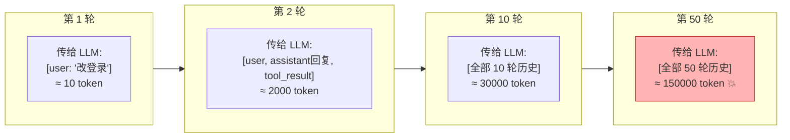
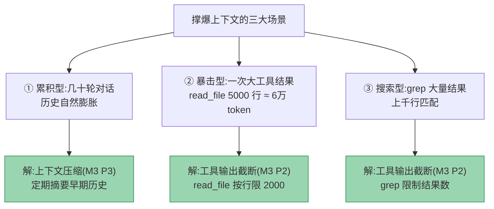
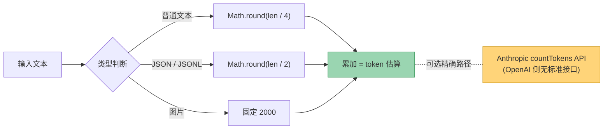
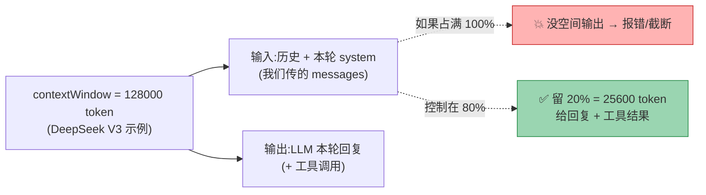
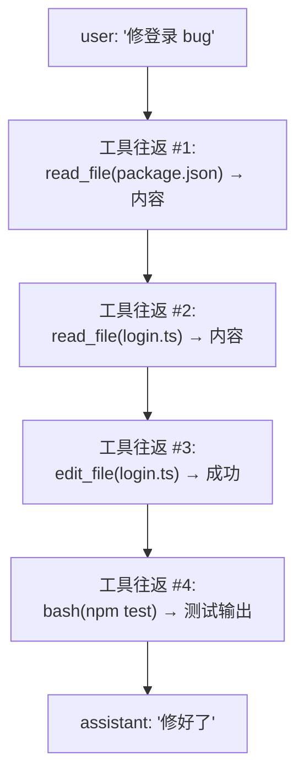
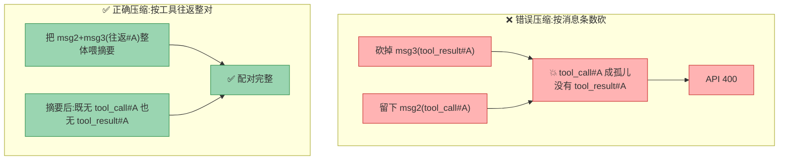
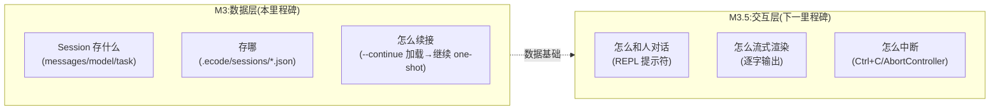
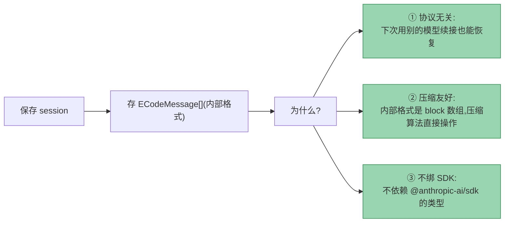

# M3 · 方案解析

> **本文档是 M3 的原理宝典**:把"为什么 agent 会越聊越傻""token 到底怎么算""压缩凭什么不破坏 tool 链""Session 凭什么能续接"讲透——"为什么这么设计"。
> **关联**: [M3-实施方案](./M3-实施方案.md)(怎么做:接口/调用链/文件清单)、[00-开发规划](./00-开发规划.md) M3 章节、[M2-方案解析 §4.3](./M2-方案解析.md)(孤儿配对坑的事实依据)
>
> 📖 **怎么读**:从头读到尾能建立完整心智模型;只查某点可跳着读,每章自洽。生僻术语(✨标记)查 [术语速查](#术语速查先看这个)。

---

## 术语速查(先看这个)

| 术语 | 一句话解释 |
|------|-----------|
| **上下文窗口 (context window)** ✨ | 模型一次能"看到"的最大文本量(以 token 计)。GLM-5.2 = 1M、DeepSeek V3 = 128K / V4 = 1M。**这是硬天花板**,超过模型就"看不到"早期内容或直接报错(出处:Atlas Cloud / 阿里云模型文档) |
| **token** ✨ | 模型处理文本的最小单位。**不等于字符也不等于词**——英文约 1 词 ≈ 1-2 token,中文约 1 字 ≈ 1-2 token。计费、算上下文都用 token |
| **tokenizer / 分词器** ✨ | 把文本切成 token 序列的工具。**没有通用 tokenizer**:每家模型(GPT/Claude/GLM)切法不同,用错家的会算偏 |
| **BPE (Byte Pair Encoding)** ✨ | 主流 tokenizer 算法:把高频字节对合并成一个 token。各家模型(GPT/Claude/GLM)BPE 表不同。ECode **不引入 tokenizer 库**,用 `length/4` 粗估(见 §2.2) |
| **摘要压缩 (summarization compaction)** ✨ | 用 LLM 把早期对话压成一段摘要,替换原始消息。对比"滑动窗口"(直接砍老消息)更保信息 |
| **滑动窗口 (sliding window)** ✨ | 最简单的上下文管理:只保留最近 N 条消息,老的直接丢。实现简单但暴力丢信息 |
| **工具往返 (tool turn)** ✨ | 一次完整的工具调用周期:assistant 发 `tool_call` → 工具执行 → user 回 `tool_result`。**这是压缩的最小不可分割单位** |
| **孤儿配对 (orphaned pairing)** ✨ | `tool_call` 没有对应的 `tool_result`(或反之)。Anthropic API 遇到孤儿直接 **400**。压缩最易触发 |
| **阈值 (threshold)** ✨ | 触发压缩的临界值。M3 用 contextWindow × 80%——留 20% 给本轮回复 |
| **providerOptions(侧信道)** ✨ | Vercel 的设计:核心数据结构保持中性,每个元素挂一个 `{providerName: {...}}` 放 provider 私有特性,核心类型不膨胀。M3 P1 引入 |
| **门面模式 (Facade)** ✨ | 用一个统一接口封装一堆复杂子系统。`ContextManager` 就是:agent 只调 `maybeCompress()`,内部管 token 计数+压缩+校验 |

---

## 📌 阅读指南:AI 时代哪些不用记

| 类别 | 例子 | 为什么不用记 |
|------|------|-------------|
| 各模型上下文窗口具体数值 | "GLM-5.2 是 1M" | 会变,查 config / 官方文档,AI 秒答 |
| tokenizer 的 BPE 合并规则 | "the → 1 token" | 算 token 用 `length/4` 粗估(决策1),不用手算 |
| 压缩 prompt 的具体措辞 | — | 实现时调研参考项目,可调优 |

**要记的是**:心智模型(为什么越聊越傻)、架构取舍(为什么摘要不滑动窗口)、踩坑(孤儿配对/失真)、Why。

---

## 一、为什么需要上下文管理(心智模型)

### 1.1 LLM 是"金鱼记忆"——上下文窗口是硬天花板

很多人对 LLM 有个误解:"它记得我们聊过的一切"。**错**。LLM 每次 API 调用,只能"看到"你**这一次**传给它的全部文本(= 上下文窗口)。它没有任何"跨调用的记忆"——所谓的"记忆",全靠你每次把**历史对话重新传一遍**。



**ECode 当前(代码事实)**:`agent.ts` 的 `messages` 数组**只增不减**——每轮把完整历史 push 上去再全量发送。这意味着:

- 第 1 轮传 10 token
- 第 10 轮传 30000 token
- 第 50 轮传 150000 token → **超过 DeepSeek V3 的 128K 窗口,直接报错**(GLM-5.2/V4 虽有 1M 容得下,但窗口够大不代表不退化——模型注意力被稀释,仍会"看不到"最早任务指令)

**这就是"越聊越傻"的本质**:不是模型变笨了,是历史把上下文窗口塞满后,要么报错,要么模型注意力被稀释、丢失早期指令。

### 1.2 三个撑爆上下文的典型场景



M3 要同时解这三类——**截断**(P2)防暴击和搜索,**压缩**(P3)治累积。

### 1.3 截断 vs 压缩:治标 vs 治本

| | 工具输出截断 | 上下文压缩 |
|---|---|---|
| **作用层** | 单个工具返回时 | 整段历史累积时 |
| **时机** | 工具执行完立即裁 | 每轮 API 调用前检查 |
| **手段** | 按行/字符硬切 | LLM 摘要(保信息) |
| **类比** | 预防针(防一次暴击) | 治疗药(治长期累积) |
| **归属** | M1 已有部分,M3 补全 | M3 全新 |

**两者不可替代**:只截断不压缩——几十轮下来照样撑爆;只压缩不截断——一次大 `read_file` 就直接触发压缩,浪费一次 LLM 摘要调用。**都要**。

---

## 二、Token 计数原理

### 2.1 为什么没有通用 tokenizer(token ≠ 字符 ≠ 词)

一个常见误区:"文本长度 = token 数"。**三者都不同**:

```
文本:     "I love 你好世界"
字符数:   12 (含空格)
词数:     4  (I / love / 你好世界 —— 中文不分词)
token 数: 取决于 tokenizer!
```

不同 tokenizer 切法:

| tokenizer | "I love 你好世界" 切成(**示意值**,非实测) | token 数 |
|-----------|----------------------|---------|
| GPT-4 (cl100k_base) | "I"/" love"/" 你"/"好"/"世界" | 5 |
| Claude | (不同切法) | ~5-6 |
| GLM | (又是一套) | ~4-7 |

**关键结论**:**精确的 token 计数,每家模型要用自己的 tokenizer**,用错误差可达 ±30%(中文更大)。

那 ECode 为什么还敢用 `length/4` 粗估(决策1)?——因为**压缩阈值判断不需要精确值,只需要"够不够触发"的趋势**(见 §2.2)。追求精确的成本(每模型一份 tokenizer,且 GLM/DeepSeek 未必有现成可靠的)远超压缩场景的收益。

### 2.2 ECode 怎么算 token(`length/4` 粗估,仿 Claude Code)



**ECode 的选择(决策1)**:`length/4` 粗估,**不引入 tokenizer 库**。

- **为什么够用**:压缩阈值是个"够不够 80% 就触发"的**趋势判断**,不是计费,不需要精确 token 数。`length/4` 估偏一点,顶多让压缩早一轮或晚一轮触发,不影响正确性。
- **为什么对中文安全**:`length/4` 源自英文经验(英文约 4 字符/token),中文实际约 1-2 字符/token,所以 `length/4` 对中文会**高估** token 数 → 倾向"早压缩" → 正好落在"宁可早压缩(无害)也不晚压缩(可能 API 报错)"的容错方向。
- **出处**:Claude Code 官方就是这么做的——`claude-code-main/services/tokenEstimation.ts:203-208` `roughTokenCountEstimation(content, bytesPerToken=4)` 默认 `/4`,JSON 类 `/2`(`:215-224`),图片固定 2000(`:400-412`)。它也不用 tokenizer 库,精确值才调 API `countTokens`(`:140-201`)。

**为什么不用 ai-tokenizer / tiktoken**(核查后结论):
- ai-tokenizer 主打 OpenAI/Anthropic/Google,**对 GLM/DeepSeek 无原生 encoding**(ECode 默认模型),套相近词表误差未知;
- 官方"≥97% 准确率"仅针对 GPT-5/Claude/Gemini,第三方测评(dev.to jerown)在数字/代码场景实测仅 37.7% within 10%,且 Gemini 本就无独立 encoding;
- 引入它对默认模型价值存疑,反而给人"很准"的错觉。零依赖的 `length/4` 更诚实。

**精确校准(可选,非必须)**:Anthropic 协议侧可调 `messages.countTokens` beta API 拿真实值;OpenAI 协议侧无标准 countTokens 接口。M3 先纯粗估。

### 2.3 为什么阈值是 80%,不是 100%

模型上下文窗口是 **"输入 + 输出"共享**的:



**80% 阈值 = 102400 token**(DeepSeek V3 128K 示例)。留的 20%(25600)够一次"读文件 + 编辑"的回复。设太高(95%)→ 回复刚开头就超限;设太低(60%)→ 压缩太频繁,浪费 LLM 摘要调用。

> 📌 **Claude Code 的真实做法不是百分比而是绝对值**:`claude-code-main/services/compact/autoCompact.ts:62,75-76` 阈值 = `contextWindow(200K) − summaryReserve(20K) − buffer(13K) = 167K`(≈83.5%);CCode 用百分比 OVERFLOW=0.85(`D:\Study\CCode\core\context-tracker.ts:58`)。ECode 用 0.8 近似,三者效果接近。

---

## 三、上下文压缩算法(核心)

> 这一章是 M3 最难、最高风险的部分。实施方案 [§五](./M3-实施方案.md) 讲了"怎么做",这里讲"为什么这么做"。

### 3.1 压缩的心智模型:对话 = 工具往返序列

一段 agent 对话,本质是一连串**工具往返**:



**洞察**:**每个工具往返的"原始输出"在事后大多是冗余的**——你只需要知道"#1 读过 package.json、#2 发现 login.ts 第 30 行有 bug、#3 改好了、#4 测试通过",不需要 60000 字符的原始文件内容。

压缩就是:**把早期往返的原始输出,换成一句"做过什么、结论是什么"的摘要**。

### 3.2 保留什么:四类不可压缩

| 内容 | 为什么必须保留 |
|------|---------------|
| **system + 当前任务** | agent 的"北极星指令",丢了就跑偏 |
| **最近 N 轮原文**(默认 6 轮) | 正在进行的往返,LLM 需要原始细节(当前在编辑哪个文件、改了什么) |
| **未配对的 tool**(孤儿) | 压缩会造新孤儿 → API 400(见 3.4) |
| **关键事实**(经摘要保留) | "bug 在 login.ts:30""测试通过"——结论必须有 |

### 3.3 压缩什么:已完成工具往返 → 摘要

**只压缩"早期的、已完成的"工具往返**,而且**整对压缩**:

```
压缩前(早期历史,~50000 token):
  msg1: user '修登录 bug'
  msg2: assistant [text:'我先看看', tool_call#A read_file(package.json)]
  msg3: user [tool_result#A: <package.json 全文 800 行>]   ← 冗余!
  msg4: assistant [text:'再看 login', tool_call#B read_file(login.ts)]
  msg5: user [tool_result#B: <login.ts 全文 300 行>]        ← 冗余!
  msg6: assistant [tool_call#C edit_file(login.ts)]
  msg7: user [tool_result#C: '成功']

压缩后(~2000 token):
  msg1: user '修登录 bug'
  msg2: user '<压缩摘要: 已读 package.json(依赖...)、
              读 login.ts 发现第30行空指针、已 edit 修复、待测试>'
  --- 最近 6 轮原文保留 ---
```

**信息密度提升 25 倍**,而关键结论(读了啥、发现啥、改了啥)全保留。

### 3.4 最硬核:不破坏 tool_use/tool_result 配对

**这是 M3 最致命的坑**(M2-方案解析 §4.3 已预告)。

**Anthropic API 的硬约束**:messages 里每一个 `tool_use` 必须有对应的 `tool_result`,反之亦然。**有一个孤儿就 400**。

**压缩最容易触发孤儿**:



**正确做法**:
1. **分组**:把历史按"工具往返"分组(call + 对应 result 是一组)
2. **整对处理**:摘要时整对喂给 LLM,绝不拆散
3. **孤儿检测**:分组时若发现某个 call 没 result(或反之,可能是历史截断造成),**把孤儿挪进"保留区"不压缩**
4. **完整性校验**:压缩返回前,遍历断言 `所有 tool_call.id 的集合 == 所有 tool_result.tool_use_id 的集合`,**不等就抛错**(宁可崩也不发坏数据)

### 3.5 压缩后的重注入(项目记忆)

压缩会丢掉早期上下文,但有一类信息**必须在压缩后重新注入**:**项目记忆(CLAUDE.md 类)**。

```
压缩前: [system, 项目记忆, task, 往返1..N(被压缩), 往返N+1..M(保留)]
                    ^^^^^^^^
                    压缩时可能进摘要(信息密度降低)

压缩后: [system, 项目记忆(重新注入), 压缩摘要, 往返N+1..M]
                    ^^^^^^^^^^^^^^
                    必须原样重新挂回(不靠摘要保真)
```

> M3 只做最简版:压缩后把 `buildSystemPrompt()` 重新生成(它本就含项目记忆),保证记忆恒在。自动整理/Repo Map 留 M5+。

---

## 四、Session 持久化原理

### 4.1 为什么 Session 是"数据层",REPL 是"交互层"

M3 和 M3.5 的**关键边界**:



**M3 的 `--continue`**:加载数据 → 把新任务作为 user 消息追加 → 继续 one-shot 跑完。**不是** REPL(那要持续对话、不退出)。M3.5 才做沉浸式交互。这个边界让 M3 聚焦数据正确性,不被 UI 复杂度拖累。

### 4.2 为什么序列化 ECode 内部格式(协议无关)

Session 存的是 **ECode 内部格式**(`ECodeMessage[]`),不是 Anthropic 或 OpenAI 原生格式:



**关键收益**:今天用 DeepSeek(OpenAI 协议)开的 session,明天 `--continue --model glm-5.2` 续接,历史照样能加载——因为存的是中性的 ECode 格式,Provider 层负责翻译。**这是 M2 Provider 抽象的长期红利**。

### 4.3 续接的难点:压缩态恢复

若 session 存的是**已压缩**的历史(摘要 + 最近 N 轮),恢复后 `maybeCompress` 看到的就是这份"已压缩态" messages。

**M3 的处理:不特殊控制。** `maybeCompress` 天然幂等——已压缩态若仍超阈值,它会再摘要一次(摘要的摘要),信息有损但**不破坏配对、不死循环**(摘要后 token 必然下降,终会低于阈值)。`session.stats.compressed` 标记仅作**信息展示**(让用户 / 日志知道这会话压缩过),**不用于控制是否压缩**。

> "加载 → 超阈值 → 立刻又压缩"**不是死循环**:每次摘要 token 单调下降,最多多花一两次摘要调用就稳定。真正的"压缩后冷却"(加载后若干轮内禁压)是 **M3.5 可选优化**,M3 不做(YAGNI)。

### 4.4 为什么每轮写盘(不是结束时才写)

对齐 `runtime-logger.ts` 的哲学:**实时写,崩溃不丢**。

- agent 跑了 20 轮突然崩了 → 下次 `--continue` 能从第 20 轮续上(不是从 0)
- 写盘是**整文件覆盖**(同 session 文件,messages 累积),不是 JSONL 追加——一个文件 = 一份可直接 `loadSession` 的完整状态(为什么不用 JSONL 事件溯源见 [实施方案 §6.2](./M3-实施方案.md):YAGNI,ECode 不做分支 / fork)
- **原子写**:覆盖写走 `<file>.tmp` → `renameSync`,防强杀于写盘中途留下截断损坏文件(对齐 Claude Code `materializeSessionFile`)
- 体积可控:messages 已被截断 + 压缩,单个 session 文件一般 < 1MB

### 4.5 写盘失败为什么不杀 agent loop

session 持久化是**旁观者**,不在 agent loop 控制流里。写盘失败(磁盘满 / 文件锁 / 权限)时**降级继续跑**,绝不杀 loop——这是 Claude Code 与 CCode 的源码共识:

- **Claude Code**:`void enqueueWrite`(Promise 从不 reject)+ `setTimeout(async)` 把磁盘错误隔离成 unhandled rejection,主 loop 感知不到;`runAgent.ts:732` 注释 *"persistence failure shouldn't block the agent"*。
- **CCode**:`SessionLogger.#appendEvent` 的 `try { appendFileSync } catch { /* 吞 */ }`,且 `SessionLogger` 是 observer,`agent-loop.ts` 根本不引用它。

**理由**:session 是**附加能力**(让会话可续接),失败顶多"本次不可 --continue";若因此杀 loop,跑到第 20 轮修 bug 时磁盘满 = 前 19 轮全白干 + 任务没完成。完整规则(持续重试 / 写盘重试一次 / 可见度)与证据表见 [实施方案 §6.6](./M3-实施方案.md)。

---

## 五、压缩陷阱(踩坑预警)

> 这一章是 M3 实现 P3 时最容易踩的坑,先预警。落地后回写到 `docs/memory/debugging.md`。

### 5.1 孤儿配对 → API 400(最致命)

**现象**:压缩后下一次 `provider.complete()` 报 400,错误信息提到 tool_use/tool_result 不匹配。

**根因**:压缩算法拆散了某个工具往返(砍了 result 留 call,或反之)。

**对策**:
- 成对压缩(决策3)
- 完整性校验(返回前断言集合相等,不等抛错)
- **单测必覆盖**:构造含孤子的历史 → 断言压缩抛错 / 孤子被保留

### 5.2 压缩丢工具结果 → agent 重复调用(死循环)

**现象**:压缩后,agent 又去 `read_file(a.ts)`——明明摘要里该有结论。

**根因**:压缩 prompt 没强调"保留已做过的操作及结论",或摘要太笼统("读过一些文件")。

**对策**:
- 压缩 prompt 明确要求"列出已做的关键操作及结论"
- 验收②专项测试:压缩后断言摘要含具体操作
- 保留最近 N 轮原文(N 别太小)

### 5.3 压缩摘要失真 → agent "失忆"

**现象**:压缩后 agent 忘了用户的原始目标,答非所问。

**根因**:把"当前任务(user 初始消息)"也压进摘要了,目标被稀释。

**对策**:
- **当前任务永远保留原文,不进摘要**(实施方案 5.2 决策矩阵)
- system + 任务是"北极星",压缩后重新注入(3.5)

### 5.4 `length/4` 粗估偏差 → 阈值误判

**现象**:粗估 75%(未压缩),实际 85%(早该压缩了)。

**根因**:`length/4` 是粗估,尤其中文有偏差(中文实际 1-2 字符/token,`/4` 高估)。

**对策**:
- 0.8 阈值留 20% 余量,吸收偏差
- **偏差方向天然安全**:`length/4` 对中文**高估**→ 倾向早压缩 → 早压缩只是多一次摘要调用(无害),晚压缩才可能 API 报错(有害)。粗估偏差正好偏向安全侧
- Anthropic 侧可选 `countTokens` API 校准

### 5.5 压缩本身的 LLM 调用失败

**现象**:摘要那次 LLM 调用失败(网络/限流),压缩进行不下去。

**对策**:**压缩失败则跳过压缩继续 loop**(降级),不阻塞——宁可下一轮再试,也不能因为压缩失败让整个 agent 停。日志告警。

---

## 六、关键设计答疑(Q&A)

**Q: 为什么用 LLM 摘要压缩,不用滑动窗口(直接砍老消息)?省一次 LLM 调用。**
滑动窗口暴力丢信息。agent 早期"读过 a.ts 发现 bug 在 30 行"这种结论被砍掉后,接下来它会**重复 read a.ts**(死循环),烧的 token 比省下的摘要调用多十倍。摘要保留结论、丢冗余原始输出,信息密度高。Claude Code/opencode 都用摘要。

**Q: 压缩要花一次 LLM 调用,成本不低,值得吗?**
值得。对比两种成本:① 压缩:一次额外 LLM 调用(摘要);② 不压缩:agent 因失忆死循环,反复调工具调 LLM,几十次调用。压缩是"花小钱省大钱"。

**Q: `length/4` 粗估有误差,凭什么信它?**
压缩阈值是"够不够触发"的**趋势判断**,不是计费,不需要精确。误差方向天然安全:`length/4` 对中文高估→早压缩(无害),不会高估到导致晚压缩报错。0.8 阈值再留 20% 余量吸收偏差。Claude Code 官方即用 `length/4`(`tokenEstimation.ts:203-208`),生产验证过的方案。

**Q: 为什么 Session 存项目级 `.ecode/`,不存全局或入库?**
三个理由:① 对话是**项目相关**的(聊的是这个仓库),放项目里天然;② `.ecode/` 已 gitignore,不污染仓库;③ 对话是即时性的,**不需要跨设备 git 同步**(不像 config/记忆要同步),入库反而泄露本地路径/敏感上下文。全局 `~/.ecode/` 留给配置和记忆,职责分离。

**Q: 压缩后用别的模型续接,历史能恢复吗?**
能。Session 存的是 **ECode 内部格式**(协议无关),不是 Anthropic/OpenAI 原生格式。今天 DeepSeek 开的 session,明天 `--continue --model glm-5.2` 续接,Provider 层负责翻译。这是 M2 Provider 抽象的红利。

**Q: P1(格式 v2 + 声明式工具)算不算 M3 范围蔓延?**
有争议,所以列在 [实施方案第十二章待审阅](./M3-实施方案.md)。支持纳入的理由:M3 压缩要在 messages 上操作,`providerOptions` 侧信道能挂"可压缩"标记;P5 的 usage 细化、并行工具标记都要挂在升级后的类型上。不升级,M3/M4 反复修补核心类型,更痛。反对的理由:P1 是重构,有回归风险,会让 M3 变大。**这是范围决策,需用户拍板**。

**Q: 为什么把 AbortController(借鉴点③)排除在 M3 外?**
M3.5 的中断功能(M3.5 核心交付之一)才真正需要 AbortController 贯穿。M3 的 retry 升级(④)会**预留** signal 参数,但不接用户输入(无中断 UI)。把 ③ 完整实现放 M3.5 之前,避免 M3 背上"中断"这个独立大工程。

**Q: 压缩算法能用现成库吗(比如 LangChain memory)?**
不用,违背"手写核心"原则(00-开发规划三个原则之一)。上下文管理是 agent 的核心能力,必须自己掌控——尤其"成对保护 tool 链"这种 ECode 特有的约束,现成库未必贴合。token 计数用零依赖的 `length/4`(决策1),压缩算法自己写。

---

## 参考来源

- [00-开发规划](./00-开发规划.md) M3 章节与认知盲区 P0-3(截断)/P1-1(项目记忆)
- [借鉴Vercel-AI-SDK对比报告](./借鉴Vercel-AI-SDK对比报告.md) §四⑥⑦(providerOptions/声明式工具)、§四④(retry)
- [M2-方案解析 §4.3](./M2-方案解析.md) 孤儿配对坑的事实依据
- **Claude Code 源码**(`D:\Study\claude-code-main`,2026-08-03 实地核查):压缩全链路——绝对值阈值(`services/compact/autoCompact.ts:62`,**非 80% 百分比**)、9 段 prompt(`services/compact/prompt.ts:61-143`)、传统路径**不保留**最近 N 轮(`compact.ts:110-112`)、`length/4` token 估算(`services/tokenEstimation.ts:203-208`)、孤儿修复 `ensureToolResultPairing`(`utils/messages.ts:5133`)
- **CCode 源码**(`D:\Study\CCode`):三策略压缩(`core/context-manager.ts:298`)、GLM fallback(`providers/openai-compat.ts:141-186`)、ContextTracker 阈值(`core/context-tracker.ts:58`)
- opencode:Session/Message/Part 状态模型(数据层设计参考)
- [How Coding Agents Actually Work: Inside OpenCode](https://cefboud.com/posts/coding-agents-internals-opencode-deepdive/)(上下文管理/Session)
- 模型窗口数据:Atlas Cloud / 阿里云百炼模型文档(GLM-5=200K / GLM-5.1+=1M;DeepSeek V3=128K / V4=1M)
- Anthropic 配对约束:GitHub issues [#5662](https://github.com/anthropics/claude-code/issues/5662) / [#8004](https://github.com/anthropics/claude-code/issues/8004)、janhq/jan #7654(错误原文:"Each `tool_use` block must have a corresponding `tool_result` block in the next message")

---

**创建时间**: 2026-08-03
**性质**: M3 原理宝典,随实现进展持续修订(踩坑回写 `docs/memory/debugging.md`)
**关联文档**: `./M3-实施方案.md`(怎么做)、`./00-开发规划.md`、`./M2-方案解析.md`、`./借鉴Vercel-AI-SDK对比报告.md`
