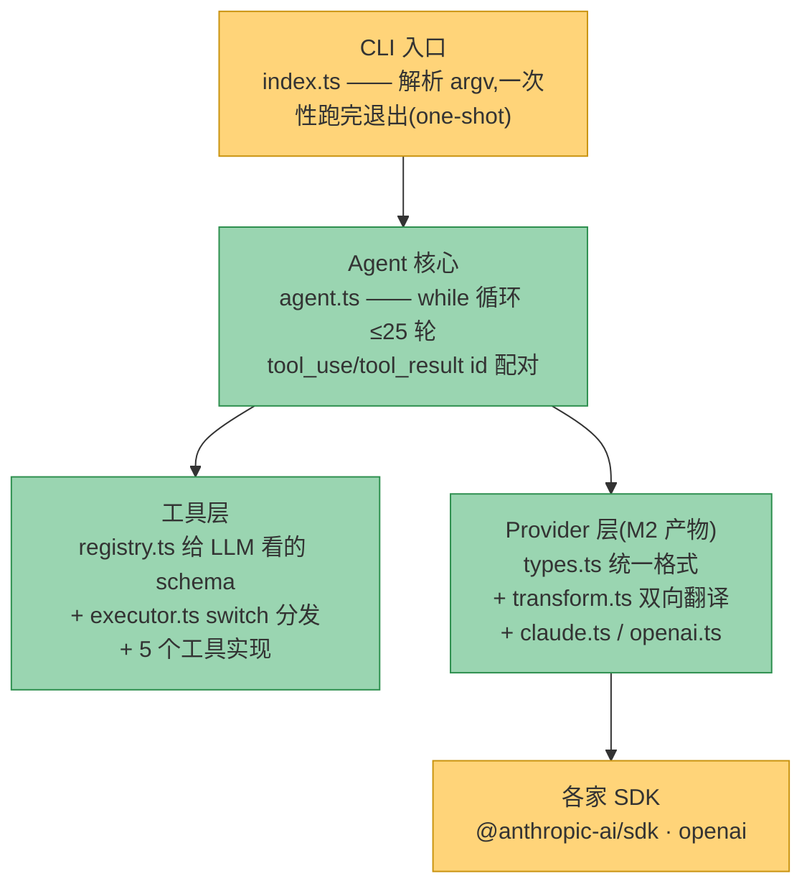
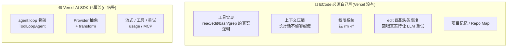
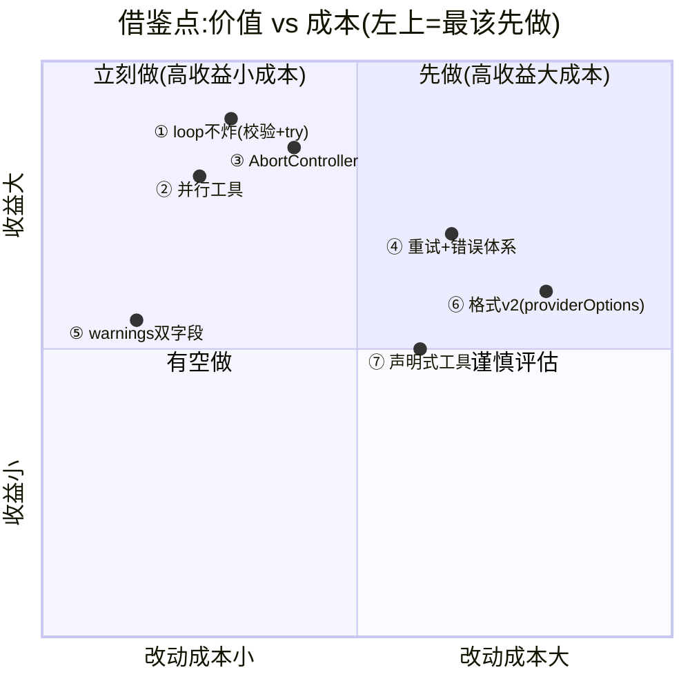
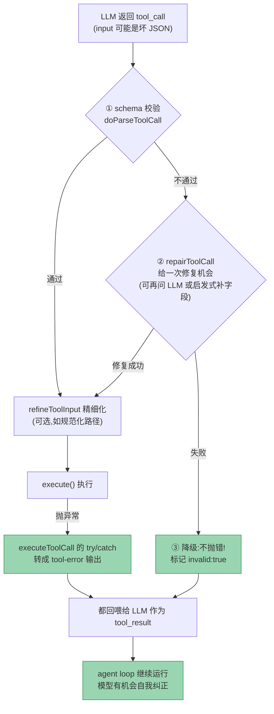
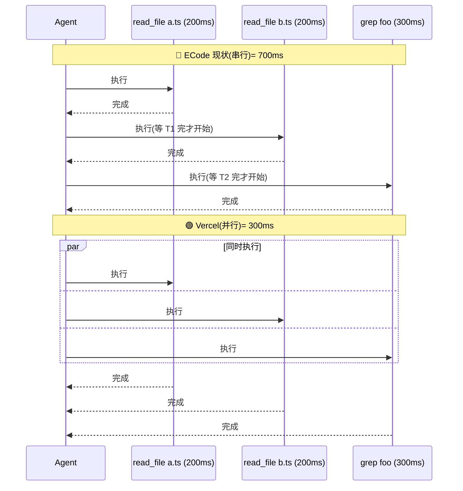
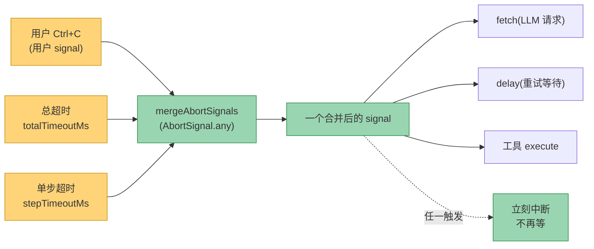
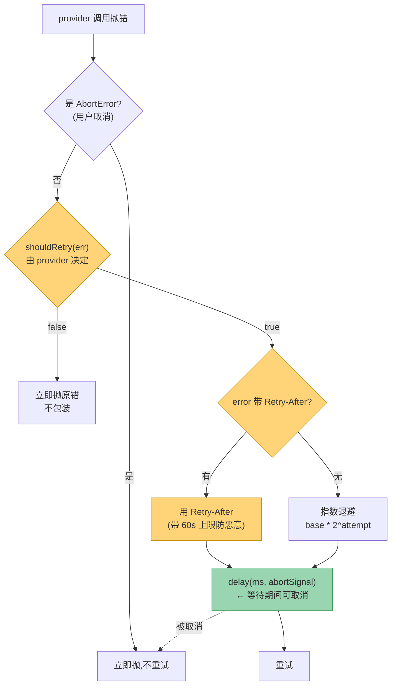
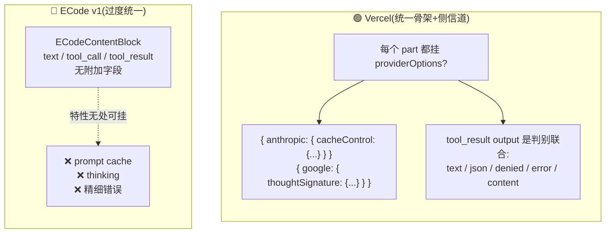
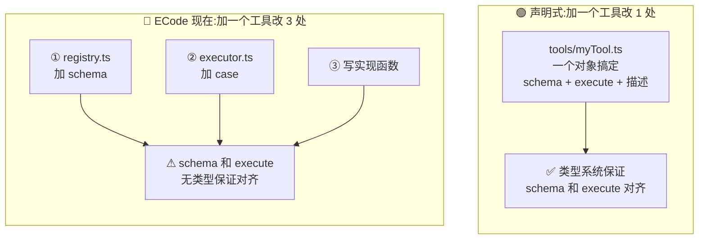
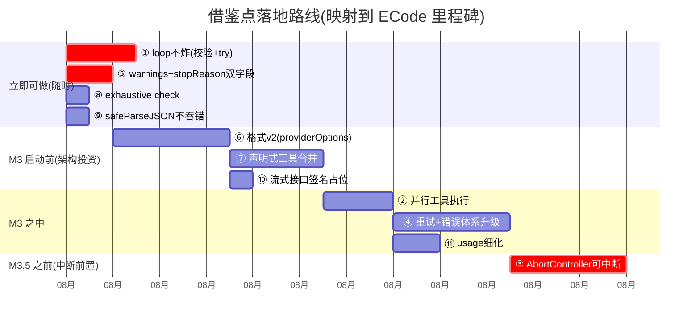

# ECode M1/M2 vs Vercel AI SDK — 借鉴对比报告

> **给谁看**:ECode 团队成员(熟悉 TS/Node,不一定读过 Vercel AI SDK 内部)。
> **解决什么**:ECode 手写 agent,不引框架;但 Vercel AI SDK(Apache 2.0 开源)在同一些地方的设计更成熟。这份报告挑出**真正值得回流到 ECode 自己代码**的设计思想和实现技巧——**只学设计,不引包**(违背"手写核心"原则)。
> **怎么读**:忙人看 [一、背景](#一先对齐背景) + [三、Top 5 结论](#三结论先行全局-top-5没时间看这个) + [六、路线图](#六演进路线建议把借鉴点映射到里程碑);要动手改某块再看 [四、详解](#四借鉴点详解)。生僻术语查 [二、术语速查](#二术语速查后面会反复出现先看这个)。
>
> **图怎么看**:GitHub 原生渲染;VS Code 装 *Markdown Preview Mermaid Support* 插件后 `Ctrl+Shift+V` 预览;或粘贴代码块到 `https://mermaid.live`。

**状态**:调研完成,待评审采纳 | **对比基准**:ECode `src/`(M1+M2)↔ Vercel `packages/{ai,provider,provider-utils,anthropic,openai,openai-compatible}` | **创建**:2026-08-03

---

## 一、先对齐背景

### 1.1 ECode 现在长什么样

ECode 是一个**手写的** AI coding agent(对标 Claude Code),单包 CLI,核心是手写的 agent loop(不用 LangGraph 等框架)。M1/M2 完成后的分层:



**一句话**:agent loop 只认 `types.ts` 里的统一格式,Provider 层负责把它和各家 SDK 协议互译。换模型 = 换 Provider 实例,agent 代码不动。

### 1.2 Vercel AI SDK 是什么,它覆盖了 ECode 哪些工作

Vercel AI SDK 是 Vercel 出的 TS 工具包(Apache 2.0,可借鉴)。它**确实覆盖了 ECode 的不少层**——包括 agent loop 本身(`ToolLoopAgent`)、Provider 抽象、transform、流式、工具、重试、MCP。**但它不覆盖 ECode 的真正核心**:



**为什么这份报告值得看**:左半边(Vercel 覆盖的)正是 ECode 当前 M1/M2 做的事——Vercel 在这些**通用骨架**上沉淀了更成熟的设计。我们把这些设计学过来,把精力省下来攻右半边(ECode 的真核心,谁也替不了)。

### 1.3 一句话结论

> ECode 的 loop/tools/Provider **能跑**,但在**健壮性、可中断、信息保真、多 provider 扩展性**上,Vercel 有 10 个设计点值得我们学——其中 5 个"低成本高收益",建议 M3 之前/之中带上。

---

## 二、术语速查(后面会反复出现,先看这个)

| 术语 | 一句话解释 | 在本文哪里用到 |
|------|-----------|----------------|
| **AbortController / AbortSignal** | Web 标准的"取消"机制。`controller.abort()` 后,所有拿着它 signal 的异步操作(fetch、定时器、工具)会立刻中断。ECode 当前**完全没用**。 | ③可中断、④重试 |
| **判别联合 (discriminated union)** | TS 类型技巧:多个对象类型共享一个字面量字段(如 `type:'text'`)。`switch(block.type)` 时 TS 能自动收窄类型。ECode 的 `ECodeContentBlock` 就是。 | ⑥格式演进、⑦声明式 |
| **鸭子类型 (duck typing)** | 不用 `instanceof`,而是"看对象有没有某个字段"来判断类型(像鸭子:会嘎嘎叫就是鸭子)。ECode 用 `(err as {status?:number}).status` 判断错误是不是 HTTP 错。 | ④错误体系 |
| **`Symbol.for(key)`** | JS 全局 Symbol 注册表:同名 key 返回**同一个** Symbol,跨 npm 包副本都能识别。比 `instanceof` 在"同一个类被装多份"时可靠(常见 monorepo 坑)。 | ④错误体系 |
| **providerOptions** | Vercel 的设计:核心数据结构保持中性,每个元素挂一个 `{providerName: {...}}` 侧信道放 provider 私有特性(如 Anthropic 的 prompt cache),核心类型不膨胀。 | ⑥格式演进 |
| **Retry-After** | HTTP 响应头:服务端告诉你"多久后再来"(秒数或日期)。429/503 限流时常用。Vercel 重试会读它,ECode 不读。 | ④重试 |
| **exhaustive check** | TS 技巧:switch 判别联合后加一行 `const _: never = subject`,新增类型变体时**编译报错**,强制所有分支都处理,防漏。 | ⑧快赢 |
| **降级 (degrade / fallback)** | 出错不抛异常中断流程,而是返回一个"次优但安全"的结果让流程继续。Vercel 工具校验失败→降级成错误回喂给 LLM,而不是炸掉。 | ①loop不炸、④ |
| **streamStep** | Vercel 流式 loop 用**递归**(上一步流结束的回调里触发下一步),而非 `while + await`(那会退化成"等完才显示"的假流式)。 | ⑩快赢 |
| **指数退避 + jitter** | 重试间隔每次翻倍(1s→2s→4s)防雪崩,再加随机抖动(jitter)避免一群客户端同时重试。ECode 已有,Vercel 更完善。 | ④重试 |

---

## 三、结论先行:全局 Top 5(没时间看这个)

按「价值 × 改动成本」排,最值得先做的 5 个:



| 优先级 | 借鉴点 | 一句话价值 | 改动量 | 建议时机 |
|---|---|---|---|---|
| **1** | ① 工具 try/catch + 输入校验 | 现在 LLM 给坏参数或工具抛错会**直接杀整个 agent loop**,用户会话作废 | ~45 行 | **立即** |
| **2** | ② 并行工具执行 | 串行跑工具,LLM 一次返 3 个 read_file 就是 3 倍延迟;并发后 = 单个最慢的耗时 | ~30 行 | M3 |
| **3** | ⑤ warnings + stopReason 双字段 | 现在 transform **默默丢字段**、把"模型拒答"误判成"超长",agent 失去决策信号 | 极小 | **立即** |
| **4** | ③ AbortController 可中断 | 现在发起 LLM 调用就**完全停不下来**,几十秒等待只能杀进程 | ~50 行 | M3.5 前 |
| **5** | ④ 重试 + 错误体系升级 | 现在硬编码状态码集合,加新 provider 会失配;不读 Retry-After | 中等 | M3 前 |

> ⑥⑦(内部格式 v2 + 声明式工具)是**架构投资**,单看性价比排在体验/健壮性之后,但建议 M3 启动时一次性做掉,避免 M3/M4 反复修补核心类型。

---

## 四、借鉴点详解

> **统一模板**(每个点都按这 5 段,方便扫读):
> 🔴 **ECode 现状**(代码现状,带 `文件:行号`) → 🟢 **Vercel 怎么做**(带 `文件:行号`) → 💡 **为什么更好**(讲原理) → 🔧 **ECode 怎么改**(示例代码) → 📊 **成本/时机**

---

### 第一梯队:立即能做、收益大

#### ① 工具 execute 包 try/catch + 输入校验 —— "loop 不炸"的底线

🔴 **ECode 现状**:`agent.ts:102` **裸调** `executeTool`,没有任何保护:

```ts
// agent.ts:102 —— 工具抛异常会一路冒泡杀掉整个 runAgent
const result = await executeTool(toolUse.name, toolUse.input);
```

而 `executor.ts:18` 用 `input as { path: string }` **强转**(不校验):

```ts
// executor.ts:17-19 —— LLM 给 {path: 123} 或 {path: undefined} 直接进实现,行为未定义
case 'read_file':
  return executeReadFile(input as { path: string });
```

**后果**:LLM 不可避免会偶尔输出坏参数(`{path: 123}`、缺字段),或工具实现抛异常(文件不存在、命令超时)。这两种情况现在都会**直接终止整个 agent loop**,用户整段会话作废,只能重跑。

🟢 **Vercel 怎么做**——三层防御(`packages/ai/src/generate-text/parse-tool-call.ts`):



关键在 `execute-tool-call.ts:162-191`:工具 `execute` 抛任何异常,都被 try/catch 接住,**转成一个 `tool-error` 输出回喂给 LLM,loop 继续运行**——单个工具崩绝不会杀掉整个 agent。

💡 **为什么更好**:LLM 出错是常态不是异常。ECode 的做法是"碰运气"(参数对了才正常),Vercel 是"校验 → 修复 → 降级",保证 loop 健壮性。把错误回喂给 LLM,模型还能**自我纠正**(下轮换个正确参数重试),而不是让用户整个重跑。

🔧 **ECode 怎么改**(两处):

```ts
// 1. executor.ts 入口加校验(失败返回 isError,不抛错、不炸 loop)
export async function executeTool(name, input): Promise<ToolResult> {
  const tool = toolImpls[name];
  if (!tool) return { content: `未知工具: ${name}`, isError: true };
  // 简易 required 校验(也可用 ajv 做 JSON-schema 校验)
  for (const field of tool.required ?? []) {
    if (input[field] == null) {
      return { content: `参数缺失: ${field}`, isError: true };  // 回喂 LLM,让它重试
    }
  }
  return tool.execute(input);
}

// 2. agent.ts:102 包 try/catch(实现抛异常也不炸)
let result;
try {
  result = await executeTool(toolUse.name, toolUse.input);
} catch (err) {
  result = { content: `工具执行异常: ${String(err)}`, isError: true };  // 降级回喂
}
```

📊 **成本**:~45 行 | **时机**:**立即**(M2 已能踩到,这是 agent 健壮性底线)

---

#### ② 并行工具执行 —— 多工具调用 N 倍提速

🔴 **ECode 现状**:`agent.ts:99` **串行** `for` 循环执行所有工具调用:

```ts
// agent.ts:99 —— LLM 一次返回 3 个 read_file,这里逐个等
for (const toolUse of toolUseBlocks) {
  const result = await executeTool(toolUse.name, toolUse.input);  // 一个跑完才跑下一个
  ...
}
```

**后果**:LLM 经常一次性返回 3-5 个独立工具调用(读 a.ts、读 b.ts、grep foo),它们之间**没有数据依赖**,但 ECode 硬要排队,总耗时 = 每个工具耗时之和。

🟢 **Vercel 怎么做**(`generate-text.ts:1545-1602`):

```ts
const toolResults = await Promise.all(
  toolCalls.map(toolCall => executeToolCall({ toolCall, tools, ... }))
);
// 3 个工具总耗时 = max(3 个),不是 sum(3 个)
```

**串行 vs 并行的直观差别**:



💡 **为什么更好**:多 tool_call 本就是独立任务,没有数据依赖,串行是纯粹的时间浪费。一行 `Promise.all` 直接拿 N 倍吞吐。

🔧 **ECode 怎么改**(**关键细化——比 Vercel 更谨慎**):

Vercel 不区分工具类型全并行,但 ECode 有 `bash`/`edit_file` 这种**有副作用**的工具,两个 edit 撞同一文件会有竞态。所以给工具加个**只读标记**,只对只读工具并发:

```ts
// tools/types.ts —— 加 parallelizable 标记
export interface ToolDefinition {
  name: string;
  parallelizable?: boolean;  // true = 只读无副作用,可并发
  ...
}
// read_file/grep/glob → parallelizable: true
// bash/edit_file → 不设(默认串行)

// agent.ts:99 改成
const readonly = toolUseBlocks.filter(t => toolImpls[t.name]?.parallelizable);
const sideEffect = toolUseBlocks.filter(t => !toolImpls[t.name]?.parallelizable);
const results = await Promise.all(readonly.map(t => executeTool(t.name, t.input)));  // 只读并发
for (const t of sideEffect) {  // 有副作用的仍串行
  results.push(await executeTool(t.name, t.input));
}
// 然后按 tool_use_id 配对顺序 push 回 messages(顺序不能乱!)
```

📊 **成本**:~30 行 | **时机**:M3 | **风险**:低(只读并发是天经地义的;**注意** push 回 messages 时要按原 `tool_use_id` 顺序配对,不能按完成顺序)

---

#### ③ AbortController 全链路可中断 —— CLI 体验刚需

🔴 **ECode 现状**:`agent.ts:56` 用 `for` 硬上限,**完全没有中断能力**:

```ts
// agent.ts:56 —— 一旦进入 provider.complete(),无法中途取消
for (iteration = 0; iteration < MAX_ITERATIONS; iteration++) {
  const response = await withRetry(() => provider.complete({...}), ...);  // 几十秒的等待
```

**后果**:用户 Ctrl+C 只能**杀进程**。如果 LLM 正在跑一个 30 秒的请求,或工具在跑一个长 bash 命令,用户除了干等或杀进程,毫无办法。对一个 CLI agent 这是致命体验缺陷(也是 M3.5 交互式 CLI 的前置需求)。

🟢 **Vercel 怎么做**——**合并多个取消源**,任何一源触发都中断(`generate-text.ts:625-629`):



关键是 `mergeAbortSignals`(`util/merge-abort-signals.ts`)用 `AbortSignal.any()` 把"用户取消 + 总超时 + 步超时"合并。这个 signal 传给 fetch、传给重试的 delay、传给工具执行——**它们都能感知到取消**。每步循环开头 `signal.throwIfAborted()` 检查一次。

💡 **为什么更好**:AbortController 是 Web 标准,fetch、定时器、SDK 都原生支持。ECode 现在即使把 `sleepFn` 注入 retry(`retry.ts:24`),它也无法和"用户想取消"联动——因为没有信号通道。

🔧 **ECode 怎么改**(分层注入):

```ts
// agent.ts —— runAgent 接收外部 signal
export async function runAgent(task: string, model?: string, signal?: AbortSignal) {
  ...
  for (iteration = 0; iteration < MAX_ITERATIONS; iteration++) {
    signal?.throwIfAborted();  // 每步顶检查
    const response = await withRetry(() => provider.complete({ ..., signal }), ...);
    //                                                                        ^^^^^^ 透传
    ...
    const result = await executeTool(toolUse.name, toolUse.input, signal);  // 工具也能取消
  }
}

// provider 的 complete 透传给 SDK(Anthropic/OpenAI SDK 原生支持 request.signal)
// retry.ts 的 sleep 也接受 signal,让重试等待可取消
```

📊 **成本**:~50 行(改 runAgent/complete/retry/executeTool 签名) | **时机**:**M3.5 中断功能的前置基础**,越早越好 | **风险**:低(标准 API)

---

### 第二梯队:Provider 层的健壮性与信息保真

#### ④ 重试 + 错误处理体系升级

> 这一条合并了三个相关点:重试策略、错误结构化、可中断等待。

🔴 **ECode 现状**(`retry.ts`):

```ts
// retry.ts:4 —— 硬编码状态码集合,加新 provider 可能不匹配
const RETRYABLE_STATUS = new Set([408, 425, 429, 500, 502, 503, 504, 529]);

// retry.ts:11-13 —— 鸭子类型判断,假设所有 provider 抛的错都带 status 字段
function getHttpStatus(err: unknown): number | undefined {
  return (err as { status?: number }).status;  // OpenAI 用 APIError.status, GLM 可能用别的字段
}

// retry.ts:39 —— 等待期间无法取消
await sleepFn(delay);  // 用户 Ctrl+C 时还在干等 8 秒

// retry.ts:42 —— 只抛最后一个错,丢失中间所有尝试的错误信息
throw lastErr;
```

三个问题:① 状态码集合是"拍脑袋"的通用值,各家 provider 语义不同;② 不读 `Retry-After` header(服务端明确说"30 秒后再来",自己却退避 4 秒重试,只会被继续限流);③ 等待不可取消。

🟢 **Vercel 怎么做**——**把"是否可重试"的决定权交还给最懂错误的 provider**:



三个亮点:

1. **`shouldRetry` 钩子**(`provider-utils/retry-with-exponential-backoff.ts:36-143`):retry 函数**完全不知道 HTTP 状态码**,它只读 `error.isRetryable` 字段。状态码判断下沉到 provider 自己——因为 Anthropic 的 529(overloaded)、OpenAI 的 429、各家网关 502 语义都不一样,只有 provider 自己清楚。

2. **尊重 `Retry-After` header**(`ai/util/retry-with-exponential-backoff.ts:9-57`):优先读 `retry-after-ms`(OpenAI 用)→ `retry-after`(秒或日期)→ 退回指数退避;带 60s 上限防恶意 header。

3. **结构化错误类 + `Symbol.for`**(`provider/src/errors/`):`APICallError` 带 `statusCode/isRetryable/responseBody` 等结构化字段;用 `Symbol.for('vercel.ai.error')` 做标记,`static isInstance()` 不依赖 `instanceof`——**解决 monorepo 重复安装下 `instanceof` 失效**的隐形坑;最终错误带 `reason: 'maxRetriesExceeded' | 'errorNotRetryable'` + 全部历史 `errors[]`,便于排查。

💡 **为什么更好**:retry 函数不用为每家 provider 维护状态码集合;Retry-After 是服务端信号比自己拍退避强(429 场景重试成功率大幅提升);可中断 delay 让取消立即响应;结构化错误让 agent 能精准决策(区分"限流,稍等"vs"鉴权失败,直接死")。

🔧 **ECode 怎么改**(渐进,不必一次到位):

```ts
// 1. 新增 src/errors.ts —— 结构化错误(用 Symbol.for 跨副本识别)
const SYM = Symbol.for('ecode.error');
export class ECodeAPICallError extends Error {
  readonly statusCode?: number;
  readonly isRetryable: boolean;
  private readonly [SYM] = true;
  static isInstance(e: unknown): e is ECodeAPICallError {
    return e != null && typeof e === 'object' && SYM in e;  // 不靠 instanceof
  }
}

// 2. retry.ts 改高阶函数,读 isRetryable 而非状态码集合
export interface RetryOptions {
  maxRetries?: number;
  shouldRetry?: (err: unknown) => boolean;  // 调用方/provider 决定
  abortSignal?: AbortSignal;                 // 等待可取消
}
export async function withRetry<T>(fn: () => Promise<T>, opts: RetryOptions = {}): Promise<T>

// 3. provider catch SDK 错时包成 ECodeAPICallError(带 statusCode + isRetryable)
// 4. withRetry 内部读 error 的 retry-after header(若有)
```

📊 **成本**:中等(新文件 ~60 行 + retry 改签名 + 两 Provider 加 catch 包装) | **时机**:M3 流式/复杂错误恢复前 | **可渐进**:先建错误类,retry 暂保原签名,后续逐步迁移

---

#### ⑤ warnings + stopReason 双字段 —— "信息保真"

🔴 **ECode 现状**——transform 在两个地方**默默丢信息**:

```ts
// transform.ts:69 —— 遇到不支持的内容块只能"默默忽略"
// thinking / 其它 block 忽略  ← agent loop 根本不知道丢了什么

// transform.ts:84-87 —— stopReason 映射信息有损
default: // max_tokens / stop_sequence / 其他
  return 'max_tokens';  // ← 把"模型拒答 content_filter"也归到这里!

// transform.ts:186-189 (OpenAI 侧同理)
default: // length / content_filter / 其他
  return 'max_tokens';  // ← 模型拒答 和 真的超长 被混为一谈
```

**后果**:`content_filter`(模型因安全策略拒答)和 `length`(真的超长)是**完全不同**的情况——前者该改 prompt,后者该压缩上下文。但 ECode 把它们都映射成 `max_tokens`,agent loop 失去分流能力。同样,GLM 不支持 thinking 时,ECode 要么硬抛错(打断流程)要么沉默(信息黑洞),没有第三条路。

🟢 **Vercel 怎么做**——**两条路都不丢信息**:

```ts
// 1. warnings 数组:降级而不丢信息(是返回值字段,不是抛错)
// provider/src/shared/v4/shared-v4-warning.ts
type Warning = { type: 'unsupported' | 'compatibility' | 'deprecated'; feature: string };
// anthropic-language-model.ts:227-265 —— Anthropic 不支持 frequencyPenalty?
// 不抛错,而是 push 一个 {type:'unsupported', feature:'frequencyPenalty'},温度超 1.0 clamp 到 1.0 同时 push warning

// 2. finishReason 双字段:统一值 + 原始值
// provider/src/language-model/v4/language-model-v4-finish-reason.ts
type FinishReason = {
  unified: 'stop' | 'length' | 'content-filter' | 'tool-calls' | 'error' | 'other';
  raw?: string;  // 保留 provider 原始串,用于调试
};
```

💡 **为什么更好**:agent 第一次能"看到"它丢了什么(GLM 不支持 thinking、温度被 clamp),也能区分"该重试"vs"该改 prompt"。`raw` 字段让调试时能立刻看到模型实际返回的原始 reason。

🔧 **ECode 怎么改**——**几乎零成本**(纯加字段):

```ts
// types.ts —— ECodeResponse 加两个字段
export interface ECodeResponse {
  content: ECodeContentBlock[];
  stopReason: {
    unified: 'stop' | 'length' | 'tool-use' | 'content-filter' | 'error' | 'other';
    raw?: string;  // 保留 provider 原始值
  };
  usage: { inputTokens: number; outputTokens: number };
  warnings: ECodeWarning[];  // 新增
}
export type ECodeWarning =
  | { type: 'unsupported'; feature: string; details?: string }
  | { type: 'compatibility'; feature: string; details?: string };
```

transform 收集 warnings 传出;agent loop 可选地打印("⚠️ 当前模型不支持 thinking,已降级")。

📊 **成本**:极小(types.ts 加字段 + transform 填入) | **时机**:**立即** | 这是信息论意义上的提升——agent 第一次"看见"它丢的东西

---

### 第三梯队:内部格式演进(架构投资,改动较大但一次做掉值)

#### ⑥ providerOptions 透传 + tool_result 判别联合 —— 内部格式 v2

> 这两个一起做才有意义——都是 ECode 内部格式**表达力**的扩展,给 M3/M4 留口子。

🔴 **ECode 现状**——内部格式"过度统一",丢掉 native 能力:

```ts
// types.ts:13-16 —— 三个 variant 都没有"附加选项"字段
export type ECodeContentBlock =
  | { type: 'text'; text: string }
  | { type: 'tool_call'; ... }
  | { type: 'tool_result'; tool_use_id: string; content: string; is_error?: boolean };
//                                                                ^^^^^^^^^^^^^^^^^^^^^^^^
// 一个 string + bool 表达力极有限:"被拒/出错/结构化结果" 4 种状态压成 2 种
```

**后果**:M3 想支持 Anthropic 的 prompt cache(`cache_control: {type:'ephemeral'}`)、thinking(`reasoning` block)、工具执行错误精细区分——ECode 内部格式**无处可挂**:要么硬塞进 content(污染字符串),要么改核心类型(为每个 provider 特性加字段,核心类型膨胀)。

🟢 **Vercel 怎么做**——"统一骨架 + provider 私有挂件":



核心思想(`provider/src/shared/v4/shared-v4-provider-options.ts`):**每个** content part 挂一个可选 `providerOptions: {providerName: {...}}`,key 是 provider 名。核心类型稳定不动,新加 provider 特性走侧信道。tool_result 的 output 是 6 variant 判别联合(`text/json/execution-denied/error-text/error-json/content`),区分"被拒/出错/结构化结果"。

💡 **为什么更好**:核心接口稳定,加新能力(provider 特性)不改核心类型。ECode 现在的"统一格式"把差异强行磨平,代价是丢掉 native 能力。

🔧 **ECode 怎么改**(改动机械,不是设计性):

```ts
// types.ts —— 每个 variant 加 providerOptions,tool_result output 改判别联合
export type ECodeToolResultOutput =
  | { type: 'text'; value: string }
  | { type: 'json'; value: unknown }
  | { type: 'error'; value: string }
  | { type: 'denied'; reason?: string };

export type ECodeContentBlock =
  | { type: 'text'; text: string; providerOptions?: Record<string, unknown> }
  | { type: 'tool_call'; id: string; name: string; input: Record<string, unknown>; providerOptions?: Record<string, unknown> }
  | { type: 'tool_result'; tool_use_id: string; output: ECodeToolResultOutput };
```

transform 时 `const opts = block.providerOptions?.anthropic; if (opts?.cacheControl) ...`。**先加字段占位,暂不解析也行**,为 M3 支持 prompt cache/thinking 留口。

📊 **成本**:较大(动 types.ts + transform.ts 全分支 + executor.ts 配合) | **时机**:**建议 M3 启动前一次性做掉**,避免 M3/M4 反复修补核心类型

---

#### ⑦ 声明式工具合并 —— 消灭 switch/case 两处改

🔴 **ECode 现状**——工具信息**分散在两个文件**,新增要改三处:

```ts
// registry.ts —— 给 LLM 看的 schema 在这里
// executor.ts:9-11 —— 实现路由在这里
/**
 * 新增工具:① registry.ts 加 schema ② 这里加 case ③ 实现工具函数   ← 三处改!
 */
switch (name) {
  case 'read_file': return executeReadFile(input as { path: string });
  case 'bash': return executeBash(input as { command: string });
  ...
}
```

**后果**:schema 和 execute 分离,**类型系统无法保证两者对齐**(改了 schema 忘改 case,或参数对不上,运行时才暴露)。每加一个工具都要记得改两个文件。

🟢 **Vercel 怎么做**——`tool()` 声明式合并(schema + execute 同对象):

```ts
// provider-utils/src/types/tool.ts:351-370
// 运行时是恒等函数,靠类型系统保证 inputSchema 和 execute 签名对齐
export function tool<INPUT, OUTPUT>(t: Tool<INPUT, OUTPUT> & { execute: ... }): ExecutableTool<...>;

// 工具集就是 Record<string, Tool>,没有 switch/case
const tools = {
  readFile: tool({ description: '...', inputSchema: {...}, execute: async (input) => {...} }),
  bash:     tool({ description: '...', inputSchema: {...}, execute: async (input) => {...} }),
};
// 新增工具 = 加一个对象字面量,零修改分发器
```

**两处改 vs 一处改的对比**:



💡 **为什么更好**:一处改,类型系统保证 schema 和 execute 签名对齐。execute 还能拿到 `{toolCallId, messages, abortSignal}` 上下文(对齐 ③)。

🔧 **ECode 怎么改**:

```ts
// tools/types.ts —— ToolDefinition 扩成四件套
export interface ToolDefinition {
  name: string;
  description: string;
  parameters: {...};
  parallelizable?: boolean;       // 配合 ② 并行
  required?: string[];            // 配合 ① 校验
  execute: (input: Record<string, unknown>, ctx?: ToolCtx) => Promise<ToolResult>;
}
// tools/index.ts 导出一个数组,每个工具自带 execute
// executor.ts 简化成:
export async function executeTool(name, input, ctx) {
  const tool = toolDefinitions.find(t => t.name === name);  // 消灭 switch
  if (!tool) return { content: `未知工具: ${name}`, isError: true };
  return tool.execute(input, ctx);
}
```

📊 **成本**:重构(每个工具从"纯函数"改成"对象带 execute") | **时机**:M3 工具层扩展前 | 和 ⑥ 一起做最划算

---

### 快赢清单(穿插做,5 分钟~半小时)

这四个改动小、独立、立竿见影,任何时候顺手都能做:

| # | 点 | 现状 | 改法 | 成本 |
|---|---|---|---|---|
| ⑧ | **exhaustive check** | `transform.ts:36-49` 的 `switch(block.type)` 不强制完备,将来加 `image`/`thinking` variant 可能漏处理某分支,运行时静默丢数据 | 每个 switch 末尾加 `default: { const _: never = block; throw new Error(...); }`,新增 variant 时编译报错 | 5 分钟 |
| ⑨ | **safeParseJSON 不吞错** | `transform.ts:191-197` parse 失败返回 `{}`,丢失"模型原本想说什么",下轮模型不知道自己工具调用出过错 | 失败时保留 `{ _parseError, _raw }` 或返回 `ParseResult` 让 transform 决定 | 5 行 |
| ⑩ | **流式接口签名提前定义** | `types.ts:57` stream 是 `// TODO(M3+)` | `ModelProvider` 现在就加 `stream(req): AsyncIterable<ECodeStreamPart>` 签名(M2 不实现,只占位);**做流式时别用 while+await.collect()(假流式),用递归 streamStep + 流 stitch** | 仅签名 |
| ⑪ | **usage 细化** | `types.ts:28` 只有 `inputTokens/outputTokens` 总量,reasoning/cache 成本不可见 | 加可选字段 `cacheReadTokens?/reasoningTokens?/raw?`,transform 尽量填 | 加可选字段 |

---

## 五、不建议学什么(避免抄错方向)

不是 Vercel 的所有设计都该搬。以下是**为 Vercel 自己的场景(通用框架、多消费者)设计的**,对 ECode(单一项目、手写核心)是过度设计:

| Vercel 的东西 | 为什么不学 |
|---|---|
| **`specificationVersion: 'v4'` + v2/v3/v4 多版本接口目录** | 给框架多消费者用的接口版本号。ECode 单一项目,不需要 |
| **`ResponseHandler` + `postJsonToApi` HTTP 抽象层** | Vercel 为**绕开 SDK 直连 HTTP** 设计的。ECode 直接用 SDK,这层多余(除非将来 ECode 也想"去 SDK 直连",那是另一个话题) |
| **gateway 包**(38+ 文件) | Vercel 商业产品的多模型路由/计量,与 ECode 单机 agent 无关 |
| **`lazySchema` / `Resolvable` 延迟解析** | ECode config 一次加载够用,模块级缓存(`config.ts`)没问题。等真需要"per-request 覆盖 config"或"热重载"再说 |

---

## 六、演进路线建议(把借鉴点映射到里程碑)



**落地原则**:
- **①⑤⑧⑨ 不绑定里程碑**,随时可做,建议本周清掉(都是健壮性/信息保真的快赢)
- **⑥⑦⑩ 是 M3 的"地基"**:在动 M3 上下文压缩前先把核心类型升到 v2、工具层声明式化、流式签名占位——否则 M3/M4 会反复修补核心类型
- **②④⑪ 随 M3 一起**:并行工具、重试升级、usage 细化是 M3 实现过程中自然要碰的
- **③ 是 M3.5 的前置**:M3.5 要做中断,必须先有 AbortController 贯穿,所以排在 M3.5 之前

---

## 附 A:Vercel 关键文件索引(供深入查阅)

| 关注点 | Vercel 文件路径 |
|---|---|
| Provider 接口 v4 | `packages/provider/src/language-model/v4/language-model-v4.ts` |
| 内容格式(part 定义) | `packages/provider/src/language-model/v4/language-model-v4-content.ts` |
| Message 按 role 分支 | `packages/provider/src/language-model/v4/language-model-v4-prompt.ts` |
| StreamPart 判别联合 | `packages/provider/src/language-model/v4/language-model-v4-stream-part.ts` |
| finishReason 双字段 | `packages/provider/src/language-model/v4/language-model-v4-finish-reason.ts` |
| Warning 判别联合 | `packages/provider/src/shared/v4/shared-v4-warning.ts` |
| providerOptions 定义 | `packages/provider/src/shared/v4/shared-v4-provider-options.ts` |
| usage 细化 | `packages/provider/src/language-model/v4/language-model-v4-usage.ts` |
| AISDKError + Symbol.for | `packages/provider/src/errors/ai-sdk-error.ts` |
| APICallError 结构化 | `packages/provider/src/errors/api-call-error.ts` |
| retry 高阶函数 | `packages/provider-utils/src/retry-with-exponential-backoff.ts` |
| 并行工具执行 | `packages/ai/src/generate-text/generate-text.ts:1545-1602` |
| 工具三层防御 | `packages/ai/src/generate-text/parse-tool-call.ts` + `execute-tool-call.ts:162-191` |
| AbortSignal 合并 | `packages/ai/src/util/merge-abort-signals.ts` |
| 流式 loop(递归 streamStep) | `packages/ai/src/generate-text/stream-text.ts:1820-2478` |
| Anthropic 转换(1393 行) | `packages/anthropic/src/convert-to-anthropic-prompt.ts` |
| OpenAI 兼容转换 | `packages/openai-compatible/src/chat/convert-to-openai-compatible-chat-messages.ts` |
| tool() 声明式合并 | `packages/provider-utils/src/types/tool.ts:351-370` |

## 附 B:ECode 受影响文件清单(落地时参考)

| 借鉴点 | 受影响文件 |
|---|---|
| ① loop 不炸 | `src/tools/executor.ts`、`src/agent.ts` |
| ② 并行工具 | `src/agent.ts`、`src/tools/types.ts`(加 parallelizable) |
| ③ AbortController | `src/agent.ts`、`src/providers/types.ts`、`src/retry.ts`、`src/tools/executor.ts` |
| ④ 重试+错误 | 新增 `src/errors.ts`、`src/retry.ts`、`src/providers/claude.ts`、`src/providers/openai.ts` |
| ⑤ warnings+stopReason | `src/providers/types.ts`、`src/providers/transform.ts`、`src/agent.ts`(打印) |
| ⑥ 格式 v2 | `src/providers/types.ts`(大改)、`src/providers/transform.ts`(全分支)、`src/tools/executor.ts` |
| ⑦ 声明式工具 | `src/tools/types.ts`、`src/tools/index.ts`、`src/tools/executor.ts`、各工具实现文件 |

---

**数据来源**:ECode `src/`(M1+M2 源码)↔ Vercel AI SDK `packages/`(本地 `D:\Study\vercel-ai-sdk`),两轮后台 Explore agent 逐文件比对产出。
**创建日期**:2026-08-03 | **维护**:采纳后,每实现一个借鉴点回这里勾选状态。
