# ECode 功能全景与架构规划

> **目的**：确定 ECode 要做哪些功能，以及每个功能的**主要架构设计**。不对标别家，只做自主决策。
>
> **结构**：
> - **第一部分：主功能支点总表**（24 支点 + 状态 + 规划动作）
> - **第二部分：已知 P0 问题**
> - **第三部分：功能架构设计**（逐个补充，讨论一个写一个）
>
> **状态图例**：✅ 已完成 / 🟡 部分完成 / ❌ 桩代码 / ⬜ 未开始

---

## 第一部分：主功能支点总表

> 现代 CLI coding agent 的 24 个功能支点（含跨平台适配）。每个支点是用户/开发者感知的一个独立能力域。

| # | 主功能支点 | 状态 | 规划动作 | 优先级 |
|---|-----------|------|---------|--------|
| 1 | **交互入口模式**（REPL / 管道 / 无头） | 🟡 | 补无头模式 `ecode -p`（CI/脚本化） | P1 |
| 2 | **Agent Loop 核心**（工具循环 / 终止 / 事件流） | ✅ | — | — |
| 3 | **内置工具集**（文件 / 编辑 / 搜索 / bash / 网络） | 🟡 | 补 write_file / TodoWrite / fetch；delete/move/ls 升级专用工具（跨平台倒逼）；~~edit 匹配失败恢复闭环~~（已完成） | P0 |
| 4 | **上下文管理**（token / 压缩 / 截断） | 🟡 | ~~接线响应式恢复（🔴-1）~~ ✅已修 + 绝对阈值（现硬编码，待进 config） | P0 |
| 5 | **多模型 / Provider 抽象** | ✅ | — | — |
| 6 | **会话持久化**（保存 / 恢复 / 续接） | ✅ | — | — |
| 7 | **权限系统**（模式 / 规则引擎 / 命令分级 / 路径保护） | 🟡 | 档 A 已有（bash 弹窗）；补：三档模式（砍 plan，只读靠 deny 规则 `edit:{"*":"deny"}` 模拟=替代 plan mode）+ 规则引擎（arity 字典 / last wins）+ 工具默认策略（补 edit_file）+ 路径越界 / 敏感文件黑名单 + 修 🔴-2 | P0 |
| 8 | **记忆系统**（CLAUDE.md / memory 自动加载 / 经验沉淀） | 🟡 | CLAUDE.md 注入 ✅；补 memory 三层自动加载（user/项目共享/项目个人）+ 自动生成 skill（跨支点13） | P1 |
| 9 | **子代理 Subagent**（独立上下文 / 并行 / 实时可观测） | ⬜ | M5+：递归 runAgentStream（指挥官+侦察兵模式，只回结论不回过程）+ Task 工具 + 实时进度查看（后续增强） | P2 |
| 10 | **MCP 扩展**（外部工具服务器 / 第三方 App 协议） | ⬜ | M5+：阶段1 stdio+Tools（LLM 自动调）→ 阶段2 Streamable HTTP；砍 Prompts（待查证，手动触发归 Skill）；`/mcp` 状态查看；不可信代码走权限系统；**安装态独立注册表（不进 config，防替换误删，VS Code 扩展模式，详待 MCP 讨论）** | P2 |
| 11 | ~~**计划模式 Plan Mode**（只读思考）~~ | ❌ 已撤销 | 并入支点7：plan mode 不独立——「只读」靠支点7 deny 规则 `edit:{"*":"deny"}` 模拟（更灵活），「先规划后执行」靠提示词软引导 | — |
| 12 | **Hooks 系统**（事件钩子） | ⬜ | M5+：先做6事件（SessionStart/End + UserPromptSubmit + Pre/PostToolUse + Stop）；系统hooks代码注册强制叠加（用户不可覆盖），用户hooks进config分层；仿permissionGate注入回调（挂agent.ts:374/429/emitCompleted）；handler先做command | P2 |
| 13 | **技能 Skills**（可复用工作流） | ⬜ | M5+：阶段1 手写（SKILL.md+frontmatter，懒加载注入，/skill 手动+自动匹配）→ 阶段2 自动生成（LLM 归纳+proposal 审批队列，依赖支点12 hooks）；格式抄 OpenClaw 对齐 agentskills.io | P3 |
| 14 | **斜杠命令** | 🟡 | 补全已落地✅；两层扩展架构——①内置命令自包含化（SlashCommandDef 带 handler + CommandContext，注册即生效）②自定义命令 .md 注入（三层作用域 用户/项目/系统，注册即成命令，LLM 执行）；@file 横切解析器（文本/图片分流，跨支点24）；补 /model /compact | P1 |
| 15 | **配置系统** | ✅ | 核心机制已就绪（文件加载/env覆盖/优先级/安全脱敏，config.ts）；配置边界=轻量参数进 config、安装态（MCP/skill/plugin）走独立注册表；各支点配置块（上下文压缩/权限/hooks）收口放支点4/7/12 实现后统一挂 ECodeConfig | — |
| 16 | **UI / UX 渲染** | 🟡 | 多行输入（[详设进行中](../详设/20260808150000_多行输入-详设[进行中].md)：ink 7 原生 Kitty 协议，三键换行 Shift+Enter/Alt+Enter/反斜杠续行 + cursorIndex 多行编辑，多端适配）/ 用户插话（可选增强，待做） | P1 |
| 17 | **可观测性**（日志 / 成本 / 结构化） | 🟡 | 日志✅结构化✅；成本追踪重做——usage 归一化五项模型（四家 cache 语义适配：Anthropic/DeepSeek 互斥透传，OpenAI/GLM 子集减法；reasoning 展示非计费防双计）+ 四项成本公式 + Ctx% 三项口径（input+cacheRead+cacheWrite）+ 单价表（ModelConfig.cost 绝对值，内置默认起步/config 覆盖/未知 fallback 警告）+ 修 claude.ts:79 流式 inputTokens 写死0 & agent.ts:337 runtime log；持久化 session 级起步跨会话后置；🔴-3 逻辑已修待下游 bug 修完验证 | P1 |
| 18 | **后台任务**（长运行 shell） | ⬜ | bash execSync→spawn（根本改动）+ run_in_background 参数 + 输出抄 CC 纯落盘（DiskTaskOutput，resolveDataDir，100MB cap，O_NOFOLLOW 安全）+ 完成主动注入唤醒（一步到位：事件驱动 agent 自动响应，并发串行排队，注入点在 use-agent-stream 层非 agent loop）+ TaskOutput/TaskStop 两工具（kill 进程树 Win taskkill /T）+ AgentEvent background_task_completed 专属 UI 区分；主进程死全 kill 仅留输出记录；UI 三问（执行时可对话/完成视觉区分/途中事件唤醒） | P1 |
| 19 | ~~**Git 自动化**~~ | ❌ 已撤销 | 撤销：bash 已覆盖 git 操作（CC/opencode 均无专门 git 工具，全走 bash）；自动 commit 风险高且违背「git 历史干净」偏好；能力分散归位——敏感拦截→支点7权限安全网/支点12 Hooks、commit+提交→bash+提示词现状够（最多 /commit 归支点14）、worktree 隔离→若做单列小功能 P3、自动 PR→砍 | — |
| 20 | ~~**插件系统**（打包分发）~~ | ❌ 已撤销 | 撤销：能力分散归位（plugin 包装层不必要）——打包的零件（命令/技能/hook/MCP）本属支点10/12/13/14 各自扩展点；轻量内核（文件投放发现）归支点13（SKILL.md 懒加载）/支点14（命令 .md 注入）注册机制，实现时抄 opencode glob（`{skills}/**/SKILL.md`、`{commands}/**/*.md` 零 manifest）；安装启停注册表归支点15；marketplace+manifest+版本缓存+安装管线砍（CC 45 文件/openclaw 200 文件，个人项目 YAGNI）；附：SKILL.md 三家事实标准（CC/openclaw/opencode 全识别），支点13 用该格式=零成本跨工具生态兼容 | — |
| 21 | **跨平台适配**（Windows / WSL / Linux / macOS 多端） | 🟡 | bash 工具 shell 分流、路径统一（path.join）、数据目录 `resolveDataDir` 落地、原生二进制处理 | P1 |
| 22 | **模型路由**（任务分级：复杂→强模型 / 简单→便宜模型） | ⬜ | M5+：路由决策层（压缩摘要 / 子代理 / 批量各派不同模型），依赖支点9 子代理 | P3 |
| 23 | **多渠道对话接入**（Web UI / IM 微信飞书） | ⬜ | 远期：agent 后端与对话前端分离，本地 HTTP+WS 服务 + 渠道适配器，复用 runAgentStream；参考 OpenClaw 多渠道但单机简化 | P3 |
| 24 | **多模态输入**（图片上传与解析） | ⬜ | 架构红利 content 已是 block[]（加分支不重做）；主力=粘贴（Ctrl+V mac/Win Alt+V，spawn 系统剪贴板命令绕开终端，含 WSL 走 powershell.exe）｜备用=@路径（复用 @file 解析器）｜LLM 主动=read-image 工具；两派 transform（OpenAI dataURL/Anthropic 裸base64）；第一版 Ctrl+V 简化为纯图片触发器（完整粘贴协调器后续）；三硬障碍先验证（GLM 端点 image_url/token 估算重写/压缩时 image 占位）；占位符 [Image #N] 两段式 | P1 |

**支点统计**：✅ 4 已立柱 ｜ 🟡 9 待收尾 ｜ ⬜ 8 待开垦 ｜ ❌ 3 已撤销（共 24 行，有效 21 项）

**优先级分布**：P0（3 项，正确性/安全底线）→ P1（8 项，体验/可用性）→ P2（3 项，M5+ 扩展）→ P3（3 项，远期）

---

## 第二部分：已知 P0 问题

| # | 问题 | 位置 | 影响 | 目标 |
|---|------|------|------|------|
| ~~🔴-1~~ | ~~L3 响应式恢复死代码~~ | ✅ 已修：agent.ts:312 实际调用 forceCompact（2026-08-07） | — | 已完成 |
| 🔴-2 | allow vs allow_always 语义崩塌 | agent.ts:412 无条件 add | 一次性权限升级为永久 | M4 权限 |
| ~~🔴-3~~ | ~~StatusBar Ctx% 累计 token 膨胀~~ | ✅ 逻辑已修：reduce-agent-event.ts:129 latestInputTokens per-call 覆写 | — | 待真机端到端验证 |

---

## 第三部分：功能架构设计

> **本部分从 [`docs/功能方案/支点讨论记录[已完成].md`](支点讨论记录[已完成].md) 的逐支点讨论中提取汇总。**
> 工作流：先讨论 → 记录讨论记录 → 每个支点讨论确定后，提取结论填入本部分。

_逐支点讨论的 Q&A / 原理 / 决策过程见 [`支点讨论记录[已完成].md`](支点讨论记录[已完成].md)；本部分是讨论确定后的**设计架构汇总**。_

### 总览

**ECode 是什么**：用 TypeScript + Node.js 从零**手写**的开源 AI coding agent CLI（对标 Claude Code）。单包、手写 Agent 循环（不用 LangGraph 等框架）。核心交付：测试 / 错误恢复 / 权限 / 文档都是必须项。

**架构全景**——24 个功能支点分 5 层（已撤销的支点 11/19/20 不入图，见末尾「已撤销支点」）：

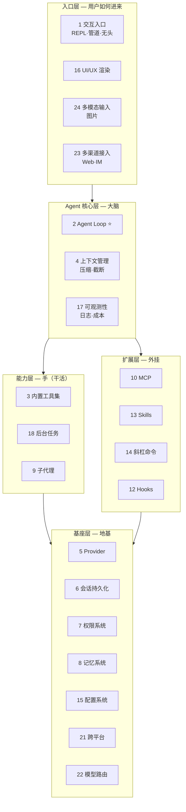

**层间关系**：入口层（用户怎么进来）→ Agent 核心层（大脑跑循环）→ 能力层（手干活）/ 扩展层（外挂能力）→ 基座层（地基支撑一切）。**支点 2 Agent Loop 是心脏**，所有上层功能都复用它、不动它——这是 ECode「地基稳」的红利。

**每个支点的统一写法**：

| 小节 | 写什么 |
|------|--------|
| **一句话** | 干什么、解决什么问题（无术语，给非开发者也能懂的场景） |
| **设计架构** | 关键组件、机制、数据流（文字） |
| **流程图** | Mermaid 可视化（flowchart / sequence 按需） |
| **当前项目怎么做** | 现状（已落地/缺口，`file:line` 实证）+ 落地设计 |

> 状态图例同第一部分：✅ 已完成 / 🟡 部分完成 / ❌ 桩代码 / ⬜ 未开始

---

### 支点 2：Agent Loop 核心 ⭐（地基）

> **状态**：✅ 已完成 ｜ **优先级**：—（地基，已完成）｜ **关联**：被几乎所有支点复用

**一句话**：agent 的「心脏」——一个不停转的循环：问 LLM → LLM 要调工具就去调 → 把工具结果喂回 LLM → 再问……直到 LLM 不再要工具、给出最终回答。**所有上层功能（无头模式、子代理、后台任务）都是在这个循环上增减，核心循环一行不改。**

**设计架构**

`runAgentStream`（`src/agent.ts:213`）是一个**异步生成器（async generator）**——边跑边吐事件（`yield`），消费方用 `for await` 接。这种设计让「同一个循环」能被不同入口复用：

| 消费方 | 怎么接事件 |
|--------|-----------|
| REPL（`use-agent-stream.ts`） | 渲染成 TUI（流式文字 + 工具折叠） |
| 无头模式（支点1，待做） | 吐成 JSON / NDJSON |
| 子代理（支点9，待做） | 吞掉中间过程，只留最终结论 |

每轮迭代做四件事：① 压缩检查（支点4）→ ② 消费 LLM 流（`yield text_delta` + 收集工具调用）→ ③ 记账（`yield usage`，支点17）→ ④ 执行工具（权限闸门 → 执行 → `yield tool_result`）→ 喂回 LLM 进下一轮。

**五种终止路径**（保证循环一定能停，不会无限烧 token）：

| 路径 | 触发 | 语义 |
|------|------|------|
| `done` | LLM 不再要工具 | 正常完成 |
| `max-iter` | 迭代到 `MAX_ITERATIONS` | 防跑飞（烧 token 闸） |
| `repeated` | 同工具 + 同签名连续 3 次 | 死循环检测 |
| `aborted` | `signal.aborted`（用户 Esc/Ctrl+C） | 用户中断 |
| `error` | 异常 | 错误退出 |

**两条铁律**（违反即 API 400 / 数据错乱）：
- `tool_result.tool_use_id` 必须**配对** `tool_use.id`（Anthropic API 硬要求）
- `messages` 是**累加**的，每轮传完整历史（不是替换）

**流程图**

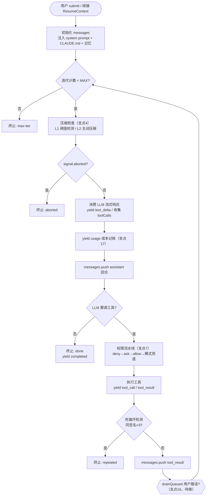

**当前项目怎么做**

- **已落地**（`src/agent.ts`）：`runAgentStream` 异步生成器 + 五终止路径 + `tool_use`↔`tool_result` 配对 + 死循环检测 + 续接 `ResumeContext`（把历史喂回 agent）。`runAgent` wrapper（`agent.ts:491`）是消费层范例。
- **无后续动作**：支点1 无头模式、支点3 工具集、支点9 子代理均**复用**它，核心循环一行不改。所有上层功能只在这个循环上「挂」事件或「加」入口，不动主干。


---

### 支点 5：多模型 / Provider 抽象

> **状态**：✅ 已完成 ｜ **优先级**：—（地基）｜ **关联**：支点17（成本归一化在 transform 层）、支点24（多模态扩展）

**一句话**：让 ECode 能接不同公司的模型（Anthropic / OpenAI 兼容，覆盖 GLM / DeepSeek / Claude / 任何 OpenAI 兼容端点），任意上下文窗口，用户可配置可切换——**加新公司新模型 = 改配置，零代码**。

**设计架构**

两级配置结构，天然支持「公司下不同模型」：
- `providers`（一级·公司）：`protocol`（anthropic/openai）+ `baseURL` + `apiKeyEnv`（指向环境变量，不明文存 key）
- `models`（二级·模型）：`provider`（指向上面的 key）+ `capabilities` + `contextWindow`

双协议适配：**Anthropic 原生**（claude provider，Messages API）/ **OpenAI 兼容**（openai provider，覆盖 GLM / DeepSeek / 任意兼容端点）。baseURL 三级优先级：`env > config.json > 协议默认`（切代理/端点不改文件）。

**流程图**

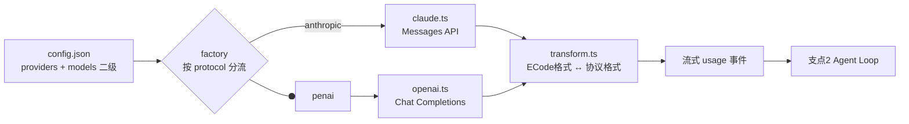

**当前项目怎么做**

- **已落地**（`src/providers/`）：claude.ts / openai.ts / factory.ts / transform.ts / config.ts / types.ts + `~/.ecode/config.json`
- 查询函数齐备：`listAvailableModels()` / `getContextWindow()` / `hasCapability()`；首次启动自动生成带注释的 config.json 模板
- **缺口**：`/model` 运行时切换是存根（`app.tsx:214` fall through）——归支点14 补全（照搬 SessionPicker 二级菜单，3 步纯 UI）

---

### 支点 6：会话持久化

> **状态**：✅ 已完成 ｜ **优先级**：—（地基）｜ **关联**：支点2（ResumeContext 续接）、支点1（入口族）

**一句话**：对话「存档」——关掉终端不丢，下次接着聊。四件事：**保存 / 恢复 / 续接 / 导出**，前三件全实现，导出不做。

**设计架构**

- **保存**：每轮自动落盘到 `.ecode/sessions/`（项目本地）
- **恢复**：`--continue` / `-c`（续最近）/ `--resume <id>`（指定）/ `/sessions` 列表 + `/resume` 弹面板切换
- **续接**：`ResumeContext`（id/task/createdAt/messages）把历史喂回 agent 的 `runAgentStream`
- **导出**：`/export` **不做**（YAGNI，用户确认不重要）

**流程图**

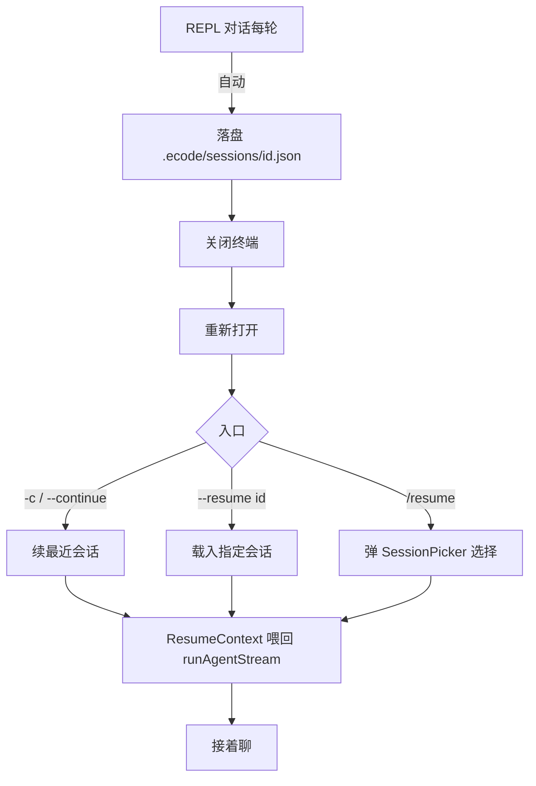

**当前项目怎么做**

- **已落地**（`src/session.ts`）：保存/恢复/续接三件全实现，入口齐全（`/sessions` 列表 + `/resume` 弹面板 + CLI 续接族 `--continue`/`-c`/`--resume` + 查询族 `--sessions`）
- **无后续动作**

---

### 支点 15：配置系统

> **状态**：✅ 核心机制就绪 ｜ **优先级**：—（基础设施，随各支点收口）｜ **关联**：支点4/7/10/12/21

**一句话**：ECode 所有「可调参数」的统一管理框架——配置来源分层、加载合并、存储格式、什么进 config 什么不进。

**设计架构**

三级优先级：`env > config.json > 内置默认`。

**配置边界**（关键决策）——轻量参数进 config，安装态走独立注册表：

| 类型 | 归宿 | 例 |
|---|---|---|
| 轻量参数 | `~/.ecode/config.json`（ECodeConfig） | 模型 / baseURL / 压缩参数 / 权限规则 / hooks |
| 安装态 | **独立注册表**（不进 config，防替换误删） | MCP / skill / plugin |

为什么安装态不进 config：用户会替换 config.json（换项目/拷贝覆盖），安装态塞进去会被**误删**。VS Code 扩展模式——安装/卸载时维护独立注册表，替换 config 不动它。

安全：API Key 不进 config，只存 `apiKeyEnv` 指向环境变量，真 key 走 `.env`（呼应 §9.2）。

**流程图**

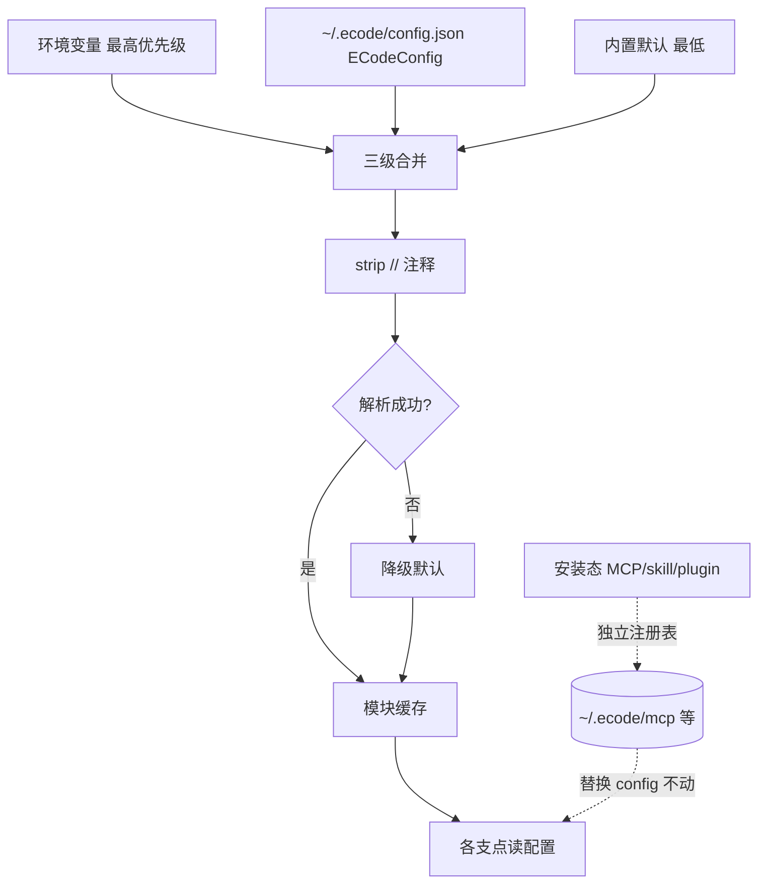

**当前项目怎么做**

- **已落地**（`src/providers/config.ts`，150 行）：文件加载 + 三级优先级 + `//` 注释支持（手动 strip）+ 解析失败降级 + 模块缓存 + 首次生成模板 + `apiKeyEnv` 脱敏
- **统一收口后置**：各支点（4/7/10/12）实现完，配置项自然冒出来再统一挂 ECodeConfig（YAGNI，现在猜会过度设计）
- **隐患**（归支点21）：`config.ts:26` 用 `homedir()` 定位 `~/.ecode/`，§9.3 要求统一 `resolveDataDir()`——跨平台收口时处理

---

### 支点 1：交互入口模式

> **状态**：🟡（REPL 完整 / 无头+管道待补）｜ **优先级**：P1 ｜ **关联**：支点2（复用 runAgentStream）、支点23（网络型入口）

**一句话**：ECode 怎么被启动和交互——三种入口：**REPL**（坐下来对话）/ **无头**（给脚本/CI 调用，吐结构化输出）/ **管道**（接 Unix 管道，喂输入/接输出）。让 ECode 从「给人手动开的聊天窗口」变成「能给 shell 脚本调用的命令行工具」。

**设计架构**

入口判定（`selectEntryMode` 纯函数，`src/repl-mode.ts`）按命令行参数 + TTY 分流。无头模式**复用主干道 `runAgentStream`，只动入口（管道）与出口（无头），核心循环一行不改**。

关键认知：无头 / 管道是**两个正交维度**——无头管「怎么跑」（非交互），管道管「输入输出接哪」（`|` `<` `>`），可任意组合：`cat err.log | ecode -p "分析" | jq '.result' > 答.txt`。

**流程图**

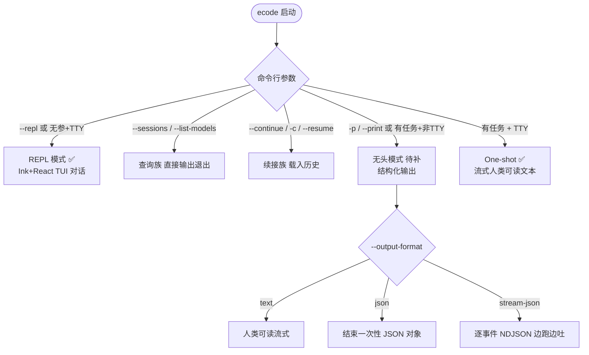

**当前项目怎么做**

- **已落地**：REPL 完整（Ink TUI）；one-shot 流式文本；入口判定 `selectEntryMode`；续接族 + 查询族齐全
- **待补**（P1）：无头模式 `ecode -p`——新增 `src/headless.ts`（纯输出消费层，~30 行，`for await` 消费 `runAgentStream`）+ 3 个 CLI 选项（`-p` / `--output-format` / `--max-turns`）+ 管道输入（`stdin.isTTY===false` 检测 → `<pipe_input>` 标签拼接）。**不加载 Ink/React**（保持快启动）

---

### 支点 3：内置工具集

> **状态**：🟡（5 已有 / 3 缺 / 3 待专用化）｜ **优先级**：P0 ｜ **关联**：支点7（工具过权限）、支点10（MCP 外部工具）、支点13（Skill 组合工具）、支点21（bash 跨平台）

**一句话**：agent 随身装备的基础工具——文件 CRUD / 搜索 / 执行 / 任务管理 / 网络。**开箱即用**，不装 MCP 就能干活。

**设计架构**

三层归类边界（判断口诀：① 是动作还是方法？方法=Skill；② 接外部系统吗？是=MCP；③ 通用必备吗？是=内置）：

| 层 | 本质 | 归属 |
|----|------|------|
| **内置工具** | agent 随身装备，开箱即用 | 文件 CRUD / 搜索 / 执行 / 任务管理 / 通用 fetch |
| **MCP**（支点10） | 接外部系统的桥，按需装 | GitHub / Slack / Jira / 数据库 |
| **Skill**（支点13） | 菜谱（组合工具 + 方法论），**不是工具** | 代码审查 / 部署 / 重构 |

工具全集 11 个（5 已有 + 3 缺 + 3 bash 代）。跨平台只有 **bash 系是真战场**（shell 方言不通），其余 10 个天然跨平台。

**跨平台三招**：① **环境上下文注入**（最省钱，system prompt 告诉 LLM 平台/shell）→ ② **专用工具**（delete/move/ls 用 Node `fs` 绕开 shell）→ ③ **统一 shell**（bash 工具 Windows 自探测 Git Bash/WSL）。

**流程图**

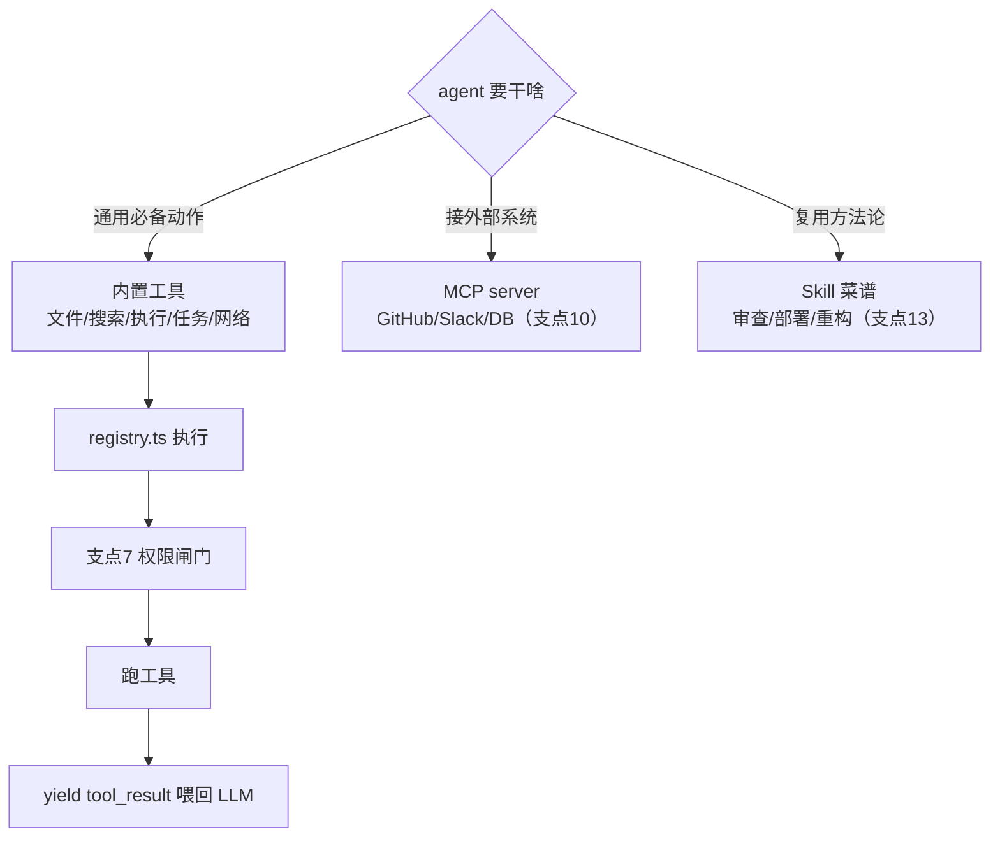

**当前项目怎么做**

- **已落地**（`src/tools/registry.ts`）：5 个——`read_file` / `bash` / `edit_file`（含 0/多/唯一匹配兜底）/ `grep` / `glob`
- **待补**（P0）：`write_file`（UI 已预留折叠规则，核心未注册）、`TodoWrite`（内存任务状态）、`fetch`（Node 18+ 全局 fetch）；`delete_file` / `move` / `ls` 从 bash 代劳升级为 Node `fs` 专用工具（跨平台倒逼 + 安全 + 免审批）

---

### 支点 4：上下文管理（token / 压缩 / 截断）

> **状态**：🟡（L1-L4 全实现 / 手动入口+参数配置待补）｜ **优先级**：P0 ｜ **关联**：支点2（挂循环前）、支点17（Ctx% 阈值）、支点15（压缩参数配置）

**一句话**：控制「喂给 LLM 的对话历史有多大」。LLM 有上下文窗口上限（如 GLM 1M token），对话越长历史越膨胀，超了 API 报错。本支点：**检测快满了 → 压缩历史（留近的、摘要旧的）→ 不超**。

**设计架构**

四级防线（核心代码 `src/context-manager.ts` + `src/agent.ts`）：

| 级别 | 干啥 | 触发 |
|------|------|------|
| **L1 阈值检测** | 监控历史逼近窗口上限 | 每轮迭代前（窗口×0.8） |
| **L2 主动压缩** | 快满了先压（先白嫖后花钱） | 每轮迭代前 |
| **L3 响应式恢复** | API 真报超限了，抢救 | API 报上下文窗口错误 |
| **L4 熔断** | 抢救 3 次还不行，放弃 | L3 重试计数 `MAX_CONTEXT_RETRIES=3` |

L2 级联（先省后花）：① `trimToolResultContents`（零 LLM 成本，旧 tool_result 换占位符）→ ② `compressMessages`（花一次 LLM 调用摘要旧消息）。

**两条铁律**（违反即 API 400）：① 不劈开「工具往返」（`tool_use` 与配对 `tool_result` 必须连一起，`splitForCompression` 保证边界切）；② 压缩后结构不变（`verifyMessagesPairing` 检查）。

**流程图**

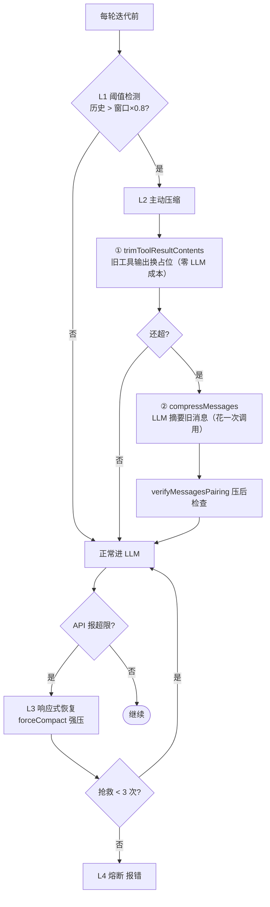

**当前项目怎么做**

- **已落地**：L1-L4 全实现；🔴-1（forceCompact 死代码）**已修**（`agent.ts:312` 实际调用）
- **待补**：① `/compact` 手动压缩（已注册未实现，`app.tsx:214` fall through——调 `api.compact()` 复用 `forceCompact`）；② 压缩参数配置化（现硬编码 `keepRounds=6`/`keepRecent=3`/`阈值=0.8`，进 config 的 `context` 块）

---

### 支点 7：权限系统

> **状态**：🟡 ｜ **优先级**：P0（安全底线）｜ **关联**：支点3（工具过闸）、支点9（子代理权限⊆主代理）、支点10（MCP 工具纳入）、支点12（hook vs 规则边界）。完整设计见 [M4 三件套](../里程碑/M4-实施方案[进行中].md)

**一句话**：agent 执行有副作用操作（改文件 / 跑命令 / 删东西）前的**审批闸门**——根据规则决定「直接放行 / 先问 / 直接拒」。走 opencode 精简路线（非 CC 重工业），不用 tree-sinter（原生二进制撞 §9.3 红线）。

**设计架构**

两层架构：**模式（粗旋钮，整体宽松度）+ 规则（精细名单，具体命令/路径）**。规则优先于模式——名单明确的按名单，没提的才看模式兜底。

三档模式（砍 plan——用 deny 规则 `edit:{"*":"deny"}` 模拟更灵活）：`default`（危险才问）/ `acceptEdits`（编辑放行，bash 仍按规则，**日常主力**）/ `bypass`（全放行，CI/调试）。

命令分级用 **arity 字典**（命令前缀→token 数，纯 TS 无依赖），不用 tree-sitter AST。规则配置扁平 **last wins**（项目级覆盖用户级）。allow_always 默认**不写盘**（防误点永久放行）。

安全网（P0 必做）：路径越界（读写工作目录外要问）+ 敏感文件黑名单（`.env`/`.gitconfig` 等编辑总问，即使 acceptEdits）。

**流程图**

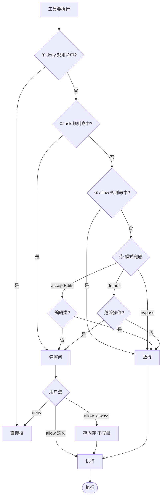

**当前项目怎么做**

- **已落地**：bash 已纳入审批；`permission-dialog.tsx` 三选项（allow / allow_always / deny）+ **425ms grace period（ECode 独有亮点，必留）**
- **待补**（P0）：① `edit_file` 改文件却不问——**该问不问**（CC/opencode/CCode 都问），注册工具时配权限；② 路径越界 + 敏感文件黑名单；③ 命令分级 arity 字典；④ 工具默认策略（write/delete/move 该问，TodoWrite/ls 不问）；⑤ 修 🔴-2（`allow` vs `allow_always` 语义崩塌，选「这次」被记成「永久」）

---

### 支点 16：UI / UX —— 用户插话机制

> **状态**：🟡（基础渲染完成 / 插话待补）｜ **优先级**：P1 ｜ **关联**：支点2（drain 挂循环）、支点18（后台跑时能否插话）。完整方案见 [用户插话机制方案[已完成].md](用户插话机制方案[已完成].md)

**一句话**：agent 正在跑（streaming + 工具循环）时，用户能继续打字、发出去、参与进当前对话——**而不是干等它跑完**。选定**排队式**（mid-turn drain，对齐 CC 键盘默认）。

**设计架构**

现状是行业最保守一档：`app.tsx:277` `disabled={api.isRunning}` → agent 跑时输入框锁死。CC 相反——运行中不禁用，还鼓励插话。

排队式语义：话排队，等当前工具跑完、下轮问 LLM 前**塞进去**，LLM 同轮可见。不打断、不无视、自然衔接。

**drain 点（心脏）**：`agent.ts:415` toolCalls for 循环右括号后、重复检测前——这是 tool_result 已配对闭环、stream 未启的**安全窗口**，只 append 一条 user message，不破坏 tool_use_id 配对。

**流程图**

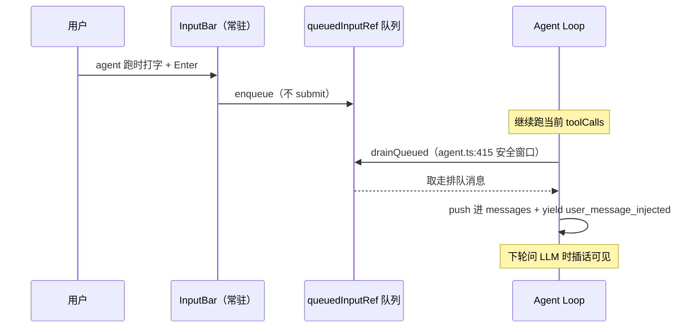

**当前项目怎么做**

- **已落地**：基础流式渲染 / 工具折叠 / Ctrl+O pager
- **待补**（P1，~80 行产品代码 + ~50 行测试，6 文件）：① InputBar 去 `disabled={isRunning}`，输入框常驻；② `handleSubmit` 判 `isRunning` → 普通文本 `enqueue`；③ `useAgentStream` 加 `queuedInputRef` + `enqueue()` + `drainQueued` 回调；④ `agent.ts:415` 加 drain。**约束**：drain 前查 `signal.aborted`（竞态保护）、drain 后清零 `lastSignature`（插话=新意图，防误判死循环）、slash 命令不进队列

---

### 支点 17：可观测性（日志 / 成本 / 结构化）

> **状态**：🟡（日志+结构化生产级 / 成本追踪重做）｜ **优先级**：P1（修 bug 部分 P0）｜ **关联**：支点2（yield usage）、支点5（transform 归一化）、支点15（单价表配置）

**一句话**：agent 运行时的「仪表盘」——**日志**（排查用）、**成本**（花了多少钱/token）、**结构化事件**（程序可解析）。前两个生产级，成本追踪要重做（cache 不归一化必错）。

**设计架构**

三大支柱：① 结构化事件（`agent-events.ts` 判别联合，生产级）；② 日志（`runtime-logger.ts` 双层：主 `.md` 摘要 + `raw/round-N.req|resp.json` 完整 payload，生产级）；③ 成本/用量（**重做**）。

**成本算法核心**（研究重点）——不同 provider 的 cache 字段**语义相反**（有的互斥分项、有的子集），同一句话在三家算法不同：

| provider | 语义 | 正确算法 |
|---|---|---|
| Anthropic | 互斥分项 | 直接加 |
| OpenAI 标准 / **GLM**（嵌套） | 子集 | **必须减** |
| **DeepSeek**（顶层） | 互斥分项 | 直接加（字段名不同） |

不管 provider 怎么报，transform 出口一律吐**互斥五项** `{input, cacheRead, cacheWrite, output, reasoning}`（字段探测，不靠 config 标注）。**reasoning 是展示项不计费**（它是 output 子集，再算会双计）。

两个公式：**成本** = `(input×P.in + cacheRead×P.cR + cacheWrite×P.cW + output×P.out) / 1M`；**Ctx%** = `(input + cacheRead + cacheWrite) / contextWindow × 100`（纯 input 侧，下轮才进窗口）。

**流程图**

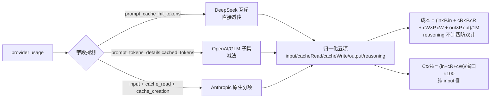

**当前项目怎么做**

- **已落地**：结构化事件 + 双层日志（生产级）
- **待补**：① usage 类型扩五项互斥模型（`agent-events.ts:44` + `types.ts`）；② transform 出口归一化（字段探测 + 子集减法，`transform.ts:86,189` / `claude.ts` / `openai.ts`）；③ `ModelConfig` 加 `cost` 四绝对值字段 + 新建 `cost-tracker.ts`（从 `status-bar.tsx:27` 抽出硬编码价）；④ Ctx% 分子改三项和（`app.tsx:284`）；⑤ **修 bug**（P0）：`claude.ts:79` Anthropic 流式 inputTokens 写死 0、`agent.ts:337` runtime log 硬编码 0。持久化 session 级起步、跨会话后置

---

### 支点 18：后台任务（长运行 shell 不阻塞 agent loop）

> **状态**：⬜ ｜ **优先级**：P1（高频刚需）｜ **关联**：支点2（executeTool 不阻塞）、支点9（调度底座共用）、支点16（后台跑时插话）、支点17（完成事件）

**一句话**：跑测试 / dev server / 长构建是高频刚需，但现 bash 是 `execSync` 同步阻塞——**长命令卡死整个 agent loop**。本支点：命令后台跑、agent 不阻塞、完成主动通知。

**设计架构**

本质区分：后台任务（**shell 命令**没脑子）vs 子代理（**agent 循环**有脑子）是正交两维度——支点18 专指 shell 命令后台化，不套 agent（opencode 把 background 强绑子 agent 是教训）。

四件套：① **触发**（bash 加 `run_in_background`，首版只做显式一条路径）；② **输出缓冲**（抄 CC 纯落盘——`spawn` → pipe → 落盘 `tasks/taskId.output`，内存零保留，走 `resolveDataDir()`，100MB cap，`O_NOFOLLOW`+`O_EXCL` 安全）；③ **完成通知**（child exit → 注入 `<background_task_result>` + emit 事件）；④ **控制查询**（`TaskOutput` tail/增量读 + `TaskStop` kill 进程树）。

**唤醒 agent（关键认知）**：注入点**不在 `agent.ts` loop 内部**（loop 是单次 submit 生命周期），而在 **`use-agent-stream` 层**——agent idle 自动启动新一轮，running 则排队，**并发红线：绝不两个 runAgentStream 并发**。

**流程图**

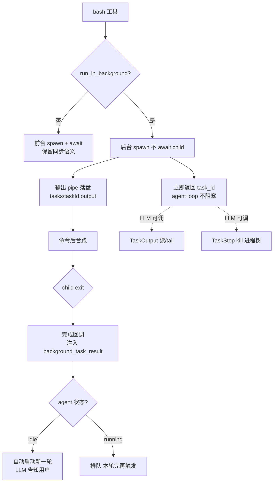

**当前项目怎么做**

- **现状（根因）**：`src/tools/bash.ts:7` 用 `execSync` 同步阻塞，maxBuffer 10MB（内存）、timeout 30s——长命令卡死 loop、超 10MB 报错、超 30s 被杀
- **待补**（P1）：① `bash.ts` `execSync`→`spawn`（async）+ `run_in_background` 分支；② 新建 `background-task.ts`（task 注册表 + 落盘抄 `DiskTaskOutput` + 完成回调）；③ `registry.ts` 加 `TaskOutput`/`TaskStop`；④ `use-agent-stream.ts` 加 wake 机制（核心难点）；⑤ `agent-events.ts` 加 `background_task_completed`；⑥ UI 专属渲染 + StatusBar 计数。**跨平台**：kill 进程树 Win `taskkill /T` / Unix `process.kill(-pid)`；主进程死全 kill 仅留输出记录

---

### 支点 9：子代理 Subagent（独立上下文 / 并行 / 只回结论）

> **状态**：⬜ ｜ **优先级**：P2（M5+）｜ **关联**：支点2（递归 runAgentStream）、支点7（权限⊆主代理）、支点17（实时可观测）、支点18（调度底座共享，别混）、支点22（模型路由派发）

**一句话**：主代理派「侦察兵」子代理**独立跑**（独立上下文 / 人设 / 工具），**只回最终结论**，中间过程主代理一概看不到——避免污染主上下文、支持并行。

**设计架构**

- **本质 = 递归调一次 `runAgentStream`**：换独立系统提示词 + 工具子集 + 空 messages，跑完回最终文本。不造新循环，地基直接复用（跟支点1 无头模式同一循环）。
- **只回结论不回过程**：子代理的中间 tool_use/tool_result 主代理看不到。Why：主代理拿结论后还要自己加工组织；若子代理回完整过程 → 主代理退化成"传话筒" + 污染主上下文。
- **权限红线：子代理 ⊆ 主代理**（只能更严不能更宽，防权限代持绕审批——主代理 default 模式改文件要审批，若子代理权限更宽就能偷偷改）。子代理调工具仍走权限流水线（deny→ask→allow→mode），**ask 弹窗归主对话**（子代理不自己弹）。
- **三边界**：**读**（默认读项目 CLAUDE.md + memory 获取背景，如"用 npm 不用 pnpm"，复用 `loadInstructions`，人设可覆盖）/ **写**（不独立沉淀记忆，跑完即弃，结论回主代理决定记不记）/ **会话**（不独立存 session，是主对话的一次工具调用）。
- **与支点18 的区分**（别混）：后台任务（**shell 命令**没脑子）vs 子代理（**agent 循环**有脑子）是正交两维度——共享调度底座（task id + 输出流 + 完成通知），但支点18 不套 agent（opencode 把 background 强绑子 agent 是教训）。

**流程图**

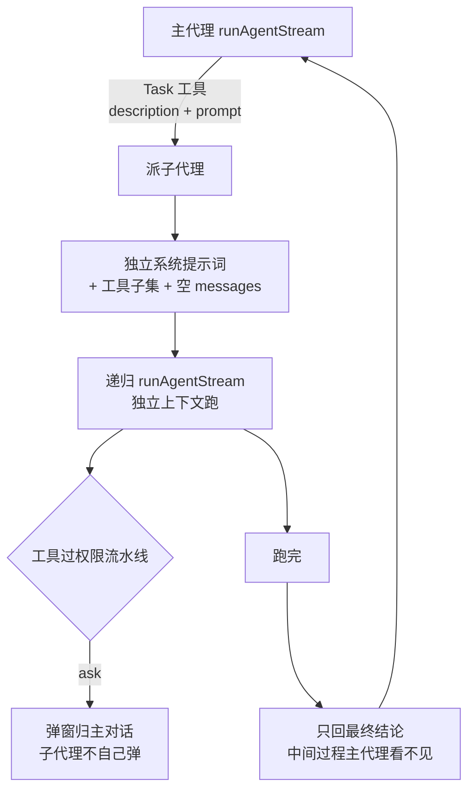

**当前项目怎么做**

- **现状**：未开始（M5+）
- **待补**（P2）：① `Task` 工具（入参 description + prompt → 派子代理）；② 递归 runAgentStream（换提示词 + 工具子集 + 空 messages）；③ 权限⊆ 机制（继承主代理模式+规则，人设 `tools:` 收紧，ask 归主对话）；④ 实时可观测（后续增强，关联支点17——子代理跑时能查看进度）。**YAGNI**：现单 agent 够用，等真实并行需求 + 上下文污染压力再做

---

### 支点 24：多模态输入（图片上传与解析）

> **状态**：⬜ ｜ **优先级**：P1（核心体验）｜ **关联**：支点5（Provider 多模态扩展，前置）、支点7（read-image 权限）、支点14（@file 解析器共用）、支点23（Web 渠道复用管道）

**一句话**：用户把图片喂给 ECode → 编码成多模态 message → 送 vision 模型。**ECode 自己不解析**（解析是 LLM 的能力）。主力=粘贴，**绕开终端字节流**（按键只是信号，触发后 spawn 系统剪贴板命令问 OS 要图片二进制）。

**设计架构**

架构红利：`ECodeMessage.content` **已经是 `string | ECodeContentBlock[]` 联合类型**（`providers/types.ts:30`）——加图片是给联合加 `image` 分支，不是推翻重做。三个穷尽式 switch（`default: never`）会编译器强制提醒补 case。

协议两派（transform 各写一套）：**Anthropic 原生**（裸 base64）/ **OpenAI 兼容**（`image_url` dataURL，**GLM/DeepSeek 主力**）。ECode 内部统一 base64，发送按端点转。

输入方式：**粘贴**（主力，Ctrl+V mac/linux、Alt+V win）/ `@路径`（备用，复用 @file 解析器分流）/ `read-image` 工具（LLM 主动）。占位符两段式（输入框插 `[Image #N]`，submit 时替换真实 block）。

**流程图**

```mermaid
flowchart TD
  Key["Ctrl+V（mac/linux）/ Alt+V（win）"] --> Spawn[spawn 系统剪贴板命令]
  Spawn --> Platform{平台分流}
  Platform -->|mac| Osascript[osascript 写临时 PNG]
  Platform -->|win / WSL| Powershell["powershell.exe .NET Clipboard<br/>（WSL 也走 win powershell）"]
  Platform -->|linux X11| Xclip[xclip]
  Platform -->|linux Wayland| Wl[wl-paste]
  Osascript --> B64[读 base64]
  Powershell --> B64
  Xclip --> B64
  Wl --> B64
  B64 --> Preproc[sharp 压 5MB/1568px<br/>+ WSL2 BMP 检测转 PNG]
  Preproc --> Block[image block 注入 content]
  Block --> Submit[submit [Image #N] 替换真实 block]
```

**当前项目怎么做**

- **现状**：未开始（架构红利已就位，content 已是 block[] 联合）
- **三个硬障碍**（动手前必须解决）：① GLM coding 端点是否支持 image（`/coding/paas/v4` 套餐专属，多模态可能要走 `/paas/v4`，curl 验证）；② token 估算（`token-counter.ts:38` 现 `length/4`，对 base64 图片严重低估，image case 按像素/固定 ~1500 token）；③ 压缩时图片（摘要 LLM 喂 base64 会 token 爆炸，`blockToText` image 输出占位 `[图片]`）
- **改造**（9 处，加分支级别）：`types.ts` 加 image variant / `transform.ts` 两派各加 case / `token-counter.ts` image 估值 / `context-manager.ts` 占位 / 新建 `clipboard.ts` 平台分流 / `input-bar.tsx` + 新 `read-image` 工具。第一版 Ctrl+V 简化为纯图片触发器（完整协调器后续优先级低）

---

### 支点 8：记忆系统

> **状态**：🟡（CLAUDE.md 注入完成 / memory 自动加载+经验沉淀待补）｜ **优先级**：P1 ｜ **关联**：支点13（自动生成 skill=经验沉淀闭环）、支点15（配置）、支点21（user 目录走 resolveDataDir）

**一句话**：解决 LLM「金鱼记忆」——LLM 每次调用都是全新的，不记得上次。解决：**把记忆写进文件，每次调用都塞进 system prompt**，它就「每次都看到」了。

**设计架构**

本质机制：记忆写文件 → 每次调用注入 system prompt。现状 CLAUDE.md 注入已实现（`loadInstructions()` + `buildSystemPrompt()`，读 home+cwd 两层 CLAUDE.md/ECODE.md）。

**memory 三层自动加载**（待补）——读三层合并注入，跟 CLAUDE.md 多目录读取同模式：

| 层 | 位置 | 放什么 |
|----|------|--------|
| **user 级** | `~/.ecode/memory/`（不进 git，云盘同步） | 个人偏好 / 通用流程（跨所有项目） |
| **项目共享** | `docs/memory/`（git 跟踪） | 项目决策 / 踩坑 / 进度（团队共享） |
| **项目个人** | `.ecode/memory.local/`（gitignore） | 私人笔记 / 含敏感信息的踩坑 |

加载逻辑：读三层 `MEMORY.md` 索引（一行一条摘要，便宜）+ 按需读相关分类文件 → 合并注入（**不无脑全注入**，token 控制）。

**流程图**

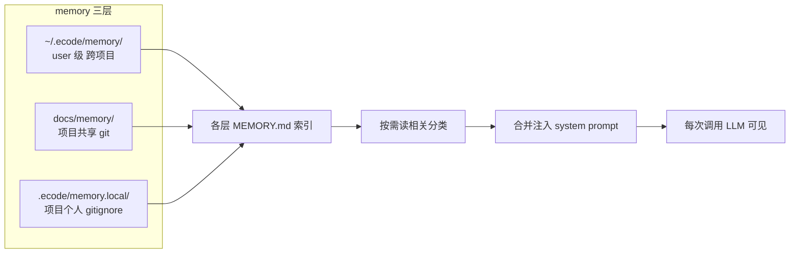

**当前项目怎么做**

- **已落地**：CLAUDE.md → system prompt 注入（`instructions-loader.ts`）
- **待补**（P1）：① memory 三层自动加载（读 MEMORY.md 索引 + 分类，合并注入）；② user 级 `~/.ecode/` 定位**必须走 `resolveDataDir()`**（呼应支点21，禁用 `os.homedir()`——Windows/WSL 两套 home 对不上）；③ 自动生成 skill（经验沉淀闭环，主体归支点13）

---

### 支点 10：MCP 扩展（Model Context Protocol）

> **状态**：⬜ ｜ **优先级**：P2（M5+）｜ **关联**：支点7（MCP 工具纳入权限）、支点13（砍 Prompts 归 Skill）、支点14（/mcp）、支点17（状态查看）

**一句话**：给 agent 装「第三方 App」的应用商店协议——别人写好的工具服务器（GitHub / Slack / 数据库），接上就能用，不用自造。**生态红利**：CC 生态已有大量现成 MCP server，接上协议白嫖全部。

**设计架构**

类比：内置工具（read/write/bash）= 手机自带应用；MCP server = App Store 第三方 App；agent = 手机，装上就能干更多事。

机制：① 配置登记一个 server → ② agent 启动连上（stdio 本地 / Streamable HTTP 远程）→ ③ server 告知「我有这些工具」→ ④ 工具透明加入工具列表 → ⑤ **LLM 需要时自动调用**（不用 / 命令触发）。

**配置归属**：MCP **安装态独立注册表**（`~/.ecode/mcp/`），不进 config.json——VS Code 扩展模式，防用户替换 config 时连坐删除 MCP。

三个原语取舍：**Tools**（做，自动调）/ Prompts（砍，跟 Skill 重复）/ Resources（后置）。传输分阶段：阶段1 stdio → 阶段2 Streamable HTTP（旧 SSE 已废弃）。**安全红线**：MCP server 是第三方不可信代码 → 纳入权限系统 + 显式登记 + 防 stdio RCE。

**流程图**

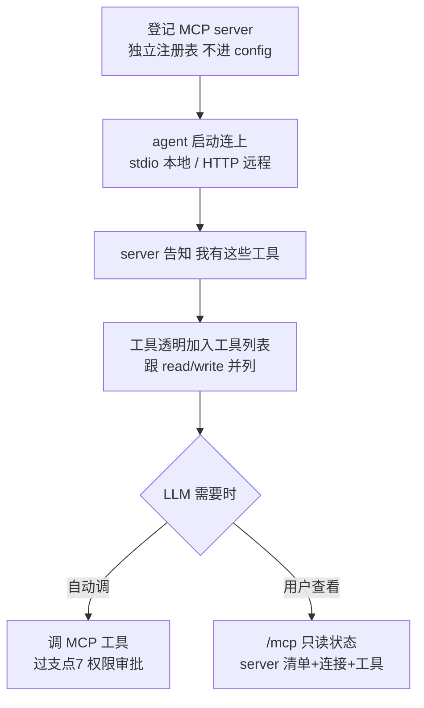

**当前项目怎么做**

- **现状**：未开始
- **待补**（P2）：① 阶段1 stdio + Tools（LLM 自动调）；② `/mcp` 只读状态查看（server 清单 + 连接状态 + 工具清单）；③ MCP 工具纳入支点7 权限系统；④ 安装态独立注册表（支点15 边界）。**待查证**：Prompts/Resources 砍与后置的最终定论

---

### 支点 12：Hooks 系统（事件钩子）

> **状态**：⬜ ｜ **优先级**：P2（M5+）｜ **关联**：支点7（hook vs 规则边界）、支点9（Subagent 事件）、支点13（自动归纳依赖 hooks）、支点15（配置分层）、支点17（审计/通知）

**一句话**：在 agent 生命周期的关键事件点上挂自定义脚本，agent 走到那自动跑——**Git hooks 的 agent 版**。

**设计架构**

三个核心 hook：

| Hook | 比喻 | 时机 | 能干啥 |
|------|------|------|--------|
| PreToolUse | 🚪 门卫 | 工具执行**前** | 拦截(deny)/改输入/提醒 |
| PostToolUse | 📋 监工 | 工具执行**后** | 改输出/记账/通知 |
| Stop | ✅ 验收员 | agent 要停 | 打回继续干/反馈 |

hook vs 权限规则：规则是静态黑白名单（硬底线），hook 是动态脚本（复杂判断）。执行顺序：`PreToolUse hook → 权限规则 → 工具执行 → PostToolUse hook`。权限 deny 是硬边界，hook 不能覆盖。

**配置分层（核心）**：系统 hooks **写代码里，强制叠加，用户改不了**（例：内置拦 `rm -rf /`、保护 `.env`，用户关不掉）；用户 hooks 进 config 的 hooks 块（分层：用户/项目/项目本地）。系统级一切跟 config 零依赖——呼应 §9.3。

先做 6 核心事件：SessionStart/End + UserPromptSubmit + Pre/PostToolUse + Stop。

**流程图**


**当前项目怎么做**

- **现状**：未开始；挂点已定位（`agent.ts:374` 权限前 / `:429` executeTool 后 / 4 处 `completed` yield 抽 `emitCompleted`）
- **待补**（P2）：① 6 核心事件；② 系统 hooks 代码注册强制叠加；③ 用户 hooks 进 config 分层；④ 实现——Pre/Post 必须 Promise-await 注入回调（仿 `permissionGate`，不能用事件流），Stop 可复用事件流；⑤ handler 先做 command（shell），跨平台 shell 分流走支点21

---

### 支点 13：技能 Skills（可复用工作流）

> **状态**：⬜ ｜ **优先级**：P3（M5+）｜ **关联**：支点8（自动生成=经验沉淀）、支点10（砍 Prompts 归这）、支点12（自动归纳依赖 hooks）、支点14（/skill + /accept）、支点15（安装态独立注册）

**一句话**：可复用的「工作流菜谱」——把一次性摸索出来的成功流程写成 skill，下次照菜谱干，不重新摸索。场景：部署流程、代码审查 checklist、调试某类 bug 的步骤——写一次反复用。

**设计架构**

两种来源：① **手写**（用户/团队写 SKILL.md）② **自动生成**（agent 总结经验沉淀）。格式：`SKILL.md` + YAML frontmatter——**三家事实标准**（CC/openclaw/opencode 全识别），用此格式=零成本跨工具生态兼容。

**懒加载注入（技术核心）**：启动只把 name+description 拼进 system prompt（catalog，便宜），触发后才读正文 → 防 prompt 爆炸。跟 CLAUDE.md 全量注入不同，skill 是**按需注入**。

触发：手动 `/skill xxx` + LLM 匹配 description 自动用，**两个都做**。

**自动生成质量命门**：agent 生成的 skill **不直接落盘** → 进 proposal 审批队列 → 安全扫描 → 用户 `/accept` 才转正（否则重复犯错）。归纳用 LLM（非正则）。依赖支点12 hooks（Stop hook 触发总结）——这就是 hooks 是 P2、skill 是 P3（13 依赖 12）。

**流程图**

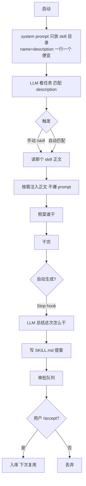

**当前项目怎么做**

- **现状**：未开始
- **待补**（P3，分阶段）：阶段1 **手写**（SKILL.md + 懒加载 + /skill 手动 + 自动匹配）先行；阶段2 **自动生成**（LLM 归纳 + proposal 审批队列）后置（依赖支点12）。文件投放抄 opencode glob（`{skills}/**/SKILL.md` 自动发现，零 manifest）

---

### 支点 14：斜杠命令（命令注册中心）

> **状态**：🟡（解析+补全完成 / 内置解耦+自定义命令待补）｜ **优先级**：P1 ｜ **关联**：支点10（MCP 命令）、支点13（Skill 区分）、支点24（@file 解析器共用）、支点7（!cmd 过权限）

**一句话**：**命令注册中心 + 解析 + 补全**（基础设施）。具体命令的*实现*归各支点（`/mcp`→支点10、`/skill`→支点13），本支点只管「统一注册 + 识别 + 补全 UX」。

**设计架构**

两层扩展架构：

| 层 | 做什么 |
|----|--------|
| **第一层：内置命令自包含化** | `SlashCommandDef` 自带 `handler(ctx)`，加内置命令一处搞定、不动 `app.tsx`（去 switch） |
| **第二层：自定义命令 `.md` 注入** | 用户放 `.ecode/commands/xxx.md` → 自动成 `/xxx`，执行= `.md` 内容注入对话交给 LLM，**零代码** |

自定义命令三层作用域：用户级（`~/.ecode/commands/`，走 `resolveDataDir`）/ 项目级（`.ecode/commands/`，git 共享）/ 系统级（自带模板）。优先级 项目级 > 用户级 > 系统级；代码内置命令最高、不可被 `.md` 覆盖。

**@file 横切解析器**（关键架构决策）：`@file` 是横切基础设施，支点14（文本注入）和支点24（图片注入）**共用一个解析器**，按扩展名/内容分流（文本→读内容、图片→base64、其他→拒绝）。

**流程图**

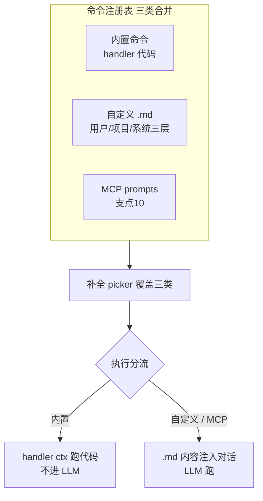

**当前项目怎么做**

- **已落地**：解析 `parseUserInput`（支持 args）+ 补全 picker（`/` 前缀匹配 + ↑↓ Enter）
- **待补**（P1）：① 内置命令自包含化（SlashCommandDef + CommandContext，去 `app.tsx:166-225` 的 switch）；② 自定义命令 `.md` 注入（frontmatter `description`/`argument-hint` + `$ARGUMENTS`/`$1` 参数 + `@file` + `!cmd` 过权限）；③ @file 横切解析器独立模块；④ 存根命令补全（`/model` /compact，照搬 SessionPicker 二级菜单）

---

### 支点 21：跨平台适配（Windows / WSL / Linux / macOS）

> **状态**：🟡 ｜ **优先级**：P1 ｜ **关联**：本支点是**收口性质**——跨平台红线散落在支点3/15/18，这里聚成统一机制 + 检查清单

**一句话**：让 ECode 在 Windows / WSL / Linux / macOS 多端都能正常跑。这是**每个支点都要过的必检维度**，本支点不是新功能，是把散落的跨平台坑收口成一套统一机制 + 检查清单。

**设计架构**

核心铁律（§9.3）：**数据目录统一走 `resolveDataDir()`**，禁用 `os.homedir()` / `~` / `$HOME`——构建跑 Windows、Claude Code 跑 WSL 时两套 home 是不同物理目录，散用会读到空数据。`resolveDataDir()` 优先级：显式 > env > 自探测对端 home > 默认 home，模块级缓存。

**跨平台三招**（散落在各支点，本支点收口）：

| 招 | 干啥 | 归属 |
|----|------|------|
| ① **环境上下文注入** | system prompt 告诉 LLM 平台/shell/cwd/版本，让它写对命令（最省钱） | 支点3 |
| ② **专用工具** | delete/move/ls 用 Node `fs` 绕开 shell | 支点3 |
| ③ **统一 shell** | bash 工具 Windows 自探测 Git Bash/WSL，agent 永远写 bash 语法 | 支点3/18 |

**进程管理**：kill 进程树——Windows `taskkill /T /PID`、Unix 进程组 `process.kill(-pgid)`（必处理，否则 orphan 子进程）。`spawn` 跨平台 OK 但要显式指定 shell。

**跨平台检查清单**（每个支点实现时过）：
1. 路径分隔符——用 `path.join`，禁字符串拼 `/`
2. shell 语法——Win cmd/PowerShell ≠ Unix bash，靠环境注入 + 统一 shell
3. 数据目录——走 `resolveDataDir()`，禁 `homedir()`
4. 原生二进制——tree-sitter 等撞 §9.3 红线，避开（用纯 TS 替代如 arity 字典）

**流程图**

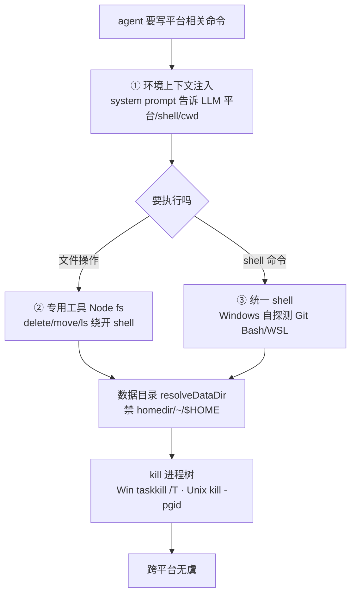

**当前项目怎么做**

- **已落地**：路径用 `path.join`；部分接入 `resolveDataDir`
- **待补**（P1）：① bash 工具 shell 分流（Win 自探测 Git Bash/WSL）；② `resolveDataDir()` 全面落地（替换 `config.ts:26` 的 `homedir()`、memory 的 user 目录、后台任务输出路径）；③ kill 进程树跨平台（支点18 TaskStop）；④ 环境上下文注入补全（system prompt 注入平台/shell/cwd/版本/项目特征）

---

### 支点 22：模型路由（任务分级）

> **状态**：⬜ ｜ **优先级**：P3（远期）｜ **关联**：支点9（子代理派不同模型）、支点5（Provider 多模型）、支点17（成本优化）

**一句话**：不同任务派不同模型——**复杂任务派强模型**（推理重）、**简单/批量任务派便宜模型**（省钱）。在能力与成本间找平衡。

**设计架构**

路由决策层（远期）——在 `runAgentStream` 之上加一层「任务分级」，按场景派模型：

| 场景 | 派谁 |
|------|------|
| 复杂推理 / 架构决策 | 强模型（如 Claude / GLM 大杯） |
| 简单问答 / 批量改写 | 便宜模型（如 DeepSeek / GLM 小杯） |
| 子代理派发（支点9） | 各子代理按人设派不同模型 |
| 上下文压缩摘要（支点4） | 便宜模型（摘要不需强推理） |

**关键约束**：路由决策本身要轻（不能为选模型花掉省下的钱）——首版用规则映射（任务类型→模型），不引入额外 LLM 决策。

**流程图**

```mermaid
flowchart TD
  Task[任务进来] --> Classify{路由决策层<br/>规则映射任务类型}
  Classify -->|复杂/推理重| Strong[强模型<br/>Claude/GLM 大杯]
  Classify -->|简单/批量| Cheap[便宜模型<br/>DeepSeek/GLM 小杯]
  Classify -->|子代理派发| Sub[支点9 子代理<br/>各派不同模型]
  Classify -->|压缩摘要| Compact[便宜模型 摘要]
  Strong --> Stream[runAgentStream]
  Cheap --> Stream
  Sub --> Stream
  Compact --> Stream
```

**当前项目怎么做**

- **现状**：未开始；底层多模型（支点5）已就绪，缺路由决策层
- **待补**（P3 远期）：① 路由决策层（规则映射起步，非 LLM 决策）；② 依赖支点9 子代理（子代理是路由的主要消费场景）。**YAGNI**：现单模型够用，等真实成本压力 + 子代理落地再做

---

### 支点 23：多渠道对话接入（Web UI / IM 微信飞书）

> **状态**：⬜ ｜ **优先级**：P3（远期）｜ **关联**：支点1（同属入口，本地 vs 网络）、支点9（多渠道并发需子代理隔离）、支点24（Web 渠道天然图片上传）

**一句话**：把 ECode 的对话能力从终端扩展到**浏览器 + IM 聊天软件**。agent loop 不变，起网络服务把对话暴露给外部渠道。

**设计架构**

本质：**agent 后端与对话前端分离**。终端 REPL 只是「对话前端」之一，分离后前端可以是终端 / Web 浏览器（WebChat）/ IM（微信/飞书/钉钉）。

跟 MCP 的区别（别混）：MCP（支点10）是 **agent → 外部**（调外部工具）；多渠道接入是**外部 → agent**（外部渠道连 agent 对话）。方向相反。

架构（参考 OpenClaw Gateway，单机简化）：ECode 起本地 HTTP+WS 服务 + 渠道适配器 → 复用 `runAgentStream`（不改）。

**流程图**

```mermaid
flowchart LR
  subgraph FE["对话前端 多种"]
    Term[终端 REPL 现在]
    Web[Web 浏览器]
    IM[微信/飞书/钉钉]
  end
  FE -.各自适配器.-> Service["ECode 对话服务<br/>HTTP+WS + 会话路由"]
  Service --> Agent[runAgentStream 不改]
```

**当前项目怎么做**

- **现状**：未开始
- **待补**（P3 远期）：① 后端/前端分离 + 渠道适配器；② Web UI（本地 HTTP+WS，复用 runAgentStream）；③ IM 接入（各平台 bot API 适配器，**微信个人号无官方 bot API 是硬约束**，企业微信/飞书/钉钉可行——待调研）。**YAGNI**：核心 REPL M3.5 还在打磨，先不分散

---

## 已撤销支点说明（共 3 项）

> 这 3 个支点在讨论中经核实撤销，**能力没丢——分散归位**到更轻量的机制。列原因与归属，避免重复讨论。

### 支点 11：Plan Mode（规划模式）

- **撤销原因**：与 M3.5 **预览模式（流式事件）**需求重叠。预览模式「边吐边看」比 Plan Mode「先规划后执行」更轻量、更符合 ECode 单循环哲学（不引入第二个状态机）。Plan Mode 的双阶段（规划态/执行态）会让 agent loop 复杂化。
- **能力归属**：「看清再批准」的需求由 **支点2 流式消息 + 支点7 工具级权限批准**覆盖——用户能逐工具看清再放行，不需要单独的规划阶段。

### 支点 19：Git 集成

- **撤销原因**：git 操作不是 agent 的**核心能力**，而是**工具**。用 bash 工具跑 git 命令即可（`commit`/`diff`/`log`...），不需要单独立支点、不引入 git SDK 依赖。
- **能力归属**：**支点3 工具集**——git 命令走 bash 工具执行，复用现有 shell 能力；agent 经 system prompt 引导已会用 git。

### 支点 20：插件系统（打包分发）

- **撤销原因**：CC/openclaw 的 **marketplace + 版本缓存**机制太重（YAGNI）——ECode 是单机 CLI，不需要集中式市场分发。经核实源码，opencode 的「**文件投放**」（glob 自动发现、零 manifest）是唯一值得借鉴的轻量模式。
- **能力归属**：

| 被撤销的能力 | 归位到 | 机制 |
|------------|--------|------|
| SKILL.md 文件投放 | **支点13 Skills** | `{skills}/**/SKILL.md` glob 自动发现 |
| 自定义命令 .md 投放 | **支点14 斜杠命令** | 用户/项目/系统三层 `.md` 注入 |
| 远程工具扩展 | **支点10 MCP** | 需时再接，已是现成协议 |

---

**创建时间**：2026-08-07
**维护**：本文件是 ECode 功能决策的单一事实源，每个功能的架构设计确定后写入第三部分。
