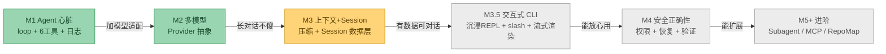
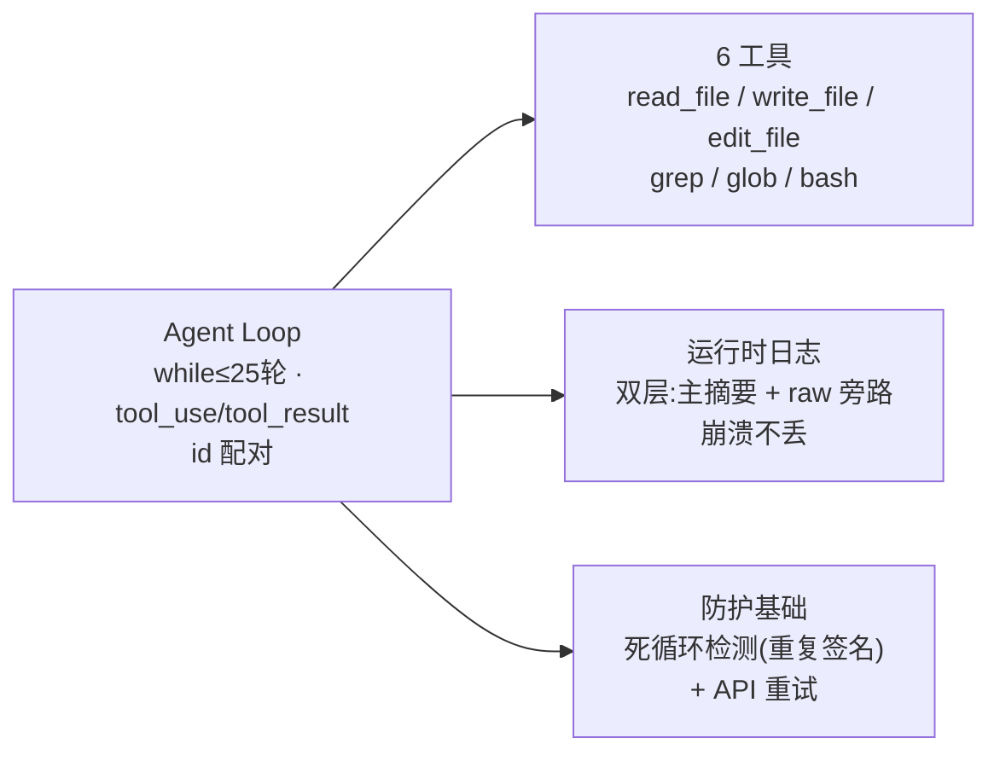
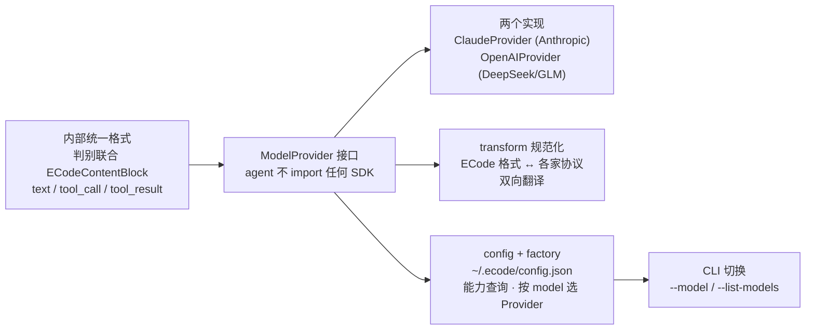
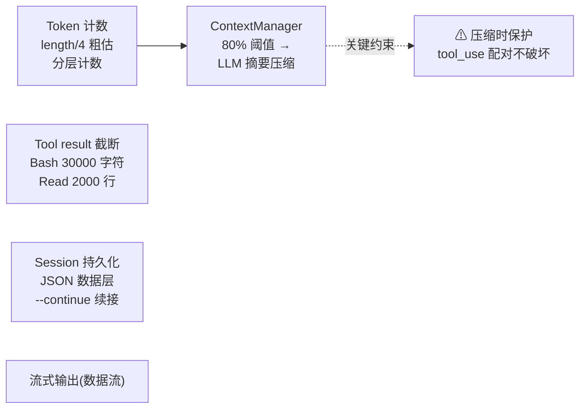
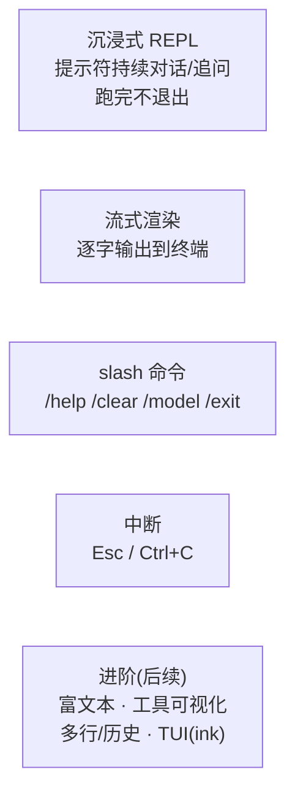
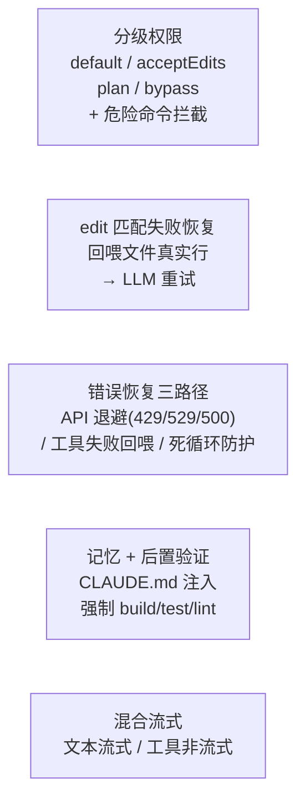
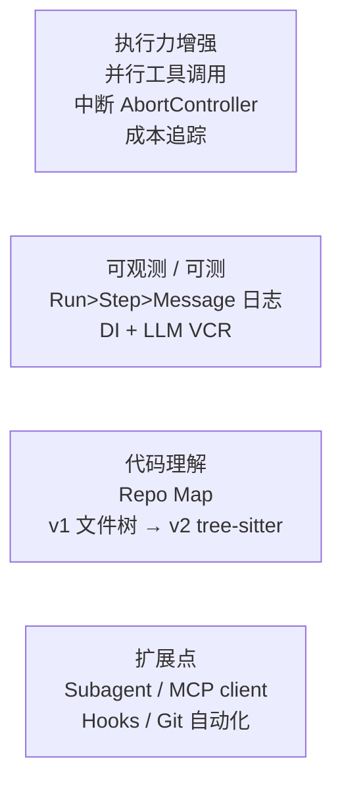
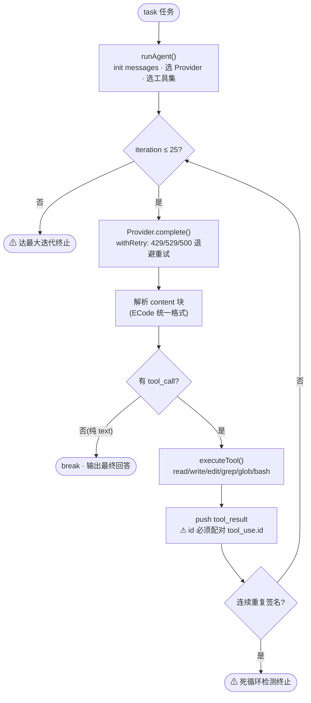

# ECode 里程碑功能流程图

> 把 `docs/总纲/00-开发规划.md` 的里程碑规划可视化。每个阶段的主要功能、演进依赖、当前进度一目了然。
>
> **图用什么看**:GitHub / GitLab 原生渲染(无需插件);VS Code 装 *Markdown Preview Mermaid Support* 插件后 `Ctrl+Shift+V` 预览;或复制代码块到 `https://mermaid.live`。
>
> **维护**:每完成一个里程碑,更新①演进图的 `classDef` 状态色 + ②该阶段图的标题勾选。

**状态色图例:**

| 色 | 含义 | classDef |
|----|------|----------|
| 🟢 绿 | ✅ 已完成 | `done` |
| 🟡 黄 | ⬜ 进行中 / 下一焦点 | `next` |
| ⚪ 灰 | ⬜ 未开始 | `todo` |

---

## ① 里程碑演进总览(全局 + 进度 + 依赖)

> 目标线:能跑 → 多模型 → 记得住 → 可信任 → 可扩展。后一阶段依赖前一阶段的产物。

---

## ② 各阶段主要功能分解

### M1 — Agent 的心脏(最小可运行 loop) ✅

**验收**:「读→改→验证」完整消息流转;改一处代码并跑通测试。

---

### M2 — 多模型适配(Provider 抽象) ✅

**验收**:同一任务双协议都能跑;新增模型仅改配置、零代码改动。

---

### M3 — "记不住"问题(上下文管理 + Session 数据层) ⬜ 下一焦点

**验收**:一次压缩全过程可解释(保留什么/压缩什么/如何不破坏 tool 链);超长会话持续工作不崩。

---

### M3.5 — 交互式 CLI 体验(让 agent 能和人持续对话) ⬜ 规划中

> 对标 Claude Code 的核心产品力。**与 M3 边界**:M3 管"数据层",M3.5 管"交互呈现层"(人怎么和 agent 对话)。

**MVP**(能对标门槛):沉浸 REPL + 流式渲染 + slash 命令 + 中断。**进阶**:富文本 / 工具可视化 / 多行历史 / TUI。
**实现细节**(ink vs readline、slash 设计、中断保持 id 配对):进入本里程碑时再定。

---

### M4 — "信任问题"(安全 + 正确性 + 健壮性) ⬜

**验收**:edit 自我纠正;权限拦 `rm -rf`;端到端真实任务测试。

---

### M5+ — 进阶(按使用痛点迭代) ⬜

---

## ③ Agent Loop 运行时流程(项目心脏,M1 产物)

> 贯穿所有阶段的核心机制。**硬约束**:`tool_result.tool_use_id == tool_use.id`(不配对 → API 400);`messages` 累加不重建;M3 压缩绝不能破坏 id 配对。

---

**创建日期**:2026-08-03
**最近更新**:2026-08-03(新增 M3.5 交互式 CLI 里程碑,与 00-开发规划.md 同步)
**数据来源**:[00-开发规划.md](./00-开发规划.md)、[memory/project.md](./memory/project.md)、`src/agent.ts`、`src/providers/types.ts`
