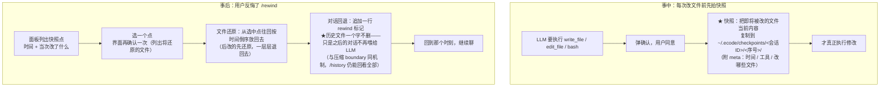
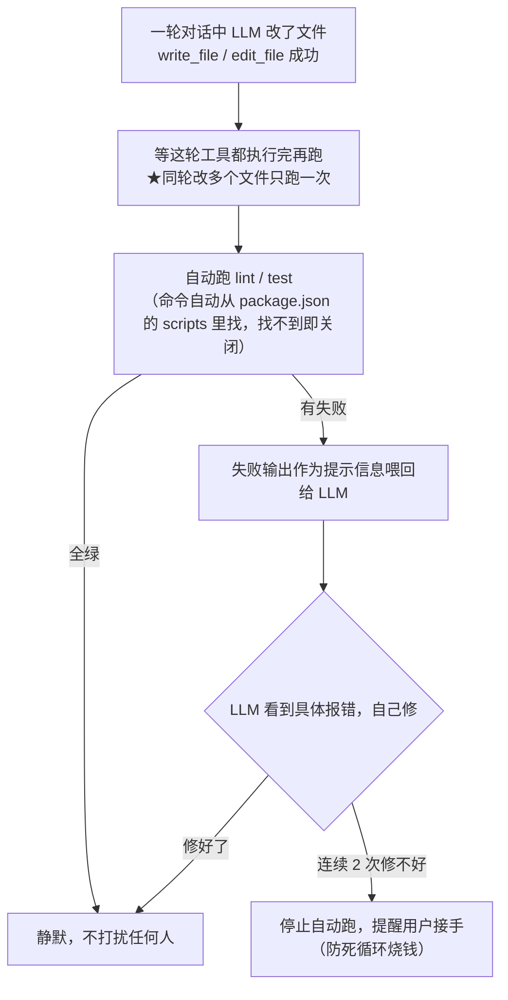
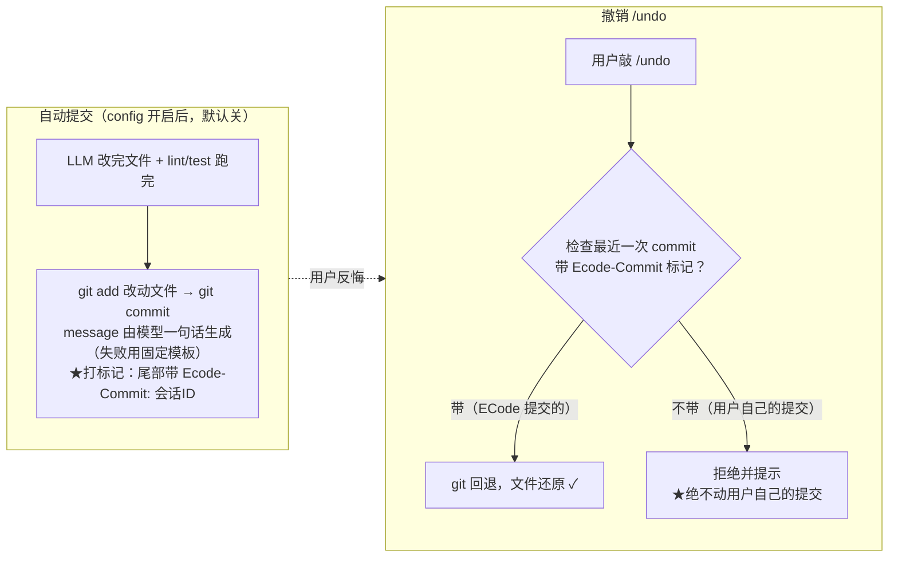
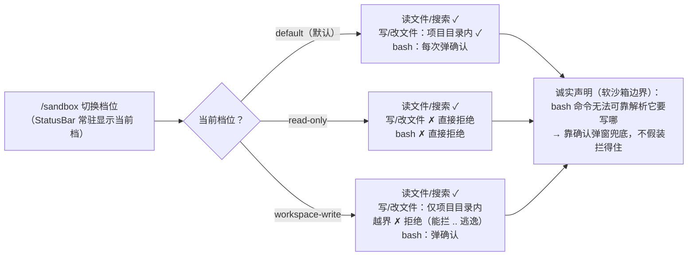

# ECode 后续 M9 实施方案：改动安全网与质量闭环

> 日期：2026-08-15 · 状态：**设计稿 v1（待启动）**
> 主题一句话：**改坏了能回去**（checkpoint + /rewind）、**改完自动验**（lint/test 回喂）、**权限有纵深**（沙箱模式）；git 做轻量集成。
> 来源：功能差距盘点（四家成熟 CLI 对比）发现三个「四家全有、ECode 全无」的硬缺口中的两个半（安全网 / 质量闭环 / 沙箱纵深）。参考实现集中附录 B。

---

## 0. 目标与验收

**目标**：给「Agent 改文件」这个最高频高危动作建立纵深——事前有围栏（沙箱）、事中有快照（checkpoint）、事后有验证（lint/test）、后悔有退路（/rewind 与 /undo）。

**验收**：
- **checkpoint**：write_file/edit_file/bash 修改过的文件在改动前被快照；`/rewind` 面板选消息点 → 文件还原 + 对话回退（投影标记，不删历史）
- **lint/test 回喂**：编辑类工具成功后自动跑配置的 lint/test 命令，失败输出作为信息性 tool_result 回喂模型自纠；连续 2 次失败熔断
- **git 集成**：`autoCommit`（默认 **false**）开启时编辑轮末自动 commit（带 ECode 标记）；`/undo` 只回退 ECode 创建的 commit
- **沙箱**：`/sandbox` 三档（default / read-only / workspace-write）；write_file/edit_file 越界拦截；read-only 下副作用工具整体拒绝
- **快照治理**：每会话上限 100 个快照点（超限淘汰最旧）；>10MB 文件跳过快照并 warn

**不做**（后置）：进程级 OS 沙箱（codex 式 seccomp/Job Object——重基建，软沙箱先行）、diff 浏览器面板（会话级改动总览 UI）、LSP 诊断（§5 占位，M9 有余量才做否则 M10）。

---

## 1. checkpoint 文件快照 + /rewind（P0，~3-4 天）

**问题**：edit_file/bash 改坏文件后没有任何退路——不总在 git 里、也不该被迫为 Agent 的每次尝试污染 git 历史。

**流程图（事中快照 + 事后反悔两条线）**：

**详细讲解**：

**快照机制**（`src/services/checkpoint.ts`）：
- **触发点**：副作用工具（write_file/edit_file/bash）`execute` **前**、确认通过后——通过 `ToolContext` 注入可选 `onBeforeWrite?(paths: string[])` 回调，cli/TuiApp 的 makeDeps 装配（**心脏只在 ToolContext 透传，不认识 checkpoint 概念**）
- **快照内容**：「本次将修改的文件」的改动前副本（write/edit 从入参取 path；bash 不解析命令——快照 cwd 下**近修改集**：git 有则 `git status` 变更文件，无 git 则跳过 bash 快照并记 warn）
- **存储**：`~/.ecode/checkpoints/<sessionId>/<seq>/` 下原路径相对结构 + `meta.json`（消息 id / 工具 / 时间）。**copy 而非硬链接**（Windows 下工作区与 home 常跨卷，硬链接不可用；快照对象是文本文件，体量可接受）
- **治理**：每会话 100 点上限（淘汰最旧）；单文件 >10MB 跳过 + warn；会话保留跨重启（`/rewind` 恢复历史会话后仍可用）

**/rewind**（命令 + overlay 面板）：
- 面板列出快照点（时间 + 工具 + 文件摘要）→ 选中：
  1. **文件还原**：该点之后的全部快照按时间逆序还原（后改的先还原）
  2. **对话回退**：**投影派做法**——往 history 追加一行 `{"rewind_to": <seq>}` 标记，`buildContextMessages` 识别最后一个 rewind 标记截断投影（与 boundary 同机制、append-only 不删历史；`/history` 回看完整）
     **类型与 UI 配套**（审阅补）：`HistoryLine` 联合扩展 `RewindLine` 变体 + `isRewind` 守卫（core/types.ts，与 BoundaryLine 同层）；`commit.ts` 的 `messagesToCommitted` 对 rewind 行生成 `⇺ 已回退至 N` 标记（boundary 的 compacted 标记同款处理——否则新变体进 filter 会被当 Message 渲染炸 UI）
- 还原前 ConfirmPrompt 二次确认（列出将还原的文件清单——它本身就是副作用操作）

## 2. 编辑后 lint/test 自动回喂（P0，~2-3 天）

**问题**：模型改完就说「完成」——编译错/测试红要等用户自己发现再贴回来。四家里 aider 的 auto lint/test 是质量闭环标杆，ECode 完全没有。

**流程图（改完自动验，红了自动修）**：

**详细讲解**（`src/services/quality.ts`）：
- **配置**：`lintCommand` / `testCommand`（config 顶层；**默认自动探测**——package.json scripts 里的 `lint`/`test`，探测不到即关闭，零配置可用）
- **触发**：一轮工具执行中若有 ≥1 个编辑类工具成功（write_file/edit_file），**轮末聚合跑一次**（同轮多编辑不重复跑）——挂在 `executeTools` 返回后？不，**loop 零改动**：作为 `onToolResult` 的宿主侧逻辑（TuiApp/cli 的 callback 里检测编辑成功 → 轮末触发），或独立 `afterTools` 回调注入 opts（与 onCompacted 同款模式）
- **回喂**：输出作为**信息性 tool_result** 追加（`is_error: false` + `[lint] 失败输出...` 前缀）——模型看到即自纠；成功则静默（不打扰）
- **熔断**：连续 2 次 lint/test 失败且模型修复无效（输出无变化）→ 停止自动跑，onWarn 提示用户接手
- 超时 60s；输出截断复用 bash 截断（30KB 头尾中截）

## 3. git 轻量集成（P1，~2 天）

**问题**：想要干净历史的用户需要 Agent 改动可追溯；但 ECode 哲学是**不静默改用户 repo**——所以默认关、显式开。

**流程图（自动提交 + 安全撤销）**：

**详细讲解**（`src/services/git.ts`）：
- `autoCommit: true`（config，默认 false）时：编辑轮末（quality 跑完后）`git add <改动文件> && git commit`，message 由当前模型一句话生成（复用 callLLM 通道，失败 fallback 固定模板 `ecode: <工具与文件摘要>`），commit trailer 打 `Ecode-Commit: <sessionId>` 标记
- **/undo**：`git reset --soft HEAD~1` + 文件还原——**只对带 Ecode 标记的最近 commit 生效**（`git log -1` 查 trailer，非 ECode 的 commit 拒绝并提示，绝不动用户自己的提交）
- 与 checkpoint 互补：checkpoint 总在（不依赖 git/不污染历史）；git 模式给要干净历史的人。两者共存时 /rewind 优先（粒度到消息点）

## 4. 沙箱模式（P1，~2 天）

**问题**：现在的唯一防线是确认弹窗（人盯）——读多写少的日常场景里，一次误确认就是一次事故。需要模式级的纵深。

**流程图（三档各拦什么）**：

**详细讲解**（**软沙箱**——工具层路径校验，进程级围栏后置）：
- 三档（`/sandbox` 切换 + StatusBar 标识 + config 默认档）：
  | 档 | read_file/ls/grep/glob/WebFetch | write_file/edit_file | bash |
  |---|---|---|---|
  | `default` | ✓ | cwd 内 ✓（越界确认）| 确认（现状）|
  | `read-only` | ✓ | **整体拒绝**（is_error「只读模式」）| **整体拒绝** |
  | `workspace-write` | ✓ | **仅 cwd 内**（越界直接拒绝）| 确认 + 输出审计提示 |
- 实现：write_file/edit_file 的 execute 前置 `resolve()` + 前缀校验（路径净化防 `..` 逃逸）；bash 无法可靠解析目标路径——read-only 档直接拒绝、其余档维持确认（**诚实声明软沙箱边界**，不假装拦得住）
- MCP 工具：read-only 档下按其 `readonly` 元数据分流（M6 已有）
- 与 M8 WebFetch 的收口：read-only/workspace-write 档下 WebFetch 照常（已是只读+SSRF 拦截）

## 5. LSP 诊断回喂（P2 占位，有余量才做）

编辑后查询已装 LSP server 的 diagnostics，与 lint 结果同通道回喂。依赖子进程/语言服务管理（重），M9 只留接口位（quality.ts 的 provider 抽象），实现视余量或整体后置 M10。

---

## 6. 实施拆解

| 步 | 内容 | 依赖 | 心脏 |
|---|---|---|---|
| P0 | checkpoint.ts + ToolContext.onBeforeWrite 注入 + 快照治理 | 无 | ToolContext 加可选字段（透传，非逻辑）|
| P1 | /rewind 命令 + 面板 + rewind_to 投影标记（context.ts 扩展）| P0 | context.ts（投影函数加标记识别）|
| P2 | quality.ts（探测/轮末触发/回喂/熔断）+ afterTools 回调注入 | 无 | LoopRunOptions 加可选回调（onCompacted 同款）|
| P3 | 沙箱三档 + /sandbox + StatusBar 标识 | 无 | 零（工具 execute 前置校验）|
| P4 | git.ts（autoCommit + /undo + trailer 标记）| 无 | 零 |
| P5 | （余量）LSP provider 接口位 | P2 | 零 |

## 7. 测试

| 模块 | 场景 |
|---|---|
| checkpoint | 副作用工具前快照（mock fs）/ 只读工具不快照 / 100 点淘汰 / >10MB 跳过 warn / bash 无 git 跳过 |
| rewind | 面板列表 / 逆序还原 / rewind_to 投影截断（context.ts）/ 恢复会话后可用 / 还原前确认 |
| quality | package.json 探测命中/未命中 / 轮末聚合（同轮两编辑只跑一次）/ 失败回喂格式 / 连续失败熔断 / 超时 |
| 沙箱 | 三档矩阵（每工具×每档）/ `..` 逃逸拦截 / 越界拒绝文案 / MCP readonly 分流 |
| git | autoCommit trailer / /undo 只退 ECode commit（用户 commit 拒绝）/ fallback 模板 |

## 8. 风险

| 风险 | 影响 | 缓解 |
|---|---|---|
| 快照磁盘膨胀 | 中 | 100 点上限 + 10MB 单文件跳过 + 文本文件为主（实测校准）；/rewind 后旧点可清 |
| bash 快照盲区（无 git 时）| 中 | 诚实降级：warn + 文档明示；有 git 的项目用 git status 兜 |
| lint/test 死循环（失败→修→再失败）| 中 | 连续 2 次熔断 + 60s 超时；输出无变化判定 |
| /undo 误伤用户 commit | 高 | trailer 标记强校验，非 ECode commit 一律拒绝 |
| 软沙箱被绕（bash 写 cwd 外）| 中 | 明示边界：bash 档位靠确认兜底；进程级沙箱后置声明 |
| rewind 与压缩交互 | 低 | rewind_to 与 boundary 同为投影标记，取「最后」语义天然共存（测试覆盖同存场景）|

## 9. 决策表

| # | 决策点 | 结论 | 理由 |
|---|---|---|---|
| M9-D1 | 快照存储 | copy 到 `~/.ecode/checkpoints/`（非硬链接）| Windows 跨卷硬链接不可用；文本体量可接受 |
| M9-D2 | 快照触发 | ToolContext.onBeforeWrite 回调注入 | 心脏只透传不认识 checkpoint；与 confirm 后耦合（确认通过才快照）|
| M9-D3 | 对话回退 | rewind_to 投影标记（append-only）| 与 M5 boundary 同机制；历史永不删 |
| M9-D4 | 质量回喂形态 | 信息性 tool_result（is_error:false）| 模型自纠语义；与工具错误（is_error:true）区分 |
| M9-D5 | autoCommit 默认 | **false**（显式开启）| 不静默改用户 repo（项目哲学）|
| M9-D6 | /undo 安全 | trailer 强校验只退 ECode commit | 绝不动用户提交 |
| M9-D7 | 沙箱形态 | 软沙箱（工具层校验）+ bash 诚实声明 | 进程级围栏重基建后置；不假装拦不住的东西拦得住 |
| M9-D8 | LSP | 接口位占牌，实现视余量/M10 | 依赖重；quality provider 抽象预留 |

---

## 附录 B：参考来源（启发映射）

| ECode 设计 | 启发来源（本地源码） |
|---|---|
| 文件快照 + 消息点回滚 | claude-code `utils/fileHistory.ts`（快照上限 100/按消息关联）；opencode `session/revert.ts` + `snapshot/` |
| rewind 的投影标记 | ECode 自身 M5 boundary 机制延伸（非外部）|
| 编辑后 lint/test 回喂 + 熔断 | aider `base_coder.py` auto_lint/auto_test（质量闭环标杆）|
| autoCommit + /undo + 安全标记 | aider 自动 commit/undo；「只退自己的 commit」为本项目安全加固 |
| 沙箱三档 + 审批策略 | codex `sandbox_mode`（read_only/workspace_write/danger_full_access）——软实现为本项目裁剪 |
| LSP 诊断回喂 | claude-code `services/lsp/`（passive feedback）；opencode `lsp/` |

## 附录 C：代码锚点

| 落点 | 现状 |
|---|---|
| `src/tools/interface.ts` ToolContext | 加可选 `onBeforeWrite`（M9-P0）|
| `src/core/types.ts` HistoryLine | 加 `RewindLine` 变体 + isRewind 守卫（与 BoundaryLine 同层）|
| `src/core/context.ts` buildContextMessages | 加 rewind_to 标记识别（与 boundary 同层）|
| `src/core/loop.ts` LoopRunOptions | 加可选 `afterTools` 回调（onCompacted 同款先例）|
| `src/tui/commit.ts` messagesToCommitted | rewind 行 → `⇺ 已回退` 标记（compacted 标记同款）|
| `src/tools/builtin/{write_file,edit_file}.ts` | 沙箱前置校验注入点 |
| `src/tui/` | /rewind /sandbox 面板（PanelShell）+ StatusBar 档位标识 |

## 附录 D：后置需求观察区（未排期储备）

> 2026-08-15 盘点入库：全量 grep `详设/` 各方案的「不做/后置/暂不/预留/占位/接口位」标记，剔除已进 M8/M9 正式范围者，**悬空项统一收口在此**——此前散落 7 份方案，无排期的裁剪只有决策号没有回收点。此表不是承诺，是「什么时候捡、捡哪」的触发器登记簿。
>
> **使用规则**：某行触发条件出现 → 该项进对应里程碑方案（或开新方案 + ADR 记录"何时为何放开"）；实现时回来源列标注的决策号核对当时裁剪理由是否仍成立。新里程碑的方案定稿时应把本表相关行吸走。

### D.1 上游先例触发（别人做了我们跟）

| 项 | 来源 | 触发条件 | 补齐落点 |
|---|---|---|---|
| mcp_tool / prompt 型 hook 执行体 | M7 §H0 / M7-D9 | codex 或 Claude Code 真实现（codex schema 已在途，标注 not supported yet） | `exec.ts` 形态分支 + `validate.ts` schema 放开（`types.ts` 类型位已留，三层防御齐） |
| proxy 元工具模式（工具极多收敛为单一 `mcp` 元工具） | M6-D28 | 单 server 工具数让 schema 上下文占用成为实测负担 | McpManager 注册层 |

### D.2 依赖就绪触发（等某系统先有）

| 项 | 来源 | 触发条件 | 补齐落点 |
|---|---|---|---|
| PreCompact / PostCompact hook 事件 | M7 §H2 后置 | 压缩行为需要门控/观测（M9 checkpoint × 压缩联调是自然回看点） | HOOK_EVENTS + 压缩编排器接线 |
| SubagentStart/Stop 事件 + plugin `agents` 组件 + skill `fork` | M7 §H2 / 附录C；M6 附录C | sub-agent 立项 | 事件集扩展 + 清单组件发现 |
| LSP 诊断回喂实现 | M9 §5（本方案占位） | M9 余量或 M10 | `quality.ts` provider 抽象（接口位随 M9 留） |

### D.3 实践信号触发（用出需求再上）

| 项 | 来源 | 触发条件 | 补齐落点 |
|---|---|---|---|
| Skill 增量推送 | M6 S7.2 / M6-D6 | skill 清单 token 占用成负担（变化签名接口已留） | `listing.ts` 增量三态 |
| skill 级 disable | M7 P4.5 | 自然语言消解不顺手（频繁冲突的团队项目） | config + SkillPanel |
| bash 免确认白名单 | M3 §14 | 确认弹窗噪音实测烦人 | `proc.ts` 白名单 + ConfirmPrompt 跳过 |
| 失败 2 次强制确认（替代每次副作用 confirm） | M3-D6 | 同上，且跨迭代计数器归属有定论 | loop/装饰层计数 |
| grep -C 上下文 | M3 §14 | LLM grep 后频繁 read_file 浪费轮次 | grep 工具参数 |
| `/config` 应用内面板 | M4-D11 | $EDITOR 路径收到抱怨 | PanelShell 新面板 |
| WebSearch | M8-D10 | 选定搜索 API/key | 新工具（web_fetch 同族） |
| 外溢到文件 spill / 反应式重放 | M5 §2 | 摘要损失信息成实际痛点 | 压缩策略接口（可插拔位已留） |
| MCP resources / prompts 原语 | M6-D16 | 常用 server 普遍带这两类能力 | adapt 层扩展 |
| MCP OAuth needs-auth / elicitation | M6 附录C | 常用 server 需要认证流 | 六态状态机扩展 |
| per-tool 白黑名单 | M6 附录C | 单 server 只用个别工具（权限系统可先覆盖） | 与权限规则合流 |
| tools/list_changed 增量同步 | M6 附录C | server 运行期热更工具 | manager 订阅 |
| MCP 面板高级项（直连 toggle/token 估算/自动关/键位/鼠标）+ 禁用 server 启用操作 | M6 T4 / §面板 | 单条用户反馈 | McpPanel |
| reduced-motion | M2 §10 | 无障碍诉求 | Spinner 退化静态 |

### D.4 生态与安全演进触发

| 项 | 来源 | 触发条件 | 补齐落点 |
|---|---|---|---|
| npm:spec 安装源 | M7 附录C（v3.1 评估完） | 官方市场成型或插件分发诉求 | PluginLoader source 解析 |
| autoUpdate + commit sha 比对 | M7 附录C | 插件安全更新诉求 | loader + known 注册表 |
| 企业策略 allowlist/blocklist | M7 附录C | 企业场景 | config 层级 |
| keychain 安全存储 | M7 附录C | apiKey 明文+600 文件权限被合规挑战 | services/config |
| matcher ReDoS 限长/预检 | M7 风险表 | 第三方 matcher 来源不可信 | `matcher.ts`（可与权限系统合做） |
| `${ECODE_PROJECT_DIR}` / `${user_config.K}` 占位符 | M7 §占位符 | 插件配置需要项目/用户值 | expandPluginRoot 白名单扩 |
| plugin 依赖解析 + 跨市场白名单 | M7 风险表 | 出现互相依赖的插件生态 | manifest + loader |
| git-subdir 部分克隆 | M7 附录C | 大仓库插件 | install 链 |
| 批量安装 / 热度排序 / userConfig 收集 UI | M7 附录C | 市场规模化 | PluginPanel |
| 项目级 hooks 源（`.ecode/hooks.json`） | M7 §H1 | 团队共享 hooks（信任模型先定，批准机制可对齐 .mcp.json） | specsFor 第三源 |
| 进程级 OS 沙箱 | M9 §4 / M9-D7 | 软沙箱边界被实际绕过 | 平台层 |
| diff 浏览器面板 | M9 §0 不做 | 会话级改动总览诉求 | TUI |
| 权限系统三态规则引擎 | M8 §12 设计储备 | **M9 沙箱启动前回看**（既定回看点，两者正交可合） | 新 service |
| memory 管理命令（/memory 等） | M8 §0 不做 | M8 memory 落地后文件操作不顺手 | commands |
| ask_user preview 分栏 | M8 §0 不做 | ask_user 高级需求 | TUI |
| ImageBlock 图像输入 | 详设 §2.1 / M1 types 占位 | 多模态主力化 | types 已占位 + Provider `case 'image'` + read_file 扩展 |
| 跨进程事件总线 | M8 §0 不做 | 多进程形态出现（单进程哲学下基本永不） | — |

### D.5 代码级接线缺口（2026-08-15 代码走读发现，入档即待修）

> 与上四类不同：这些不是"裁剪的设计"，是**协议层已交付、接线层没铺完**的缺口，量级都在案发现场几行。可随任一里程碑顺手清，也可单独一批小修。

| 项 | 现状锚点 | 修法 |
|---|---|---|
| SessionStart 的 additionalContext 未消费 | `TuiApp.tsx:529/553` `.then` 只取 systemMessages | 注入首轮消息（典型用途恰是"会话开始注入环境信息"） |
| PreToolUse verdict 的 additionalContext/systemMessages 未消费 | `hooked.ts:67-74` 只看 block/updatedInput | block 时一并展示；context 可注入 tool_result |
| dispatch 的 `opts.signal` 七处接线点均未传 | 全部调用形态①（不传 opts） | 案发现场透传 AbortSignal，hook 子进程随 Ctrl+C 中断（当前仅超时兜底） |
| Stop 的 stop_reason 固定 `'turn-complete'` | `TuiApp.tsx:309` | abort 路径带 `'aborted'` 再 dispatch |
