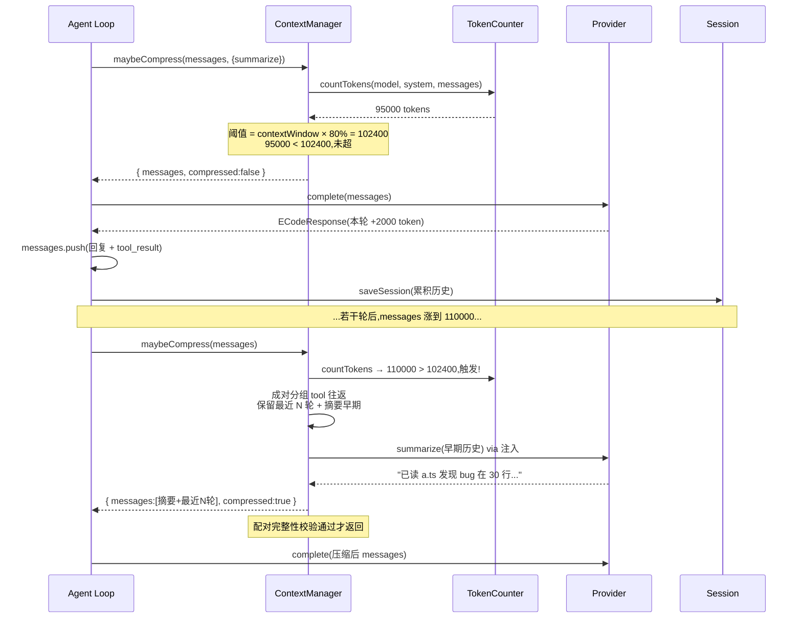
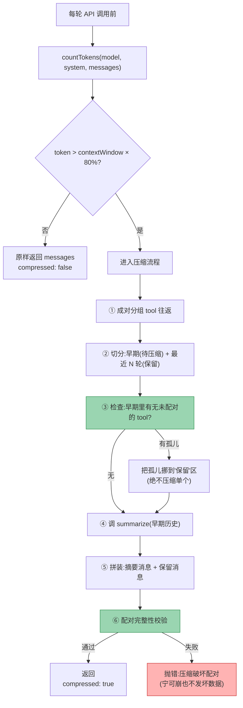
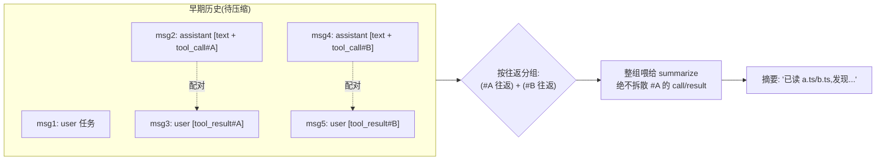
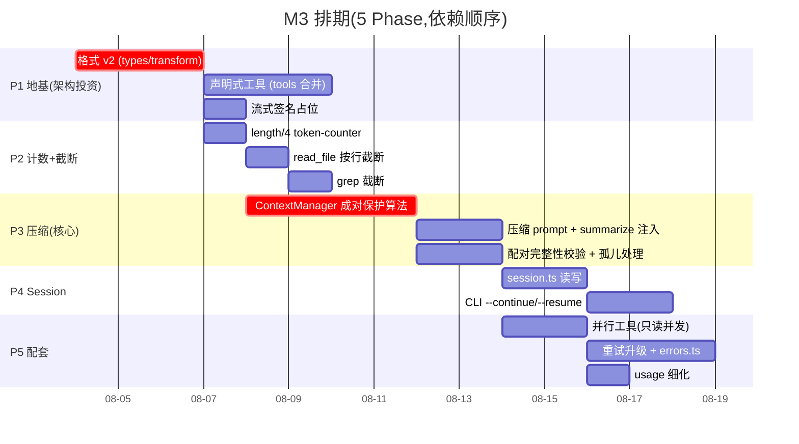

# M3 · 实施方案

> **里程碑**: M3 ——"记不住"问题:上下文管理 + Session(数据层)
> **状态**: ⬜ 待审阅(本文档 + [M3-方案解析](./M3-方案解析[已完成].md) 确认后进入 TDD 编码)
> **前置**: M2 完成(Provider 抽象已落地,agent 已解耦 SDK)+ M3 前置借鉴点已做(①⑤⑧⑨,见 [00-开发规划](../总纲/00-开发规划[进行中].md) M3「前置准备」表)
> **参考来源**: [00-开发规划](../总纲/00-开发规划[进行中].md) M3 章节与认知盲区 P0-3/P1-1、[借鉴Vercel-AI-SDK对比报告](../调研/借鉴Vercel-AI-SDK对比报告[已完成].md)、[M2-方案解析 §4.3 孤儿配对预告](./M2-方案解析[已完成].md)、**Claude Code 源码**(`D:\Study\claude-code-main`,2026-08-03 实地核查)、**CCode 源码**(`D:\Study\CCode`,9 条引用全部属实)、opencode Session 模型。所有"数值/实现"类断言均带 `file:line` 出处,见正文 📌 标记。
>
> 📖 **先读[第零章总览](#零总览先看这里做什么--用什么--缺什么)**:做什么 / 用什么 / 缺哪些知识。
> 🔍 **想懂"为什么这么设计"看 [M3-方案解析](./M3-方案解析[已完成].md)**;本文是"怎么做"。

---

## 零、总览(先看这里:做什么 / 用什么 / 缺什么)

### 0.1 M3 一句话

给 agent 装上**"记忆管理"**:长对话不撑爆上下文(token 计数 + 摘要压缩)、单次工具结果不撑爆(截断)、会话能存下来续接(Session 持久化)。让 agent 从"金鱼记忆的一次性脚本"变成"能长聊、能续接"的工具。

### 0.2 要做的事(5 个 Phase 的分组视图)

M3 范围大,按**依赖顺序**拆成 5 个 Phase,每个 Phase 都有可独立验证的交付物:

| Phase | 做什么 | 为什么放在这 | 产出 | 借鉴点 |
|-------|--------|-------------|------|--------|
| **P1 地基** | 内部格式升 v2(`providerOptions`)+ 工具声明式合并 + 流式签名占位 | M3 要在核心类型上挂东西(缓存标记/结构化结果),先升级类型,避免 M3/M4 反复修补 | `types.ts` v2、`tools` 声明式 | ⑥⑦⑩ |
| **P2 计数+截断** | token 估算(`length/4` 粗估)、`read_file` 按行截断、`grep` 截断 | 压缩的"触发判断"依赖 token 计数;截断是压缩的预防层 | `token-counter.ts`、`truncate` 完善 | — |
| **P3 压缩** | `ContextManager`:80% 阈值触发 LLM 摘要,**成对保护 tool 链** | M3 最硬核、最高风险,放地基之后 | `context-manager.ts` | — |
| **P4 Session** | 会话持久化(JSON)+ `--continue` / `--resume` 续接 | 数据层,独立于压缩,可并行设计 | `session.ts`、CLI 参数 | — |
| **P5 配套** | 并行工具(只读并发)+ 重试升级(读 Retry-After)+ usage 细化 | 过程中自然要碰,放最后不阻塞主线 | `agent.ts`、`retry.ts`、`errors.ts` | ②④⑪ |

> 依赖图:`P1 → P2 → P3`(主线,压缩依赖计数,计数依赖 v2 类型);`P4` 与主线弱耦合(可在 P3 后插入);`P5` 是收尾增强。完整排期见 [第九章 Gantt](#九子任务拆解tdd--含-5-phase-排期)。

### 0.3 技术栈(M3 新增 vs 已有)

| 类别 | 用什么 | 状态 |
|------|--------|------|
| **新增依赖** | **无**——token 计数用 `length/4` 粗估(Node 内置即可,见决策1) | ✅ 零依赖 |
| **不用什么** | ❌ `ai-tokenizer`(主打 OpenAI/Claude/Gemini,对 GLM/DeepSeek 无原生 encoding,核查见决策1);❌ tiktoken(只对 OpenAI 家准);❌ LangChain memory(违背"手写核心");❌ 联网 count_tokens 为主(延迟+只对 Claude 协议) | — |
| **Node 内置** | `fs`(Session 读写)、`path`/`os.homedir()`(定位 `.ecode/`) | ✅ 已掌握(M2 config 已用) |
| **设计模式** | **策略模式**(压缩策略可替换:摘要/滑动窗口)、**门面模式**(`ContextManager` 封装计数+压缩,agent 只调一个方法) | 🟡 概念熟 |
| **核心类型** | TS 判别联合(M2 已用)+ **`providerOptions` 侧信道**(借鉴点⑥,M3 首次引入) | 🔴 `providerOptions` 需补 |
| **测试** | Vitest 纯函数(token 计数/截断/压缩配对保护)+ **LLM 摘要用 record/replay 或 mock**(压缩不写真实 LLM 调用测试) | 🟡 mock 已会,record/replay 待定 |

### 0.4 知识缺口清单(动手前要补的)

| # | 知识点 | 为什么 M3 需要 | 现状 | 动作 |
|---|--------|---------------|------|------|
| 1 | **上下文窗口 / token 上限**各模型差异 | 压缩阈值要按模型上限算(GLM-5.2=1M、DeepSeek V3=128K/V4=1M…),不能写死 | 🟡 概念懂,数值已核查 | 写 `config` 时补每个模型的 `contextWindow` |
| 2 | **token 粗估实现**(`length/4` + JSON 类 `/2`) | token 估算是压缩触发依据 | 🟡 原理懂(仿 Claude Code),实操待做 | P2 时实操 + 回写笔记 |
| 3 | **摘要压缩的 prompt 工程** | 压缩质量直接决定 agent 会不会"失忆" | 🔴 无 | 参考 Claude Code / opencode 的压缩 prompt,P3 设计 |
| 4 | **`providerOptions` 侧信道模式** | P1 格式 v2 的核心表达(中性骨架挂 provider 私有特性) | 🔴 无 | 看 [借鉴报告 §四⑥](../调研/借鉴Vercel-AI-SDK对比报告[已完成].md) 已整理,实操落地 |
| 5 | **tool_use/tool_result 配对完整性算法** | 压缩时破坏配对 → API 400(最致命的坑) | 🟡 M1/M2 配对概念懂,压缩态下的配对保护没写过 | P3 重点,方案解析 §3.4 详述 |

### 0.5 前置检查(开工前确认)

- [ ] M2 达标(agent 已解耦 SDK,49+ 单测全绿,OpenAI 协议端到端跑通)
- [ ] M3 前置借鉴点已做(①⑤⑧⑨ —— 已于 2026-08-03 完成)
- [ ] 读过 [M2-方案解析 §4.3](./M2-方案解析[已完成].md)(孤儿配对坑的事实依据)
- [ ] 确认本方案 [第十二章待审阅决策清单](#十二待审阅决策清单给用户拍板的)——尤其是 **P1 范围**(要不要在 M3 动核心类型重构)

---

## 一、背景与目标

### 1.1 M2 留下的债(为什么 M3 必须做)

M2 让 agent 能多模型跑通了,但 agent 的"记忆"还是**最原始的形态**——三个硬伤:

**硬伤 ①:越聊越傻,最终崩(无上下文管理)**

`agent.ts` 每轮把**完整历史**发给 LLM,从不裁剪:

```ts
// agent.ts —— messages 只增不减,直到撑爆
const messages: ECodeMessage[] = [{ role: 'user', content: task }];
// ...每轮 push assistant 回复 + tool_result,越积越多
```

一个真实任务(读 5 个文件 + 几轮编辑)轻松产生几万 token。模型上下文窗口是有上限的(GLM-5.2 = 1M、DeepSeek V3 = 128K / V4 = 1M),**一旦超过 → API 报错或模型"看不到"早期指令 → agent 失忆/死循环**。

> 📌 出处:模型窗口数据见 Atlas Cloud / 阿里云模型文档(GLM-5 = 200K、GLM-5.1+ = 1M;DeepSeek V3/V3.1/R1 = 128K、V4 = 1M)。ECode `config.ts` 默认模型 `glm-5.2` 即 1M 窗口。

**硬伤 ②:单次工具结果就能撑爆(截断不全)**

- `bash`:已截断 30000 字符 ✅(`truncate.ts` + `bash.ts`)
- `read_file`:**当前截断 50000 字符,且按字符不按行**(`read-file.ts:8`) —— 一个 2000 行的大文件读进来就是 ~6 万字符,直接吃掉大半上下文 ❌
- `grep`:无截断 ❌(全量搜索结果可能上千行)

**硬伤 ③:跑完即失忆,无法续接(无 Session)**

`index.ts` 是 one-shot:跑完 `runAgent` 进程退出,messages 全丢。想接着刚才的对话问一句?只能重开,从头再来。对比 Claude Code 能 `--continue` 续接上次会话,这是核心产品力差距。

### 1.2 M3 交付目标(对应 00-开发规划 M3)

| # | 交付目标 | 衡量标准 |
|---|---------|---------|
| 1 | 长对话不"越聊越傻" | 超长会话(模拟 50+ 轮)能持续工作不崩,token 估算 + 80% 阈值触发压缩 |
| 2 | 压缩不破坏 agent 行为 | 压缩后 agent 不重复已完成的工具调用(压缩保留关键信息);tool 链配对完整 |
| 3 | Tool result 截断防撑爆 | `read_file` 按行截断(默认 2000 行)、`grep` 限制结果数,大文件/大搜索不爆上下文 |
| 4 | Session 持久化 + 续接 | 会话存盘 + `ecode --continue` / `--resume <id>` 能恢复上下文继续对话 |

### 1.3 非目标(明确不做,避免范围蔓延)

- ❌ **流式输出 / REPL 多轮交互** —— 属 **M3.5**(沉浸式 CLI)。M3 只做"数据层":Session 存什么、怎么存、怎么续接;**怎么和人交互**(提示符、流式渲染)归 M3.5。`--continue` 在 M3 只是"加载数据继续 one-shot 跑",不是 REPL。
- ❌ **权限系统 / edit 匹配恢复 / 危险命令拦截** —— 属 **M4**。
- ❌ **项目记忆自动整理 / Repo Map** —— P1-1/P1-2,M5+。M3 只做"压缩后重注入 CLAUDE.md"(最简版),不做自动整理。
- ❌ **中断(AbortController)** —— 借鉴点③,明确推到 **M3.5 之前**(M3.5 中断功能的前置基础)。M3 的 retry 升级(④)会预留 signal 参数,但不接用户输入。

---

## 二、设计决策(含理由,对标调研结论)

### 决策 1:Token 估算用 `length/4` 粗估(仿 Claude Code,零依赖)

**选择**:字符串长度除以 4 粗估 token 数,**不引入 tokenizer 库**(ai-tokenizer / tiktoken 都不用)。

**理由**(2026-08-03 核查后修订,推翻 00-开发规划原"ai-tokenizer 为主"的旧结论):
- **Claude Code 官方就是这么做的**:其 token 估算默认 `content.length / 4`(JSON/JSONL/JSONC 类按 `/2`,图片固定 2000),精确值才调 API `countTokens`——根本不用 tokenizer 库。出处:`claude-code-main/services/tokenEstimation.ts:203-208`(roughTokenCountEstimation)、`:140-201`(countMessagesTokensWithAPI)
- **ai-tokenizer 对 ECode 默认模型不适用**:它主打 OpenAI/Anthropic/Google 三家 top models,对 GLM/DeepSeek 无原生 encoding(只能套相近词表,误差未知);其"≥97% 准确率"是官方针对 GPT-5/Claude/Gemini 的声明,第三方测评(dev.to jerown)在数字/代码场景实测仅 37.7% within 10%,且 Gemini 本就无独立 encoding。引入它对 GLM/DeepSeek 价值存疑,反而误导。
- **压缩阈值只需"趋势"不需精确值**:`length/4` 对中文偏保守(中文 1 字 ≈ 1-2 token,而 4 字符/token 的假设高估了 token 数)→ 倾向"早压缩",正好落在"宁可早压缩(无害)也不晚压缩(可能 API 报错)"的容错方向。
- **零依赖**:贴合"手写核心 + 极简(KISS)"原则,无新增包。

**校准(可选)**:Anthropic 协议侧可接 `messages.countTokens` beta API 做真实值对照(P2 可选增强);OpenAI 协议侧无标准 countTokens 接口,纯靠粗估。M3 先纯粗估,验证趋势正确即可。

> ⚠️ 这是**对 00-开发规划既定选型的修订**:原结论基于"ai-tokenizer 90+ 模型 97%+"的失真数据(经核查:"90+"系编造,"97%"官方声称有争议且不覆盖 GLM/DeepSeek)。00-开发规划第 II/VI 节同步更新。

### 决策 2:压缩策略 = LLM 摘要(不是滑动窗口)

**选择**:超阈值时,调用一次 LLM 把"早期历史"摘要成一段文本,替换原 messages。

**理由**:
- 00-开发规划已定"LLM 摘要压缩"
- **滑动窗口**(直接砍掉最老的 N 条)会**暴力丢信息**——把"我刚才读过 a.ts 发现 bug 在第 30 行"这种关键结论一起丢了,agent 接下来重复读 a.ts(死循环)
- **LLM 摘要**保留"做了什么、结论是什么",丢掉的是冗余的工具原始输出——信息密度高很多
- Claude Code、opencode 都用摘要压缩,是业界共识

**代价**:摘要本身要花一次 LLM 调用(成本 + 延迟),但相比"agent 因为失忆死循环烧 10 倍 token",值得。

### 决策 3:压缩时**成对保护** tool_use/tool_result(最关键)

**选择**:压缩算法以"工具往返(tool_call + tool_result 配对)"为最小单位——要么整对保留,要么整对压缩,绝不拆散。

**理由**:
- M2-方案解析 §4.3 已预告这是 M3 最致命的坑:`tool_use` 没有对应 `tool_result`(或反之)→ Anthropic **API 直接 400**
- 压缩若"砍掉 tool_result 留 tool_use"(或反过来),就造出孤儿,下一次 API 调用必崩
- 详见 [M3-方案解析 §3.4](./M3-方案解析[已完成].md) 和本方案 [第五章](#五上下文压缩算法m3-核心)

### 决策 4:截断分两层(工具级预防 vs 上下文级治疗)

**选择**:
- **工具输出截断**(M1 已有部分,M3 补全):单个工具返回时就裁剪,**预防**单个结果撑爆
- **上下文压缩**(M3 新增):整体历史超阈值时摘要,**治疗**累积撑爆

**理由**:两者解决不同问题——截断是"一次大读取"的预防针,压缩是"长期对话"的治疗药。缺截断,一次 `read_file` 大文件就直接触发压缩(浪费);缺压缩,截断再狠,几十轮下来照样撑爆。**都要**。

**`read_file` 截断要按行,不是按字符**(现状 `read-file.ts:8` 按 50000 字符):
- 代码是按行组织的,按字符截断会把一行劈成两半,LLM 看到半截代码更困惑
- 00-开发规划 P0-3 基准:**Read 2000 行 / 单行 2000 字符**

### 决策 5:Session 存项目级 `.ecode/sessions/`,格式 JSON

**选择**:
- 位置:项目根 `.ecode/sessions/`(不是全局 `~/.ecode/`)
- 格式:JSON
- 命名:`YYYYMMDDHHmmss_<task-slug>.json`

**理由**:
- **项目级**:对话上下文是**项目相关**的(聊的是这个仓库的代码),放项目里天然;`.ecode/` 已 gitignore(见 §9.2),不污染仓库
- **不入库反而对**:对话是即时性的,不需要跨设备 git 同步(不像 config/记忆要同步);入库还会泄露本地路径/敏感上下文
- **JSON**:与 M2 配置一致、可读可调试(`jq` 直接查)、无额外依赖
- **全局 `~/.ecode/` 留给配置/记忆**(config.json + 未来 CLAUDE.md 类记忆),职责分离

### 决策 6:P1 范围 —— 借鉴点⑥⑦⑩ 作为 M3 第一步(⚠️ 待审阅)

**选择**:M3 启动先做 P1 地基(格式 v2 + 声明式工具 + 流式签名),再进 P2-P5。

**理由**:
- 00-开发规划 M3「前置准备」已标注"⑥建议纳入 M3 启动第一步"
- P3 压缩要在 messages 上操作,`providerOptions` 侧信道能挂"这段是否可压缩"等标记;P5 usage 细化要挂在 `ECodeResponse.usage`
- **不在 M3 升级类型,M3/M4 会反复修补核心类型**(借鉴报告 §四⑥ 的判断)
- 声明式工具(⑦)让工具自带 `execute`,P5 并行工具(②)的 `parallelizable` 标记才有地方挂

**代价**:P1 是重构(动 `types.ts`/`transform.ts`/各工具),有回归风险,需要全量测试兜底。

> ⚠️ 这是范围决策,**需要用户审阅拍板**(见第十二章)。若想缩小 M3 范围,P1 可独立成一个 M2.5 小里程碑先行。

---

## 三、核心类型契约(接口先行 —— TDD 的"红灯"基础)

> 类型定义落在 `src/` 对应文件。先定接口再写实现。

### 3.1 借鉴点⑥:内部格式 v2(`providers/types.ts` 升级)

每个 content block 加可选 `providerOptions` 侧信道;`tool_result` 的输出改判别联合(区分错误/结构化结果):

```ts
// providers/types.ts —— v2 增量(加字段,不破坏 v1 既有用法)
export type ECodeToolResultOutput =
  | { type: 'text'; value: string }
  | { type: 'error'; value: string }      // 工具执行出错(原 is_error)
  | { type: 'json'; value: unknown };     // 结构化结果(预留)

export type ECodeContentBlock =
  | { type: 'text'; text: string; providerOptions?: Record<string, unknown> }
  | { type: 'tool_call'; id: string; name: string; input: Record<string, unknown>; providerOptions?: Record<string, unknown> }
  | { type: 'tool_result'; tool_use_id: string; output: ECodeToolResultOutput };
  //                                                                  ^^^^^^
  //                          v1 的 content:string + is_error?:boolean → 收敛成判别联合
```

> **兼容策略**:`tool_result` 从 `{content, is_error?}` 改成 `{output}` 是**破坏性改动**,需同步改 `agent.ts`(回喂处)、`transform.ts`(双向翻译)、所有工具返回处。P1 集中处理 + 全量测试兜底。`providerOptions` 全部可选,不破坏既有构造。

### 3.2 Token 计数契约(新增 `token-counter.ts`)

```ts
// token-counter.ts
export interface TokenCount {
  inputTokens: number;   // messages + system 估算
  outputTokens: number;  // 最近一轮 LLM 实际返回(API usage)
}

/** length/4 粗估一段 ECode 消息历史的 token 数(仿 Claude Code,见决策1) */
export function countTokens(model: string, system: string, messages: ECodeMessage[]): number;
```

- 粗估规则(对齐 `claude-code-main/services/tokenEstimation.ts:203-208` `roughTokenCountEstimation`):普通文本 `Math.round(len / 4)`;JSON/JSONL/JSONC 类 `/2`(单字符 token 多,见 `:215-224`);图片固定 2000(`:400-412`)
- 估算 = system + 所有 messages 序列化后按规则累加(序列化策略:近似 Provider 发出的 JSON 文本);**不追求精确,只求趋势**(够触发压缩判断即可)

### 3.3 ContextManager 契约(M3 核心,新增 `context-manager.ts`)

```ts
// context-manager.ts
export interface CompressOptions {
  model: string;
  system: string;
  /** 压缩用的 LLM 调用(注入,便于测试 mock) */
  summarize: (prompt: string) => Promise<string>;
}

/** 门面:agent loop 只调这一个方法,内部决定要不要压缩 */
export interface ContextManager {
  /**
   * 每轮 API 调用前调用。
   * - 未超阈值:原样返回 messages
   * - 超阈值:触发摘要压缩,返回压缩后的 messages(配对完整)
   * 返回 { messages, compressed: boolean, summary?: string }
   */
  maybeCompress(
    messages: ECodeMessage[],
    opts: CompressOptions,
  ): Promise<{ messages: ECodeMessage[]; compressed: boolean }>;
}
```

- agent loop 不直接管 token/压缩,只调 `contextManager.maybeCompress(messages)`
- `summarize` 注入:生产环境传真实 `provider.complete`,测试传 mock(避免测试发真实请求)

### 3.4 Session 数据契约(新增 `session.ts`)

> 完整设计(命名/slug/CLI/写盘失败处理/原子写/续接语义)见 [第六章](#六session-持久化设计p4);本节只给类型契约(TDD 红灯基础)。

```ts
// session.ts —— 纯数据层,零 LLM / agent 依赖
export interface ECodeSessionStats {
  rounds: number;        // agent 迭代轮数
  compressed: boolean;   // 是否发生过压缩(信息用;M3 不据此控制行为——见方案解析 §4.3)
  toolCalls: number;     // 累计工具调用数
}

export interface ECodeSession {
  id: string;            // 时间戳 YYYYMMDDHHmmss,保证唯一
  task: string;          // 首句任务(--continue 追加的新任务不覆盖此字段)
  model: string;
  messages: ECodeMessage[];
  createdAt: string;     // ISO
  updatedAt: string;     // ISO(每次 save 刷新)
  stats: ECodeSessionStats;
}

/** 列表用的轻量摘要(不含 messages) */
export type ECodeSessionSummary = Pick<
  ECodeSession,
  'id' | 'task' | 'model' | 'createdAt' | 'updatedAt' | 'stats'
>;

/** loadSession 找不到指定 id 时抛 */
export class SessionNotFoundError extends Error {}

/**
 * baseDir 默认 resolve(cwd, '.ecode', 'sessions');测试传 tmpdir 注入(决策⑥)。
 * 同步 fs,对齐 runtime-logger 实时写哲学。
 */
export function saveSession(session: ECodeSession, baseDir?: string): string;     // 返回文件绝对路径
export function loadSession(id: string, baseDir?: string): ECodeSession;          // 不存在→SessionNotFoundError;损坏 JSON→清晰错误
export function listSessions(baseDir?: string): ECodeSessionSummary[];            // updatedAt 倒序;跳过损坏文件(末尾提示 N 个跳过)
export function latestSessionId(baseDir?: string): string | undefined;
```

### 3.5 流式签名占位(借鉴点⑩,仅类型不实现)

```ts
// providers/types.ts —— ModelProvider 加 stream 签名(M3 不实现,占位)
export interface ModelProvider {
  readonly name: string;
  readonly protocol: 'anthropic' | 'openai';
  complete(request: ChatRequest): Promise<ECodeResponse>;
  // 占位:M3.5 实现。签名先定,避免届时改接口
  stream(request: ChatRequest): AsyncIterable<ECodeStreamPart>;
}
// ECodeStreamPart 定义见 M2-方案解析 §6.2,M3 先放注释/TODO
```

---

## 四、架构与调用链

### 4.1 分层(ContextManager 插入位置)

```
src/agent.ts (Agent Loop)
      ↓ 每轮 API 调用前,先问 ContextManager 要不要压缩
src/context-manager.ts (M3 新增)
  ├── token-counter.ts   估算 token(M3 新增,`length/4` 粗估,零依赖)
  └── 压缩算法           成对保护 tool 链 → 调注入的 summarize
      ↓ 压缩/不压缩,都返回 ECodeMessage[]
src/providers/ (M2 既有,不动)
      ↓
src/session.ts (M3 新增,数据层)
  └── .ecode/sessions/*.json
```

### 4.2 调用链(一次"带压缩"的 LLM 调用流转)



### 4.3 `agent.ts` 的改动(最小化)

| 当前(M2) | M3 后 |
|-----------|-------|
| 直接 `provider.complete({ messages })` | 先 `const { messages: m } = await ctxMgr.maybeCompress(messages, ...)` 再 `complete({ messages: m })` |
| 无 Session | 每轮末 `saveSession(...)`,`--continue` 时 `loadSession` 恢复 messages |
| `read_file` 截断按字符 | 改按行(P2) |

loop 的核心结构(while、配对、重复检测)**不动**,ContextManager 是 loop 外挂的一个"预处理"步骤。

---

## 五、上下文压缩算法(M3 核心)

> 这节是 M3 最难、最高风险的部分。原理详见 [M3-方案解析 §3](./M3-方案解析[已完成].md),这里讲**怎么做**。

### 5.1 何时压缩



**阈值:ECode 用 `contextWindow × 0.8` 近似触发**(留 20% 余量给本轮回复 + 工具结果——窗口是"输入+输出"共享的,输入顶满 100% 就没空间输出了)。

> 📌 **与 Claude Code 的差异**:Claude Code 实际用**绝对 token 数**而非百分比——`autoCompact.ts:62` `AUTOCOMPACT_BUFFER_TOKENS = 13_000`,默认阈值 = `200_000(contextWindow) − 20_000(摘要输出预留) − 13_000(buffer) = 167_000`(≈83.5%)。ECode 用 0.8 近似是简化,效果等价;P2 实现时若想更贴近可切绝对值逻辑(`effectiveWindow = contextWindow − summaryReserve − buffer`)。详见方案解析 §2.3。

### 5.2 压缩什么 / 保留什么(决策矩阵)

| 内容 | 处理 | 理由 |
|------|------|------|
| **system + 当前任务**(初始 user) | **永远保留** | agent 的"北极星",丢了就跑偏 |
| **最近 N 轮原文** | **保留**(N=可配,默认 6 轮) | 正在进行的工具往返,LLM 需要原始细节 |
| **早期的已完成 tool 往返** | **压缩成摘要** | 结论有价值,原始输出冗余 |
| **未配对的 tool**(孤儿) | **挪进保留区,绝不压缩** | 压缩会造新孤儿(见 5.3) |
| **纯 text 对话**(无工具) | 按比例压缩(老的摘要,新的留) | 信息密度低,适合摘要 |

### 5.3 如何不破坏 tool 链(最关键)

**核心原则**:压缩的最小单位是**"工具往返"**(一个 assistant 的 `tool_call` + 对应的 user `tool_result`),不是单条 message。



**配对完整性校验**(返回前必做):
- 遍历压缩后的 messages,收集所有 `tool_call.id` 和 `tool_result.tool_use_id`
- 断言:两个集合**完全相等**(没有只有 call 没 result,反之亦然)
- **不等就抛错**——宁可让 agent 崩(可重试),也不发配对坏的数据给 API(必 400)

### 5.4 压缩 prompt 设计(草案,P3 细化)

```
你是对话历史压缩器。把以下早期对话压缩成一段简洁摘要,
重点保留:① 用户的目标 ② 已做过的关键操作及结论 ③ 已知的重要事实(文件内容/bug 位置/决策)
丢弃:冗余的工具原始输出、重复信息。
用第三人称陈述,不要编造未发生的事。

[早期对话]
...
```

- 参考 **Claude Code 的 9 段式压缩 prompt**(`claude-code-main/services/compact/prompt.ts:61-143` `BASE_COMPACT_PROMPT`):Primary Request / Key Technical Concepts / Files and Code Sections / Errors and fixes / Problem Solving / All user messages / Pending Tasks / Current Work / Optional Next Step
- Claude Code 用**三重保险禁工具**(压缩时不调任何工具):`NO_TOOLS_PREAMBLE` + `NO_TOOLS_TRAILER`(`prompt.ts:19-26,269-272`)+ `createCompactCanUseTool` 一律 deny(`compact.ts:1125-1134`)。ECode 的 `summarize` 注入点天然不带 tools,无需额外保险
- 摘要作为一条新 `user` 消息,标注"这是压缩摘要"

---

## 六、Session 持久化设计(P4)

> 类型契约见 [§3.4](#34-session-数据契约新增-sessionts);本节是完整设计(命名 / CLI / 写盘失败处理 / 原子写 / 续接语义)。
> 写盘失败处理哲学对齐 Claude Code + CCode 源码核查(2026-08-03)。

### 6.1 文件布局与命名

```
项目根/
└── .ecode/sessions/                    (已 gitignore,不入库)
    └── YYYYMMDDHHmmss_<slug>.json      (一个文件 = 一个 session = 当前 ECodeMessage[] 快照)
```

- **id = 时间戳 `YYYYMMDDHHmmss`**(秒级):单用户 CLI 同秒起两进程概率极低。**同 id = 同一会话 = 覆盖**(对齐 Claude Code 纯 id 覆盖语义)——不做 `-2` 冲突后缀:① 与 §6.5 续接覆盖语义矛盾(`saveSession` 无法在内部区分"续接更新" vs "同秒新建冲突");② `existsSync` 检测防不了两进程并行写竞态;③ YAGNI。
- **slug 仅可读性**(不参与唯一性,文件名唯一性由 id 保证):取 `task` 前 30 字符 → 去文件名非法字符 `[\/:*?"<>|]` → 空白与连续分隔符合并为单个 `-` → **中文保留**(三平台文件系统均支持 Unicode)。例:`20260803143022_改-登录bug.json`。
- **位置 = 项目级** `resolve(cwd, '.ecode', 'sessions')`(决策 C):对话是项目相关的;项目相对路径,无 WSL↔Windows home 错位问题(呼应 CLAUDE.md §9.3)。

### 6.2 写入模型:整文件覆盖 + 原子写

每轮迭代末用**当前 `ECodeMessage[]` 快照覆盖写整个 session 文件**(非 JSONL 追加)。messages 已被截断 + 压缩,单文件一般 < 1MB,覆盖写成本可忽略。

**为什么不用 JSONL append-only**(Claude Code / CCode 的选择):append-only 支持事件溯源 / 分支 / fork,但 ECode M3 不需要这些(YAGNI)。整文件覆盖更简单——一个文件就是一份可直接 `loadSession` 的完整状态。

**原子写(防强杀截断)**:直接 `writeFileSync` 在进程被强杀(OOM / SIGKILL / 掉电)于写盘中途时,会留下**截断的损坏文件**,恰好在最需要 `--continue` 恢复时失效。对策——**写 `<file>.tmp` 再 `renameSync`**(POSIX/Win 均原子),对齐 Claude Code `materializeSessionFile`:

```ts
writeFileSync(filePath + '.tmp', JSON.stringify(session, null, 2), 'utf-8');
renameSync(filePath + '.tmp', filePath);   // 原子替换:要么旧文件、要么新文件,绝不半截
```

### 6.3 写入时机(`agent.ts` 挂载点)

| 时机 | 动作 |
|------|------|
| loop 首轮前 | 创建 session(`id` = 启动时间戳,`task` = 首句,`createdAt`);若 `runAgent` 收到 `resumedMessages`(续接),复用原 session id 续写(见 6.5) |
| 每轮迭代末(messages 已含本轮 assistant + tool_result) | save(`updatedAt` + `stats.rounds`/`toolCalls` 刷新) |
| 压缩发生后(messages 被 maybeCompress/forceCompact 替换) | 立即 save(反映压缩后态,`stats.compressed = true`) |
| loop 结束(正常 / 重复检测 / 达上限) | save 最终态 |

> 对齐 `runtime-logger.ts` 的"实时写,崩溃不丢":跑到第 N 轮崩了,`--continue` 从第 N 轮续上。

### 6.4 CLI 命令矩阵

| 命令 | 行为 |
|------|------|
| `ecode --sessions` | 列出全部 session(表格:id \| 更新时间 \| 轮数 \| 任务预览),**不调 LLM**,exit |
| `ecode --continue` / `-c`(无任务) | load **最近** session → 打印详情摘要(id/task/model/轮数/最后一条 assistant 文本预览)→ **不调 LLM**,exit |
| `ecode --continue "新指令"` | load 最近 → `runAgent(task, model, { resumedMessages })` |
| `ecode --resume <id>`(无任务) | load 指定 → 打印详情摘要 → exit |
| `ecode --resume <id> "新指令"` | load 指定 → `runAgent(...)` |
| `ecode "任务"`(现状) | 新会话,`runAgent(task, model)` |

**不带任务的续接 = 纯数据恢复**(不调 LLM):契合"M3 只做数据层"——`loadSession` 是纯数据操作,跑不跑 LLM 由"有没有新任务"决定。带任务时,新任务作为新 user 消息追加到恢复历史后,继续 one-shot 跑。

### 6.5 续接(带任务):复用原 id 续写同一文件(决策③A)

```
--resume <id> + task
  → loadSession(id) → session.messages
  → runAgent(task, model, { resumedMessages: session.messages })
agent: messages = [...resumedMessages, { role:'user', content: task }]
     → 复用同一 session.id 续写同一文件(history 连续完整)
     → updatedAt 刷新 → 该 session 在 listSessions 中跳到顶部
```

语义:"续接 = 延续同一会话"。不新建子 session / 会话树(YAGNI;那是支持 fork 的工具才需要的)。

### 6.6 写盘失败处理(对齐 Claude Code + CCode)

**核心哲学(两家源码共识)**:session 写盘失败 = **降级,绝不杀 agent loop**;持续重试,不因一次失败放弃。

| 维度 | Claude Code | CCode | ECode 采纳 |
|---|---|---|---|
| 失败杀 loop? | 否(本地磁盘永不杀;仅 CCR 远程失败 gracefulShutdown) | 否(`SessionLogger` 是旁观者,不在 loop 控制流) | ✅ 否 |
| 失败后禁用后续? | 否(每轮继续 `void enqueueWrite`) | 否(每个 `#appendEvent` 独立 try/catch) | ✅ 否(持续重试,可自愈瞬时故障) |
| 写盘重试 | 一次 + mkdir(`appendToFile`,注释"不区分错误码") | 无 | ✅ 一次(ECode 已 mkdir-first,此重试主要吃 Windows 杀毒瞬锁) |
| 对用户可见度 | debug 级(`logForDebugging`) | 完全静默 | 首次失败一次 `console.warn`,之后静默 + runtime-log |

> 出处:Claude Code `utils/sessionStorage.ts:606 enqueueWrite`(Promise 从不 reject)/ `:634 appendToFile`(重试 + mkdir)/ `runAgent.ts:732` 注释 *"persistence failure shouldn't block the agent"*;CCode `observability/session-logger.ts:273 #appendEvent` `try{appendFileSync}catch{/* 持久化失败不阻断主流程 */}`。

**ECode 规则**:
1. `saveSession` 失败 **不杀 agent loop**(session 是附加能力,失败顶多"本次不可 --continue",不该扔掉跑到一半的任务)。
2. **不因首次失败禁用**;每轮继续试(瞬时故障——杀毒锁、用户中途清磁盘——可自愈)。
3. `saveSession` 内部写盘失败 **重试一次**(对齐 CC)。
4. **可见度**:首次失败打一次 `console.warn`("⚠️ 会话未持久化,本次不可 --continue: <原因>");之后每轮失败只写 `runtime-logger`、终端静默。
5. 原子写(§6.2)保证"写盘中途强杀"不留截断损坏文件。

### 6.7 用户侧错误处理

- `loadSession(id)` 不存在 → `SessionNotFoundError` → CLI 打印"找不到会话 X,用 --sessions 查看列表" + exit 1。
- 损坏 JSON:`loadSession` 抛清晰错误(含文件路径 + 解析位置);`listSessions` 跳过损坏文件 + 末尾提示"N 个文件损坏已跳过"。
- `saveSession` 失败 → 见 §6.6(降级,不杀 loop)。

### 6.8 决策汇总

| # | 决策 | 定论 |
|---|---|---|
| ① | 续接不带任务 | 纯恢复 + 打印摘要,不调 LLM |
| ② | 旧 session 清理 | 不自动清理,手动管(YAGNI) |
| ③ | 续接带任务 | 复用原 id 续写同一文件 |
| ④ | task-slug | 中文保留 + 去非法字符 + 截断 30 字符 |
| ⑤ | 写盘失败 | 降级不杀 loop + 持续重试 + 写盘重试一次 + 首次 warn 后静默 |
| ⑤+ | 原子写 | tmp + rename(防强杀截断) |
| ⑥ | 可测试性 | 函数接受 `baseDir` 参数(默认项目 .ecode/sessions),测试注入 tmpdir |

### 6.9 测试计划(`tests/session.test.ts`,tmpdir 隔离)

- save ↔ load 往返一致(messages 结构不变)
- listSessions 倒序 + 跳过损坏文件 + 末尾提示
- latestSessionId
- slug 生成(中文保留 / 非法字符剔除 / 截断 30)
- 同 id 二次 save → 覆盖原文件(不产生 `-2`,对齐 §6.5 续接覆盖语义)
- 续接:save → load → append 新 task → save → load,history 连续 + 复用同一 id
- 损坏 JSON:loadSession 抛清晰错;listSessions 不崩
- save 不 mutate 原 messages(不可变)
- 原子写:留 `.tmp` 不 rename(模拟写盘中断)→ loadSession 不读到半截文件

---

## 七、CLI 参数

```bash
# 现有(M2)
ecode [--model <name>] [--list-models] <任务>

# M3 新增(P4)—— 完整命令矩阵见 §6.4
ecode --sessions                             # 列出本项目 session(不调 LLM)
ecode --continue                             # 纯恢复最近 session + 打印摘要(不调 LLM)
ecode --continue "接着刚才,再改一下登录"    # 恢复最近 session + 追加新指令 + 跑
ecode -c "..."                               # --continue 简写
ecode --resume 20260803143022                # 纯恢复指定 session(不调 LLM)
ecode --resume 20260803143022 "..."          # 恢复指定 session + 追加新指令 + 跑
```

> 关键:**不带任务的 `--continue`/`--resume` = 纯数据恢复,不调 LLM**(决策①)。带任务才追加新 user 消息并跑 agent loop。

用 Node 18+ 内置 `util.parseArgs` 扩展(M2 已用),不引第三方。

---

## 八、要创建/修改的文件清单

| # | 文件 | 操作 | Phase | 说明 |
|---|------|------|-------|------|
| 1 | `src/providers/types.ts` | 修改 | P1 | 格式 v2:`providerOptions` + `tool_result.output` 判别联合 + `stream` 签名占位 |
| 2 | `src/providers/transform.ts` | 修改 | P1 | 跟随 #1 改全分支翻译 |
| 3 | `src/tools/types.ts` | 修改 | P1 | `ToolDefinition` 加 `execute`/`parallelizable`/`required`(声明式 ⑦) |
| 4 | `src/tools/registry.ts` + 各 `*.ts` | 修改 | P1 | schema + execute 合并进同一对象 |
| 5 | `src/tools/executor.ts` | 修改 | P1 | 消灭 switch,改成 `find + execute` |
| 6 | `src/tools/read-file.ts` | 修改 | P2 | 按行截断(2000 行 + 单行 2000 字符) |
| 7 | `src/tools/grep.ts` | 修改 | P2 | 结果数限制截断 |
| 8 | `src/token-counter.ts` | 新建 | P2 | `length/4` 粗估封装(零依赖,见决策1) |
| 9 | `src/context-manager.ts` | 新建 | P3 | 压缩门面 + 成对保护算法 |
| 10 | `src/session.ts` | 新建 | P4 | Session 读写 + 续接 |
| 11 | `src/agent.ts` | 修改 | P3/P4/P5 | 接 ContextManager、接 Session、并行工具 |
| 12 | `src/index.ts` | 修改 | P4 | `--continue`/`--resume`/`--sessions` |
| 13 | `src/errors.ts` | 新建 | P5 | 结构化错误(借鉴点④) |
| 14 | `src/retry.ts` | 修改 | P5 | 读 Retry-After + shouldRetry 钩子 + signal |
| 15 | `src/providers/claude.ts` `openai.ts` | 修改 | P5 | catch SDK 错包成 ECodeAPICallError |
| ~~16~~ | ~~`package.json`~~ | ~~修改~~ | — | **M3 零新增依赖**(token 计数用内置 `length/4`,见决策1;此行保留以对照旧方案变更) |
| 17 | `tests/` 各 `*.test.ts` | 新建 | 全程 | TDD:token-counter/context-manager/session/retry |

---

## 九、子任务拆解(TDD + 含 5 Phase 排期)



| Phase | # | 子任务 | 对应交付 | 依赖 | 优先级 |
|-------|---|--------|---------|------|--------|
| **P1** | 1 | 格式 v2:`types.ts` + `transform.ts` | — | 无 | P0(地基) |
| | 2 | 声明式工具:`tools` 合并 + `executor` 消灭 switch | — | #1 | P0 |
| | 3 | `stream` 签名占位 | — | #1 | P1 |
| **P2** | 4 | `length/4` token-counter + `token-counter.ts` + 单测 | 交付① | #1 | P0 |
| | 5 | `read_file` 按行截断 + 单测 | 交付③ | — | P0 |
| | 6 | `grep` 截断 | 交付③ | — | P1 |
| **P3** | 7 | `ContextManager` 成对分组 + 孤儿处理 + 单测 | 交付② | #4 | P0(核心) |
| | 8 | 压缩 prompt + `summarize` 注入(mock 测试) | 交付①② | #7 | P0 |
| | 9 | 配对完整性校验(宁可抛错不发坏数据) | 交付② | #7 | P0 |
| | 10 | `agent.ts` 接 ContextManager | — | #8#9 | P0 |
| **P4** | 11 | `session.ts` 读写 + 单测 | 交付④ | — | P0 |
| | 12 | `--continue`/`--resume`/`--sessions` | 交付④ | #11 | P0 |
| **P5** | 13 | 并行工具(只读并发,按 id 配对回 push) | — | #2 | P1 |
| | 14 | `errors.ts` + `retry.ts` 升级(读 Retry-After) | — | #1 | P1 |
| | 15 | usage 细化(`cacheRead`/`reasoningTokens`) | — | #1 | P2 |

**每个子任务走 TDD**:先写测试(红灯)→ 最小实现(绿灯)→ 重构。#7 成对保护是纯算法,最适合先写测试打底。

---

## 十、验收标准(M3"完成"的定义)

- [ ] **交付①(不越聊越傻)**:模拟 50+ 轮的超长会话能持续工作不崩;token 超 80% 阈值时自动压缩,日志可见压缩发生
- [ ] **交付②(压缩不失真)**:压缩后 agent **不重复**已完成的工具调用(有测试:构造一段含"读 a.ts"的历史 → 压缩 → 断言摘要含结论);**配对完整性校验**有单测(构造孤儿 → 断言抛错)
- [ ] **交付③(截断)**:`read_file` 读 5000 行大文件只返回 2000 行 + 截断标注(有单测);`grep` 大量结果有限制
- [ ] **交付④(Session)**:一次会话存盘 → 新进程 `ecode --continue` 能恢复上下文继续对话;`--resume <id>` 指定恢复;`.ecode/sessions/` 不入库
- [ ] **token-counter** 纯函数有单测(验证估算**趋势**正确,不追求精确——`length/4` 对中文偏保守即早压缩,属容错方向;Anthropic 侧可对照 `countTokens` API)
- [ ] `npm run build`(tsc strict)+ `npm test` 全绿,零回归
- [ ] P5 借鉴点(②④⑪)落地:并行工具、重试读 Retry-After、usage 细化各有测试

---

## 十一、风险与对策

| 风险 | 影响 | 对策 |
|------|------|------|
| **压缩破坏 tool 配对 → API 400** | 致命,agent 崩 | 成对压缩(决策3)+ 完整性校验(5.3),宁可抛错不发坏数据;**单测重点覆盖** |
| **压缩摘要失真 → agent 失忆/重复调用** | 高,体验退化 | 压缩 prompt 保留"结论+关键事实";保留最近 N 轮原文;验收②专项测 |
| **length/4 粗估误差**(尤其中文) | 低,趋势正确即可 | 中文场景 `length/4` 偏保守(高估→早压缩),恰好是"宁可早压缩"的容错方向;Anthropic 侧可选 `countTokens` 校准 |
| **P1 格式 v2 是破坏性重构 → 回归** | 中 | 集中在 P1 一次性做 + 全量测试兜底;`providerOptions` 全可选降破坏面 |
| **Session 文件膨胀**(每轮写) | 低 | JSON 覆盖写非追加;messages 已截断/压缩,体积可控 |
| **压缩本身的 LLM 调用失败** | 中 | 压缩失败则**跳过压缩继续**(降级),不阻塞 loop;日志告警 |

---

## 十二、待审阅决策清单(给用户拍板的)

> 本方案核心已定,以下 **3 个点**需审阅时确认,直接影响 M3 范围与节奏:

| # | 决策点 | 推荐 | 备选 | 影响 |
|---|--------|------|------|------|
| **A** | **P1(格式v2+声明式工具)要不要纳入 M3?** | ✅ 纳入,作为 M3 第一步(避免反复修补核心类型) | 拆成独立 M2.5 先行,M3 只做压缩+Session | 纳入则 M3 更大但地基稳;拆出则 M3 更聚焦但有类型债 |
| **B** | **P5(并行工具/重试升级/usage)放 M3 还是 M4?** | ✅ 放 M3 收尾(过程中自然要碰) | 推到 M4 | 放 M3 则一次到位;推 M4 则 M3 更轻 |
| **C** | **Session 存项目级 `.ecode/` 还是全局 `~/.ecode/`?** | ✅ 项目级(对话是项目相关的) | 全局(跨项目统一管理) | 项目级更自然但不跨设备;全局需另做项目归属 |

> ✅ **已决策(2026-08-03 源码核查后)**:Tokenizer 选型 = `length/4` 粗估(决策1),推翻 00-开发规划旧"ai-tokenizer 为主"。依据:Claude Code 官方即用 `length/4`(`tokenEstimation.ts:203-208`)、ai-tokenizer 对 GLM/DeepSeek 无原生 encoding。此项无需再审。

**确认后**:按第九章排期进入 P1 的 TDD 编码。

---

**创建时间**: 2026-08-03
**当前状态**: 待审阅(文档先行,确认 5 Phase 范围后进入 TDD)
**关联文档**: `./M3-方案解析[已完成].md`(原理详解)、`../总纲/00-开发规划[进行中].md`(M3 章节)、`../调研/借鉴Vercel-AI-SDK对比报告[已完成].md`(借鉴点来源)、`./M2-方案解析[已完成].md`(§4.3 孤儿配对预告)
**参考项目(均有源码出处)**:
- **Claude Code**(`D:\Study\claude-code-main`):压缩全链路——9 段 prompt(`services/compact/prompt.ts:61-143`)、绝对值阈值(`services/compact/autoCompact.ts:62,75-76`)、`length/4` token 估算(`services/tokenEstimation.ts:203-208`)、孤儿配对修复 `ensureToolResultPairing`(`utils/messages.ts:5133`)、Session JSONL(`utils/sessionStorage.ts:202-225`)、断路器(`autoCompact.ts:70`)
- **CCode**(`D:\Study\CCode`):**三种压缩策略**(`core/context-manager.ts:298`)——FullReplace(同 Claude Code)/ SummaryWithRecent(`adjustToCompleteToolRound` 对齐工具轮次边界,`context-manager.ts:157`)/ ToolResultTrim(零 LLM 成本,`context-manager.ts:206`);ContextTracker 阈值分档(`core/context-tracker.ts:58`,OVERFLOW=0.85);GLM fallback 两级(`providers/openai-compat.ts:141-186`)
- **opencode**:Session/Message/Part 状态模型(数据层设计参考)
- **Vercel AI SDK**(`D:\Study\vercel-ai-sdk`):providerOptions 侧信道 / tool 声明式(借鉴点⑥⑦)
